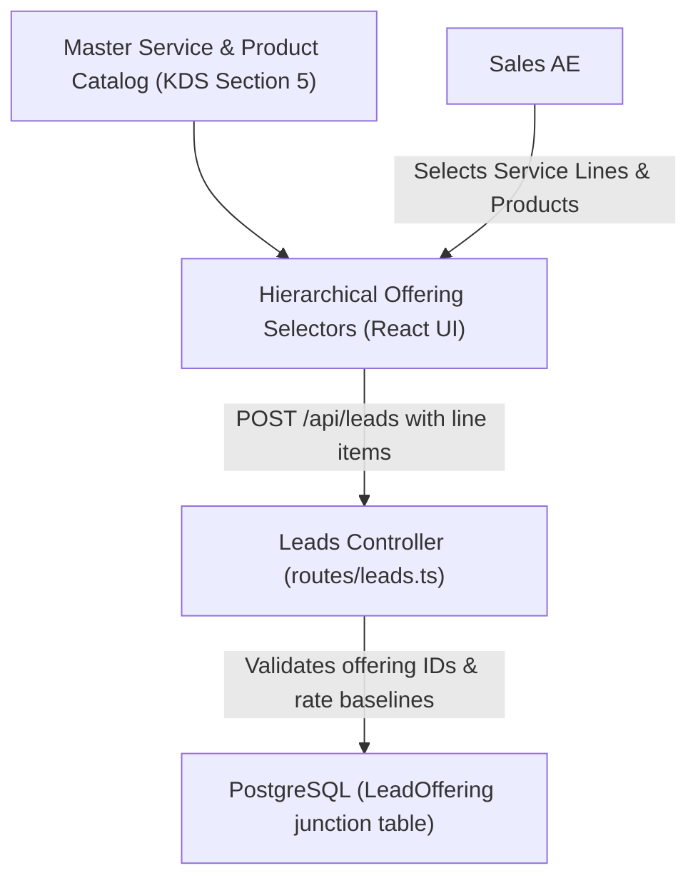

# Activate - SPH | WRICEF Functional Specification Document (FSD)

**Document Information**
- **Project Name**: SecureProfit Hub (SPH) Implementation
- **Parent Master FSD**: `10-03_Explore-05_WRICEF_Functional_Specification_FSD_SPH_v0.01.md`
- **Document Identifier**: SPH-FSD-E-DEMO-02
- **WRICEF Title**: Structured Products & Services Details at Lead Creation
- **WRICEF Type**: Enhancement (E)
- **Phase**: 03 - Explore / 04 - Realize
- **Workstream**: Commercial Intake & CRM
- **Sprint Allocation**: Sprint 1 (3 Story Points)
- **Complexity**: Medium
- **Functional Author**: Antigravity AI (Commercial Track)
- **Business Process Owner**: Hendra Wijaya (Commercial Lead)
- **Version**: v0.02
- **Status**: Draft
- **Date**: 2026-08-28

---

## 1. Business Requirement & Objective
- **Business Need**: Opportunities in professional services involve both standard consulting service lines (e.g., Red Teaming, Cloud Security Architecture, ISO 27001 Audit) and third-party software/product licenses. Capturing unstructured free text causes quoting inaccuracies and misaligned staffing.
- **User Story**: *As a Sales AE, I want to select structured Products and Services in lead details during lead creation, so that technical scope is directly aligned with the Master Service Catalog.*
- **Trigger Event**: User creates or edits a Lead in `web/src/pages/Leads.tsx` under the "Offering Scope" section.

---

## 2. Immediate Operational & System Effect Post-Implementation

> [!IMPORTANT]
> **Developer Goal & Operational Target**:
> This customization replaces unstructured free-text opportunity descriptions with relational, line-item catalog bindings mapped directly to SPH's master Service & Product catalog.

### Immediate Effects:
1. **Transparent Scope Breakdown**: Opportunities immediately reflect structured breakdowns of Consulting Services vs. Software Resale licenses in `LeadOffering` junction records.
2. **Deterministic Scoping for Principals**: Practice Principals can see exact technical scopes (e.g., 200 hours of Pen Testing + 1 EDR Resale License) before estimating delivery effort, preventing under-scoped contracts.
3. **Automated Valuation Rollup**: The `estimatedValue` field is auto-calculated from offering line items ($\sum \text{quantity} \times \text{estimatedAmount}$), eliminating manual arithmetic errors and pricing discrepancies.

---

## 3. Functional Architecture & Data Flow



---

## 4. Detailed Functional Requirements & Business Rules

### 4.1 Offering Master Catalog Mapping
1. **Service Categories**:
   - `PEN_TESTING` (Vulnerability Assessment & Penetration Testing)
   - `SOC_MANAGED` (24/7 Managed Detection & Response)
   - `GRC_AUDIT` (ISO 27001, PCI-DSS, SOC 2 Compliance)
   - `CLOUD_SEC` (Cloud Infrastructure Hardening & DevSecOps)
   - `INCIDENT_RESP` (Digital Forensics & Incident Response)
2. **Product / Resale Categories**:
   - `EDR_LICENSE` (Endpoint Detection & Response Software)
   - `SIEM_LICENSE` (Log Management & SIEM Capacity)
   - `HARDWARE_APPLIANCE` (Network Security Appliance)

### 4.2 Data Structure & API Contract
- **Prisma Schema Update**:
  ```prisma
  model LeadOffering {
    id           String   @id @default(cuid())
    leadId       String
    lead         Lead     @relation(fields: [leadId], references: [id], onDelete: Cascade)
    offeringType String   // "SERVICE" | "PRODUCT"
    category     String   // e.g. "PEN_TESTING", "GRC_AUDIT"
    name         String   // Custom specific line item name
    quantity     Float    @default(1.0)
    estimatedAmount Float @default(0.0)
    createdAt    DateTime @default(now())

    @@index([leadId])
  }
  ```

---

## 5. Error Handling & Edge Cases
- **Missing Offerings**: Submission requires at least 1 offering line item. If zero offerings are added, form returns `HTTP 400 Bad Request: "At least one service or product offering must be defined."`
- **Zero/Negative Valuation**: `estimatedAmount` must be $\ge 0$. Negative values are blocked.

---

## 6. Test Scenarios & Acceptance Criteria

| Test Case ID | Test Scenario | Input Data | Expected Result | Pass / Fail |
| :---: | :--- | :--- | :--- | :---: |
| **TC-DEMO-02-01** | Add combined Service + Product offerings | 1 Service (Pen Testing) + 1 Product (EDR License) | Both line items saved in `LeadOffering` table | [ ] |
| **TC-DEMO-02-02** | Zero line items validation | Submit lead without offerings | Form validation flags "Offering Required" | [ ] |
| **TC-DEMO-02-03** | Rollup calculation | 2 items ($10,000 + $5,000) | Form auto-suggests `estimatedValue = $15,000` | [ ] |

---

## 7. Sign-off and Approvals

| Stakeholder Role | Name & Title | Signature | Date |
| :--- | :--- | :--- | :--- |
| **Commercial Process Owner** | | ____________________ | YYYY-MM-DD |
| **Lead Technical Architect** | | ____________________ | YYYY-MM-DD |

---

## 8. Document Revision History

| Version | Date | Author / Role | Summary of Changes |
| :---: | :---: | :--- | :--- |
| `v0.01` | 2026-08-28 | Antigravity AI | Initial functional specification creation. |
| `v0.02` | 2026-08-28 | Antigravity AI | Added dedicated Section 2: Immediate Operational & System Effect Post-Implementation. |
