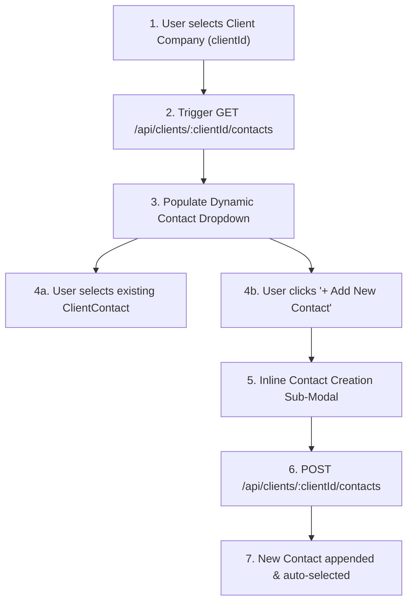

# Activate - SPH | WRICEF Functional Specification Document (FSD)

**Document Information**
- **Project Name**: SecureProfit Hub (SPH) Implementation
- **Parent Master FSD**: `10-03_Explore-05_WRICEF_Functional_Specification_FSD_SPH_v0.01.md`
- **Document Identifier**: SPH-FSD-E-DEMO-03
- **WRICEF Title**: Company-Originated Contact Dynamic Dropdown & Intake
- **WRICEF Type**: Enhancement (E)
- **Phase**: 03 - Explore / 04 - Realize
- **Workstream**: Commercial Intake & CRM
- **Sprint Allocation**: Sprint 1 (5 Story Points)
- **Complexity**: Medium
- **Functional Author**: Antigravity AI (Commercial Track)
- **Business Process Owner**: Hendra Wijaya (Commercial Lead)
- **Version**: v0.02
- **Status**: Draft
- **Date**: 2026-08-28

---

## 1. Business Requirement & Objective
- **Business Need**: In enterprise sales, contacts (Decision Makers, Technical Leads, Procurement Officers) belong strictly to specific corporate clients. Unfiltered global contact lists lead to data pollution where contacts are misattributed across unrelated client organizations.
- **User Story**: *As a Sales Ops / AE, I want the contact list in lead creation to be filtered dynamically based on the selected client company, with an inline "+ New Contact" option, so that contacts are correctly bound to client records.*
- **Trigger Event**: User selects a `Client` company in `web/src/pages/Leads.tsx` intake form.

---

## 2. Immediate Operational & System Effect Post-Implementation

> [!IMPORTANT]
> **Developer Goal & Operational Target**:
> This customization prevents cross-company data contamination and streamlines contact management by enforcing client-origin relational scoping.

### Immediate Effects:
1. **Strict Client-Contact Scoping**: Contacts are strictly filtered by the selected parent client organization, preventing accidental data leakage or cross-company misattribution.
2. **Frictionless Inline Contact Creation**: Sales reps can create and bind new client contacts on the fly directly within the Lead modal without losing form state or navigating to the Client Directory.
3. **Relational Data Integrity**: Ensures all historical client interactions, quotes, and delivery sign-offs tie back cleanly to verifiable `ClientContact` database records.

---

## 3. Functional Architecture & Data Flow



---

## 4. Detailed Functional Requirements & Business Rules

### 4.1 UI State Machine & Interaction Logic
1. **Initial State**: Contact dropdown is disabled with placeholder text: *"Please select a Client Company first"*.
2. **On Client Selection**: Dropdown enables immediately, triggers async fetch to `/api/clients/:clientId/contacts`, and renders list showing: `Contact Name (Job Title - email@domain.com)`.
3. **Empty State / New Contact Action**: If zero contacts exist for the client, render option: *"+ Create New Contact for this Company"*.
4. **Inline Modal**: Clicking "+ Create New Contact" opens a lightweight nested modal (Fields: Full Name, Title/Role, Email, Phone, Is Primary Decision Maker). Saving creates the record and binds it without refreshing the lead form.

### 4.2 API Contract
- **Endpoint 1 (List)**: `GET /api/clients/:clientId/contacts`
  - Returns array of active `ClientContact` objects.
- **Endpoint 2 (Create)**: `POST /api/clients/:clientId/contacts`
  ```json
  {
    "name": "Iwan Setiawan",
    "title": "Head of IT Security",
    "email": "iwan.s@acme.co.id",
    "phone": "+628119876543",
    "isPrimary": true
  }
  ```

---

## 5. Error Handling & Edge Cases
- **Client Deselection**: If user changes the selected client, the contact field automatically clears to prevent cross-company data contamination.
- **Duplicate Contact Detection**: If email already exists under that client, API prompts user: *"Contact with this email already exists; selected existing record instead."*

---

## 6. Test Scenarios & Acceptance Criteria

| Test Case ID | Test Scenario | Input Data | Expected Result | Pass / Fail |
| :---: | :--- | :--- | :--- | :---: |
| **TC-DEMO-03-01** | Dynamic contact filtering | Select "Bank Mandiri" | Only Bank Mandiri contacts appear in dropdown | [ ] |
| **TC-DEMO-03-02** | Disabled state check | No client selected | Contact field disabled with helper tooltip | [ ] |
| **TC-DEMO-03-03** | Inline contact creation | Click "+ Add New Contact" | Sub-modal saves contact and auto-selects in Lead form | [ ] |
| **TC-DEMO-03-04** | Client switch clearing | Select Client A $\rightarrow$ Select Contact $\rightarrow$ Switch to Client B | Contact selection cleared; Client B contacts loaded | [ ] |

---

## 7. Sign-off and Approvals

| Stakeholder Role | Name & Title | Signature | Date |
| :--- | :--- | :--- | :--- |
| **Commercial Process Owner** | | ____________________ | YYYY-MM-DD |
| **Lead Technical Architect** | | ____________________ | YYYY-MM-DD |

---

## 8. Document Revision History

| Version | Date | Author / Role | Summary of Changes |
| :---: | :---: | :--- | :--- |
| `v0.01` | 2026-08-28 | Antigravity AI | Initial functional specification creation. |
| `v0.02` | 2026-08-28 | Antigravity AI | Added dedicated Section 2: Immediate Operational & System Effect Post-Implementation. |
