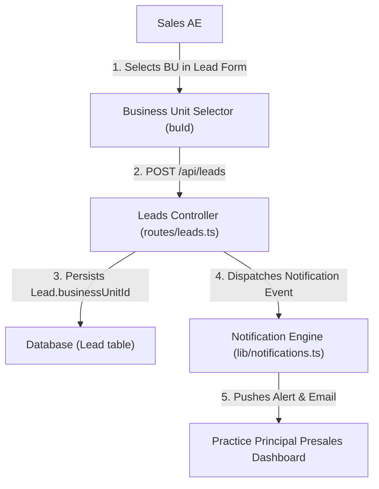

# Activate - SPH | WRICEF Functional Specification Document (FSD)

**Document Information**
- **Project Name**: SecureProfit Hub (SPH) Implementation
- **Parent Master FSD**: `10-03_Explore-05_WRICEF_Functional_Specification_FSD_SPH_v0.01.md`
- **Document Identifier**: SPH-FSD-E-DEMO-04
- **WRICEF Title**: Business Unit & Workstream Intake Routing
- **WRICEF Type**: Enhancement (E)
- **Phase**: 03 - Explore / 04 - Realize
- **Workstream**: Commercial Intake & Delivery Routing
- **Sprint Allocation**: Sprint 1 (3 Story Points)
- **Complexity**: Medium
- **Functional Author**: Antigravity AI (Commercial Track)
- **Business Process Owner**: Hendra Wijaya (Commercial Lead) & Budi Santoso (Delivery Lead)
- **Version**: v0.02
- **Status**: Draft
- **Date**: 2026-08-28

---

## 1. Business Requirement & Objective
- **Business Need**: SPH operates under multiple specialized practice Business Units (e.g., Offensive Security, Defense / Managed SOC, GRC & Advisory, Cloud Infrastructure). Assigning the Business Unit at opportunity creation ensures presales deals route immediately to the appropriate Practice Principal for scoping and technical resource allocation.
- **User Story**: *As a Practice Principal, I want Business Unit / Workstream assigned at lead creation, so that presales opportunities are pre-routed directly to my practice presales queue.*
- **Trigger Event**: Lead creation modal rendered in `web/src/pages/Leads.tsx`.

---

## 2. Immediate Operational & System Effect Post-Implementation

> [!IMPORTANT]
> **Developer Goal & Operational Target**:
> This customization establishes practice-level organizational boundaries at intake, automating notification dispatches and presales queue routing for Practice Principals.

### Immediate Effects:
1. **Instant Practice Dispatch**: Opportunities route immediately to the designated Practice Principal's presales queue (`businessUnitId`) with real-time notification alerts.
2. **Practice-Level Capacity & Forecasting**: Enables practice-level pipeline forecasting, bench capacity planning, and pre-allocation of specialized technical consultants.
3. **Zero Untracked Requests**: Eliminates unassigned or misrouted presales requests floating in generic sales backlogs.

---

## 3. Functional Architecture & Data Flow

---

## 4. Detailed Functional Requirements & Business Rules

### 4.1 Business Unit Master List
The dropdown binds dynamically to active records from `BusinessUnit` master table:
1. `BU_OFFENSIVE` — Offensive Cybersecurity & Red Teaming (Lead: Budi Santoso)
2. `BU_DEFENSIVE` — Managed Defense & SOC Operations (Lead: Rizky Pratama)
3. `BU_GRC` — Governance, Risk, Compliance & Privacy (Lead: Maya Anggraini)
4. `BU_CLOUD_INFRA` — Cloud Security & DevSecOps (Lead: Hendra Wijaya)

### 4.2 Routing & Notification Rules
- Upon saving a Lead with `businessUnitId`, the system queries the designated `headOfBuId` / Principal for that BU.
- An in-app notification and email are dispatched: *"New Lead [LEAD/YYYY/NNN] assigned to your Practice: [Lead Title] ([Client Name])"*.
- The lead automatically appears in the Principal's filtered presales pipeline (`/leads?buId=...`).

---

## 5. Error Handling & Edge Cases
- **Mandatory Field**: `businessUnitId` is a required field. If unselected, API returns `HTTP 400 Bad Request: "Business Unit must be assigned to route the opportunity."`
- **Inactive BU**: Inactive or archived Business Units are filtered out of the intake dropdown.

---

## 6. Test Scenarios & Acceptance Criteria

| Test Case ID | Test Scenario | Input Data | Expected Result | Pass / Fail |
| :---: | :--- | :--- | :--- | :---: |
| **TC-DEMO-04-01** | Standard BU assignment | Select `BU_OFFENSIVE` | Lead saved with `businessUnitId = 'BU_OFFENSIVE'` | [ ] |
| **TC-DEMO-04-02** | Principal notification trigger | Submit lead with `BU_OFFENSIVE` | Notification dispatched to Offensive Practice Principal | [ ] |
| **TC-DEMO-04-03** | Practice pipeline filtering | Open pipeline as Offensive Principal | Lead appears in Practice Presales Queue | [ ] |

---

## 7. Sign-off and Approvals

| Stakeholder Role | Name & Title | Signature | Date |
| :--- | :--- | :--- | :--- |
| **Commercial Process Owner** | | ____________________ | YYYY-MM-DD |
| **Delivery Process Owner** | | ____________________ | YYYY-MM-DD |

---

## 8. Document Revision History

| Version | Date | Author / Role | Summary of Changes |
| :---: | :--- | :--- | :--- |
| `v0.01` | 2026-08-28 | Antigravity AI | Initial functional specification creation. |
| `v0.02` | 2026-08-28 | Antigravity AI | Added dedicated Section 2: Immediate Operational & System Effect Post-Implementation. |
