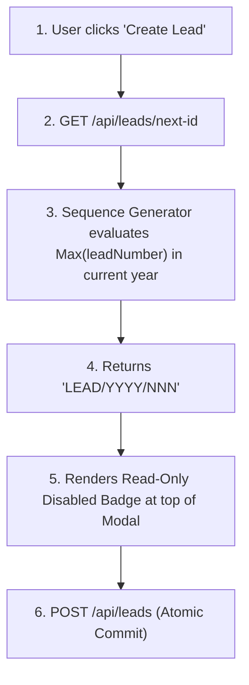

# Activate - SPH | WRICEF Functional Specification Document (FSD)

**Document Information**
- **Project Name**: SecureProfit Hub (SPH) Implementation
- **Parent Master FSD**: `10-03_Explore-05_WRICEF_Functional_Specification_FSD_SPH_v0.01.md`
- **Document Identifier**: SPH-FSD-F-DEMO-06
- **WRICEF Title**: Read-Only Sequential Lead ID Preview Form Badge
- **WRICEF Type**: Form (F)
- **Phase**: 03 - Explore / 04 - Realize
- **Workstream**: Commercial Intake & CRM
- **Sprint Allocation**: Sprint 1 (2 Story Points)
- **Complexity**: Simple
- **Functional Author**: Antigravity AI (Commercial Track)
- **Business Process Owner**: Hendra Wijaya (Commercial Lead)
- **Version**: v0.02
- **Status**: Draft
- **Date**: 2026-08-28

---

## 1. Business Requirement & Objective
- **Business Need**: Sales reps need to cite an official reference code during preliminary communications with prospective clients and cross-functional teams even while drafting an opportunity. Previewing the auto-generated sequential Lead ID directly on the intake form provides immediate reference clarity.
- **User Story**: *As a Sales AE, I want to view a read-only pre-generated Lead ID (`LEAD/YYYY/NNN`) in the creation form, so that I have an immediate official reference code.*
- **Trigger Event**: "Create Lead" modal opened in `web/src/pages/Leads.tsx`.

---

## 2. Immediate Operational & System Effect Post-Implementation

> [!IMPORTANT]
> **Developer Goal & Operational Target**:
> This customization provides pre-commit identifier transparency for sales representatives while guaranteeing concurrency-safe sequential number assignment.

### Immediate Effects:
1. **Pre-Save Reference Clarity**: Sales reps immediately see the official formatted reference identifier (`LEAD/YYYY/NNN`) while composing client proposals and drafting emails.
2. **Standardized Sequence Numbering**: Establishes uniform sequential numbering across the entire sales organization starting from `001` each calendar year.
3. **Concurrency Collision Safety**: The atomic sequence generator prevents duplicate ID assignment under high-concurrency intake spikes.

---

## 3. Functional Architecture & Data Flow

---

## 4. Detailed Functional Requirements & Business Rules

### 4.1 Identifier Algorithm & Formatting Standard
- Format: `LEAD/[YYYY]/[NNN]`
  - `YYYY`: 4-digit calendar year (e.g. `2026`).
  - `NNN`: 3-digit zero-padded sequence starting at `001` each January 1st (e.g. `LEAD/2026/001`, `LEAD/2026/045`).
- **UI Form Layout**: Displayed at top right of the modal in a styled gray read-only pill: `🔒 Lead ID: LEAD/2026/089 (Preview)`.
- **Field Behavior**: Disabled (non-editable); cannot be clicked or overwritten by user.

---

## 5. Error Handling & Concurrency Guard
- **Concurrent Creation Race Condition**: If two users open the modal simultaneously, both see preview `LEAD/2026/089`. The backend commit uses atomic database transactions (`prisma.$transaction`). The first user gets `LEAD/2026/089`, and the second user's commit seamlessly gets `LEAD/2026/090` without failing.

---

## 6. Test Scenarios & Acceptance Criteria

| Test Case ID | Test Scenario | Input Data | Expected Result | Pass / Fail |
| :---: | :--- | :--- | :--- | :---: |
| **TC-DEMO-06-01** | Lead ID preview rendering | Open Lead Creation modal | Displays formatted `LEAD/2026/NNN` badge | [ ] |
| **TC-DEMO-06-02** | Immutability check | Attempt to edit Lead ID in form | Field is strictly read-only | [ ] |
| **TC-DEMO-06-03** | Year rollover test | Simulate creation on Jan 1 | Sequence resets to `LEAD/2027/001` | [ ] |

---

## 7. Sign-off and Approvals

| Stakeholder Role | Name & Title | Signature | Date |
| :--- | :--- | :--- | :--- |
| **Commercial Process Owner** | | ____________________ | YYYY-MM-DD |
| **Lead Technical Architect** | | ____________________ | YYYY-MM-DD |

---

## 8. Document Revision History

| Version | Date | Author / Role | Summary of Changes |
| :---: | :--- | :--- | :--- |
| `v0.01` | 2026-08-28 | Antigravity AI | Initial functional specification creation. |
| `v0.02` | 2026-08-28 | Antigravity AI | Added dedicated Section 2: Immediate Operational & System Effect Post-Implementation. |
