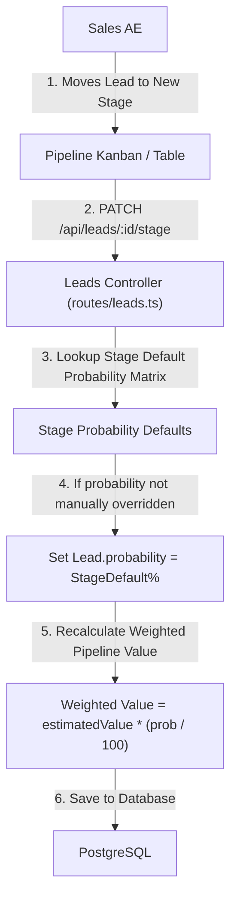

# Activate - SPH | WRICEF Functional Specification Document (FSD)

**Document Information**
- **Project Name**: SecureProfit Hub (SPH) Implementation
- **Parent Master FSD**: `10-03_Explore-05_WRICEF_Functional_Specification_FSD_SPH_v0.01.md`
- **Document Identifier**: SPH-FSD-E-DEMO-08
- **WRICEF Title**: Stage-Based Default Win Probability % Automation
- **WRICEF Type**: Enhancement (E)
- **Phase**: 03 - Explore / 04 - Realize
- **Workstream**: Commercial Pipeline & Forecasting
- **Sprint Allocation**: Sprint 2 (2 Story Points)
- **Complexity**: Simple
- **Functional Author**: Antigravity AI (Commercial Track)
- **Business Process Owner**: Hendra Wijaya (Commercial Lead)
- **Version**: v0.02
- **Status**: Draft
- **Date**: 2026-08-28

---

## 1. Business Requirement & Objective
- **Business Need**: Pipeline forecasting requires realistic, standardized win probabilities tied to sales stages. Allowing static probabilities when deals advance distorts the weighted pipeline forecast ($V \times P$). Stage changes should automatically reset the default probability while allowing documented manual overrides.
- **User Story**: *As a Sales AE, I want deal probability % to update automatically based on stage standard (e.g. Proposal = 30%), so that pipeline forecasts remain accurate and consistent.*
- **Trigger Event**: Deal dragged across Kanban columns or stage changed in `web/src/pages/Leads.tsx`.

---

## 2. Immediate Operational & System Effect Post-Implementation

> [!IMPORTANT]
> **Developer Goal & Operational Target**:
> This customization implements an automated probability state machine tied directly to sales stage advancement, standardizing commercial pipeline forecasting.

### Immediate Effects:
1. **Dynamic Weighted Forecast Recalculation**: Whenever a lead transitions stages (e.g. Qualified $\rightarrow$ Proposal $\rightarrow$ Negotiation), the deal win probability updates automatically (20% $\rightarrow$ 30% $\rightarrow$ 60%), recalculating the weighted pipeline value ($\text{Value} \times \text{Prob}$) in real-time.
2. **Forecast Drift Elimination**: Eliminates distorted executive revenue forecasts caused by reps forgetting to manually update probability percentages on advancing deals.
3. **Audited Manual Overrides**: Sales reps who apply custom probability percentages (e.g., 45% on a proposal due to executive relationships) are tracked with an `isProbabilityOverridden` flag for management visibility.

---

## 3. Functional Architecture & Data Flow

---

## 4. Detailed Functional Requirements & Business Rules

### 4.1 Stage Probability Standard Matrix
| Pipeline Stage | Stage Identifier | Default Probability % | Description / Milestone Gate |
| :--- | :--- | :---: | :--- |
| **New Lead** | `NEW` | **10%** | Initial opportunity identified; preliminary qualification. |
| **Contacted** | `CONTACTED` | **15%** | Initial discovery call completed with prospective client. |
| **Qualified** | `QUALIFIED` | **20%** | Budget, Authority, Need, Timeline (BANT) confirmed. |
| **Proposal** | `PROPOSAL` | **30%** | Formal proposal submitted; presales budgeting initiated. |
| **Negotiation** | `NEGOTIATION` | **60%** | Commercial terms under review; Finance margin approved. |
| **Contracting** | `CONTRACTING` | **85%** | Master Services Agreement (MSA) / Statement of Work (SOW) in legal review. |
| **Won** | `WON` | **100%** | Signed contract received; project transitioning to delivery. |
| **Lost** | `LOST` | **0%** | Deal lost or disqualified. |

### 4.2 Manual Override Rule
- If a user manually specifies a custom probability (e.g. 45% in Proposal stage due to strong executive relationship), the UI sets `isProbabilityOverridden = true`.
- On subsequent stage changes, SPH prompts the user: *"Reset probability to stage default (60%) or keep custom override (45%)?"*.

---

## 5. Error Handling & Edge Cases
- **Invalid Range**: Probability input is constrained strictly to $0 \le P \le 100$. Values outside this range return `HTTP 400 Bad Request`.

---

## 6. Test Scenarios & Acceptance Criteria

| Test Case ID | Test Scenario | Input Data | Expected Result | Pass / Fail |
| :---: | :--- | :--- | :--- | :---: |
| **TC-DEMO-08-01** | Standard stage advancement | Drag lead from `QUALIFIED` to `PROPOSAL` | `Lead.probability` auto-updates from 20% to 30% | [ ] |
| **TC-DEMO-08-02** | Deal Won transition | Move lead to `WON` | Probability updates to 100% | [ ] |
| **TC-DEMO-08-03** | Custom override preservation | Custom prob = 45%; advance stage | Prompt displayed; retains 45% if confirmed | [ ] |

---

## 7. Sign-off and Approvals

| Stakeholder Role | Name & Title | Signature | Date |
| :--- | :--- | :--- | :--- |
| **Commercial Process Owner** | | ____________________ | YYYY-MM-DD |
| **Lead Technical Architect** | | ____________________ | YYYY-MM-DD |

---

## 8. Document Revision History

| Version | Date | Author / Role | Summary of Changes |
| :---: | :--- | :--- | :--- |
| `v0.01` | 2026-08-28 | Antigravity AI | Initial functional specification creation. |
| `v0.02` | 2026-08-28 | Antigravity AI | Added dedicated Section 2: Immediate Operational & System Effect Post-Implementation. |
