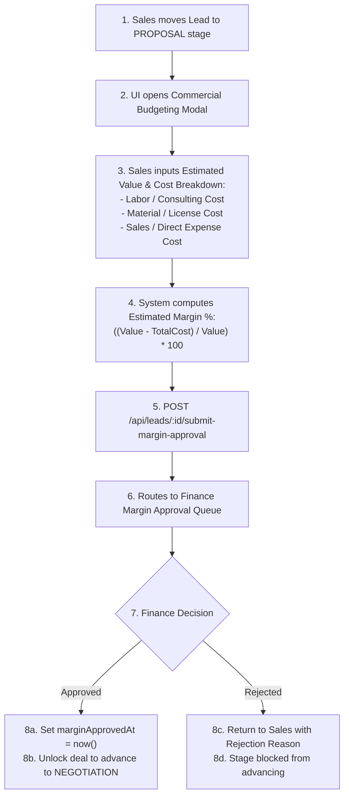

# Activate - SPH | WRICEF Functional Specification Document (FSD)

**Document Information**
- **Project Name**: SecureProfit Hub (SPH) Implementation
- **Parent Master FSD**: `10-03_Explore-05_WRICEF_Functional_Specification_FSD_SPH_v0.01.md`
- **Document Identifier**: SPH-FSD-W-DEMO-10
- **WRICEF Title**: Proposal Stage Budgeting & Finance Margin Approval Gate
- **WRICEF Type**: Workflow (W)
- **Phase**: 03 - Explore / 04 - Realize
- **Workstream**: Commercial Gating & Financial Governance
- **Sprint Allocation**: Sprint 2 (5 Story Points)
- **Complexity**: Complex
- **Functional Author**: Antigravity AI (Finance & Commercial Track)
- **Business Process Owner**: Maya Anggraini (Finance Lead) & Hendra Wijaya (Commercial Lead)
- **Version**: v0.02
- **Status**: Draft
- **Date**: 2026-08-28

---

## 1. Business Requirement & Objective
- **Business Need**: Submitting commercial quotes to clients without formal Finance verification exposes the firm to underpriced contracts and negative project margins. Enforcing a mandatory budgeting breakdown and Finance margin approval gate at the Proposal stage ensures pricing discipline before formal proposals are issued.
- **User Story**: *As a Sales AE, I want to submit estimated value and cost breakdown for Finance margin approval at Proposal stage, and as a Finance Controller, I want to approve or reject the margin, so that deals cannot advance to Negotiation without signed-off profitability.*
- **Trigger Event**: Deal moves to `PROPOSAL` stage in `web/src/pages/Leads.tsx`.

---

## 2. Immediate Operational & System Effect Post-Implementation

> [!IMPORTANT]
> **Developer Goal & Operational Target**:
> This customization enforces hard commercial governance by introducing a mandatory budgeting breakdown and Finance margin approval stage-gate before quotes can be finalized.

### Immediate Effects:
1. **Mandatory Cost Component Breakdown**: Sales reps are required to categorize estimated costs into Labor (`consultantCost`), Software/Hardware (`materialCost`), and Direct Expenses (`salesCost`) before submitting proposals.
2. **Hard Financial Stage Gate**: Stage advancement to `NEGOTIATION` or `CONTRACTING` is blocked at both UI and API levels until Finance formally stamps `marginApprovedAt`.
3. **Margin Risk Elimination**: Completely eliminates underpriced or loss-making contracts from being quoted to clients, protecting corporate profitability thresholds ($\ge 35\%$).

---

## 3. Functional Architecture & Data Flow

---

## 4. Detailed Functional Requirements & Business Rules

### 4.1 Cost Breakdown Input Structure
The budgeting modal requires 3 distinct cost categories:
1. `consultantCost`: Estimated labor cost based on proposed consultant roles and rate cards.
2. `materialCost`: Third-party software licenses, cloud compute, or hardware resale cost.
3. `salesCost`: Estimated travel, client hospitality, and direct presales expense allocation.
- **Total Estimated Cost**:
  $$\text{estimatedCost} = \text{consultantCost} + \text{materialCost} + \text{salesCost}$$
- **Estimated Margin %**:
  $$\text{estimatedMarginPct} = \left(\frac{\text{estimatedValue} - \text{estimatedCost}}{\text{estimatedValue}}\right) \times 100$$

### 4.2 Finance Approval Gate Logic
- **Routing**: Deals with $\text{estimatedMarginPct} \ge 35\%$ require standard Finance Lead approval. Deals with $\text{estimatedMarginPct} < 35\%$ trigger high-risk flag requiring VP Finance approval.
- **Stage Progression Enforcement**: If a user attempts to drag the lead from `PROPOSAL` to `NEGOTIATION` or `CONTRACTING` while `marginApprovedAt == null`, the action is blocked with an alert: *"⚠️ Commercial Gate Locked: Finance Margin Approval is required before advancing past Proposal stage."*

---

## 5. Error Handling & Exception Management
- **Incomplete Breakdown**: Submitting without filling all 3 cost breakdown components returns `HTTP 422 Unprocessable Entity`.
- **Negative Value**: If `estimatedValue` $\le 0$, submission is rejected.

---

## 6. Test Scenarios & Acceptance Criteria

| Test Case ID | Test Scenario | Input Data | Expected Result | Pass / Fail |
| :---: | :--- | :--- | :--- | :---: |
| **TC-DEMO-10-01** | Submit valid budget breakdown | Value = $100k; Labor = $50k, Material = $10k, Sales = $5k | Total Cost = $65k; Margin = 35%; Routed to Finance | [ ] |
| **TC-DEMO-10-02** | Block unapproved stage advance | Attempt to drag unapproved deal to `NEGOTIATION` | Action blocked; UI displays "Margin Approval Required" | [ ] |
| **TC-DEMO-10-03** | Finance approval unlock | Finance approves margin in queue | `marginApprovedAt` stamped; deal unlocked for negotiation | [ ] |
| **TC-DEMO-10-04** | Finance rejection handling | Finance rejects with note "Discount too high" | Deal status set to `REVISION_REQUIRED`; Sales alerted | [ ] |

---

## 7. Sign-off and Approvals

| Stakeholder Role | Name & Title | Signature | Date |
| :--- | :--- | :--- | :--- |
| **Finance Process Owner** | | ____________________ | YYYY-MM-DD |
| **Commercial Process Owner** | | ____________________ | YYYY-MM-DD |
| **Lead Technical Architect** | | ____________________ | YYYY-MM-DD |

---

## 8. Document Revision History

| Version | Date | Author / Role | Summary of Changes |
| :---: | :--- | :--- | :--- |
| `v0.01` | 2026-08-28 | Antigravity AI | Initial functional specification creation. |
| `v0.02` | 2026-08-28 | Antigravity AI | Added dedicated Section 2: Immediate Operational & System Effect Post-Implementation. |
