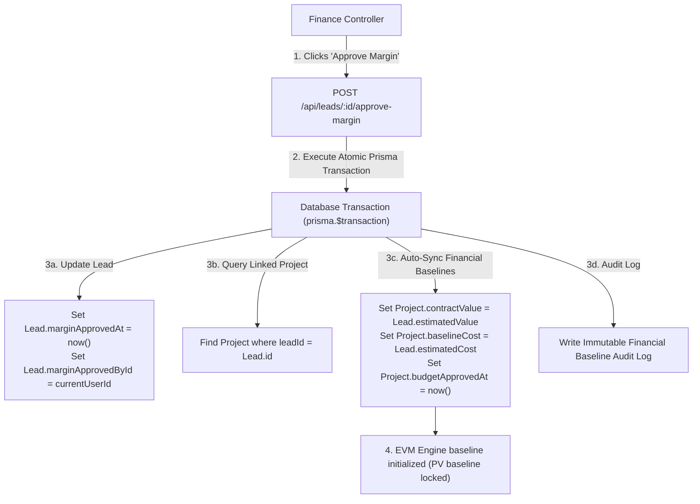

# Activate - SPH | WRICEF Functional Specification Document (FSD)

**Document Information**
- **Project Name**: SecureProfit Hub (SPH) Implementation
- **Parent Master FSD**: `10-03_Explore-05_WRICEF_Functional_Specification_FSD_SPH_v0.01.md`
- **Document Identifier**: SPH-FSD-W-DEMO-11
- **WRICEF Title**: Approved Margin Project Baseline Auto-Sync Engine
- **WRICEF Type**: Workflow (W)
- **Phase**: 03 - Explore / 04 - Realize
- **Workstream**: Financial Baselines & EVM Governance
- **Sprint Allocation**: Sprint 2 (5 Story Points)
- **Complexity**: Medium
- **Functional Author**: Antigravity AI (Finance Track)
- **Business Process Owner**: Maya Anggraini (Finance Lead) & Budi Santoso (Delivery Lead)
- **Version**: v0.02
- **Status**: Draft
- **Date**: 2026-08-28

---

## 1. Business Requirement & Objective
- **Business Need**: Once Finance approves the commercial budget and margin at Proposal stage, manually re-keying agreed revenue and cost baselines into Project Master data causes human error, timing drift, and unaligned Earned Value Management (EVM) Planned Value (PV) calculations.
- **User Story**: *As a Finance Controller / PMO Lead, I want approved margin data to automatically sync `estimatedValue` to `Project.contractValue` and `estimatedCost` to `Project.baselineCost`, so that project financial baselines are locked atomically upon approval.*
- **Trigger Event**: Finance Lead clicks "Approve Margin" in the Finance Approval Queue (`POST /api/leads/:id/approve-margin`).

---

## 2. Immediate Operational & System Effect Post-Implementation

> [!IMPORTANT]
> **Developer Goal & Operational Target**:
> This customization guarantees zero-drift baseline synchronization between approved commercial quotes and active delivery project financial master data.

### Immediate Effects:
1. **Automated Baseline Lock**: Finance margin approval atomically copies `estimatedValue` $\rightarrow$ `Project.contractValue` and `estimatedCost` $\rightarrow$ `Project.baselineCost`, locking initial commercial baselines with zero human re-keying.
2. **EVM Planned Value (PV) Initialization**: The EVM engine immediately initializes its planned performance baselines ($PV, BAC$) using official approved contract numbers.
3. **Change Control Protection**: Post-sync baseline values are locked against manual editing, forcing all subsequent project budget expansions through the formal Change Request workflow (`W-03`).

---

## 3. Functional Architecture & Data Flow

---

## 4. Detailed Functional Requirements & Business Rules

### 4.1 Field-by-Field Synchronization Mapping
| Source Lead Field | Target Project Field | Data Type | Sync Logic & Invariant |
| :--- | :--- | :--- | :--- |
| `Lead.estimatedValue` | `Project.contractValue` | `Decimal(15,2)` | Atomic copy; establishes total client contract fee. |
| `Lead.estimatedCost` | `Project.baselineCost` | `Decimal(15,2)` | Atomic copy; establishes total delivery budget ceiling. |
| `Lead.consultantCost` | `Project.laborBudget` | `Decimal(15,2)` | Allocated to WBS labor cost ceiling. |
| `Lead.materialCost` | `Project.materialBudget` | `Decimal(15,2)` | Allocated to subcontractor/material cost ceiling. |
| `Lead.salesCost` | `Project.presalesBudget` | `Decimal(15,2)` | Allocated to presales CAC ceiling. |
| `Lead.marginApprovedAt` | `Project.budgetApprovedAt` | `DateTime` | Timestamp of formal commercial authorization. |

### 4.2 Post-Sync Baseline Locking
- Once synchronized, `contractValue` and `baselineCost` in `Project` cannot be edited directly via regular project settings. Any subsequent modifications require the formal **Change Request Workflow (`W-03`)**.

---

## 5. Error Handling & Exception Management
- **Orphan Lead Handling**: If a Lead somehow has no linked `Project`, the sync logic creates the project automatically before updating baselines.
- **Rollback on Failure**: If project baseline update fails, the margin approval status rolls back immediately.

---

## 6. Test Scenarios & Acceptance Criteria

| Test Case ID | Test Scenario | Input Data | Expected Result | Pass / Fail |
| :---: | :--- | :--- | :--- | :---: |
| **TC-DEMO-11-01** | Standard margin approval sync | Value = $120,000; Cost = $75,000 | `Project.contractValue = $120k`, `Project.baselineCost = $75k` | [ ] |
| **TC-DEMO-11-02** | Baseline lock check | Attempt manual edit of `contractValue` | Edit blocked; prompt to submit Change Request | [ ] |
| **TC-DEMO-11-03** | EVM initialization | Load EVM Portfolio Monitor | Planned Value (PV) curves initialize with $120k / $75k | [ ] |

---

## 7. Sign-off and Approvals

| Stakeholder Role | Name & Title | Signature | Date |
| :--- | :--- | :--- | :--- |
| **Finance Process Owner** | | ____________________ | YYYY-MM-DD |
| **Delivery Process Owner** | | ____________________ | YYYY-MM-DD |
| **Commercial Process Owner** | | ____________________ | YYYY-MM-DD |

---

## 8. Document Revision History

| Version | Date | Author / Role | Summary of Changes |
| :---: | :--- | :--- | :--- |
| `v0.01` | 2026-08-28 | Antigravity AI | Initial functional specification creation. |
| `v0.02` | 2026-08-28 | Antigravity AI | Added dedicated Section 2: Immediate Operational & System Effect Post-Implementation. |
