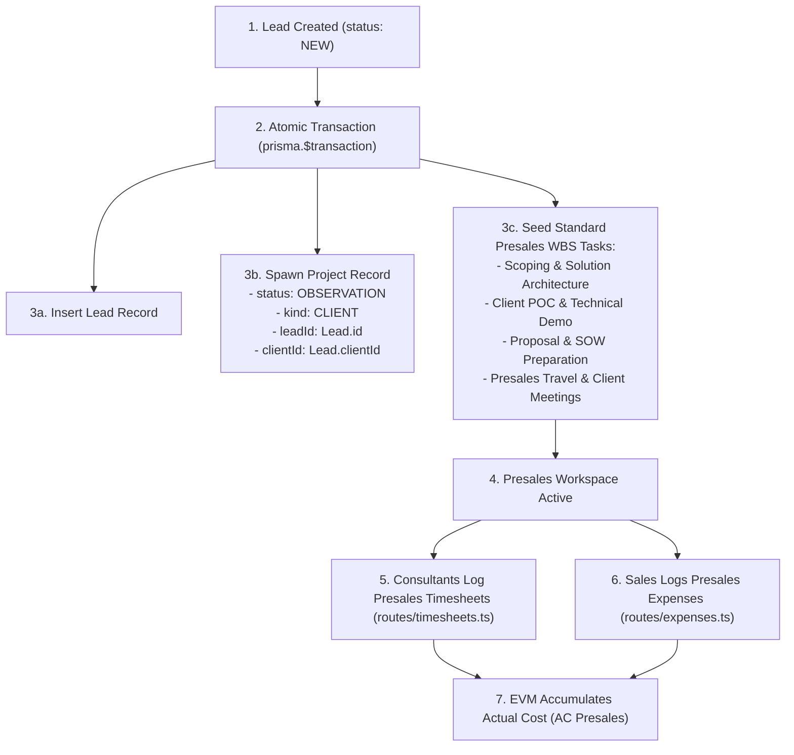

# Activate - SPH | WRICEF Functional Specification Document (FSD)

**Document Information**
- **Project Name**: SecureProfit Hub (SPH) Implementation
- **Parent Master FSD**: `10-03_Explore-05_WRICEF_Functional_Specification_FSD_SPH_v0.01.md`
- **Document Identifier**: SPH-FSD-W-DEMO-09
- **WRICEF Title**: Presales Project Auto-Spawning & Cost of Sale Capture
- **WRICEF Type**: Workflow (W)
- **Phase**: 03 - Explore / 04 - Realize
- **Workstream**: Presales Operations & Delivery Governance
- **Sprint Allocation**: Sprint 1 (8 Story Points)
- **Complexity**: Complex
- **Functional Author**: Antigravity AI (Presales Track)
- **Business Process Owner**: Hendra Wijaya (Commercial Lead) & Budi Santoso (Delivery Lead)
- **Version**: v0.02
- **Status**: Draft
- **Date**: 2026-08-28

---

## 1. Business Requirement & Objective
- **Business Need**: Presales activities (technical scoping, solution architecture, RFP preparation, proof-of-concept demos, and client travel) incur significant labor and direct expenses. Without an active project workspace from Day 1, presales costs cannot be tracked against specific deals, distorting Customer Acquisition Cost (CAC) and project profitability.
- **User Story**: *As a Presales Lead / Practice Principal, I want lead creation to immediately spawn an Observation project workspace with presales WBS tasks, so that consultants and sales reps can log timesheets and travel expenses from the point the lead is created.*
- **Trigger Event**: New Lead created via `POST /api/leads`.

---

## 2. Immediate Operational & System Effect Post-Implementation

> [!IMPORTANT]
> **Developer Goal & Operational Target**:
> This customization implements Day 1 Cost of Sale (CAC) capture by automatically provisioning an Observation project workspace upon lead creation, bridging sales opportunities and delivery timesheets.

### Immediate Effects:
1. **Real-Time Presales Cost Accumulation**: Consultants and sales reps can immediately log timesheets and travel expenses against auto-generated Presales WBS tasks (`PRE-01` to `PRE-04`) from the exact moment a lead is created.
2. **True Customer Acquisition Cost (CAC) Analytics**: The EVM engine captures Actual Cost (AC Presales) across all opportunities, providing executive visibility into the true cost to win (or cost of lost bids).
3. **Seamless Delivery Transition**: When a deal is won (`WON`), the project transitions from `OBSERVATION` to `ACTIVE` without creating duplicate project records, preserving all historical presales costs under the engagement's total actual cost.

---

## 3. Functional Architecture & Data Flow

---

## 4. Detailed Functional Requirements & Business Rules

### 4.1 Project Spawning Specifications
- **Project Initial State**:
  - `status`: `OBSERVATION` (Presales tracking mode).
  - `kind`: `CLIENT` (External client engagement).
  - `projectCode`: Generated sequentially as `PRJ/YYYY/NNN`.
  - `name`: Matches Lead title: `[Presales] {Lead.title}`.
  - `clientId`: Bound to `Lead.clientId` (Permanent lock).
  - `contractValue`: Initialized to `0.0` until formal Finance margin approval.
  - `baselineCost`: Initialized to `0.0` until formal Finance margin approval.

### 4.2 Standard Presales WBS Template
Upon workspace spawning, SPH seeds 4 default tasks under the project:
1. `PRE-01`: **Technical Scoping & Architecture Design** (Billable = False, Cap = 40h)
2. `PRE-02`: **Client POC / Demonstration** (Billable = False, Cap = 24h)
3. `PRE-03`: **RFP / Proposal & Pricing Preparation** (Billable = False, Cap = 16h)
4. `PRE-04`: **Presales Travel & Stakeholder Alignment** (Billable = False, Cap = 20h)

### 4.3 Deal Outcome Lifecycle Transitions
- **If Deal Won (`WON`)**: Project transitions to `status: ACTIVE`. Retains all presales actual costs; appends delivery WBS milestones; activates billing schedule.
- **If Deal Lost (`LOST`)**: Project transitions to `status: CLOSED` (or `CANCELLED`). Presales costs are permanently preserved for P&L cost-of-sale accounting and win/loss CAC analytics.

---

## 5. Error Handling & Atomicity Guard
- **Transactional Rollback**: Spawning Lead and Project happens inside a single `prisma.$transaction`. If Project or WBS creation fails, Lead creation rolls back completely to prevent orphan records.

---

## 6. Test Scenarios & Acceptance Criteria

| Test Case ID | Test Scenario | Input Data | Expected Result | Pass / Fail |
| :---: | :--- | :--- | :--- | :---: |
| **TC-DEMO-09-01** | Presales workspace auto-spawning | Create new Lead | Project spawned in `OBSERVATION` status with 4 WBS tasks | [ ] |
| **TC-DEMO-09-02** | Log presales timesheet | Submit 8h to `PRE-01` | Timesheet approved; AC Presales increases by $8 \times \text{Rate}$ | [ ] |
| **TC-DEMO-09-03** | Presales expense logging | Log travel expense to project | Expense logged under presales cost bucket | [ ] |
| **TC-DEMO-09-04** | Deal Won transition | Move Lead to `WON` | Project moves to `ACTIVE`; presales costs retained | [ ] |

---

## 7. Sign-off and Approvals

| Stakeholder Role | Name & Title | Signature | Date |
| :--- | :--- | :--- | :--- |
| **Commercial Process Owner** | | ____________________ | YYYY-MM-DD |
| **Delivery Process Owner** | | ____________________ | YYYY-MM-DD |
| **Finance Process Owner** | | ____________________ | YYYY-MM-DD |

---

## 8. Document Revision History

| Version | Date | Author / Role | Summary of Changes |
| :---: | :--- | :--- | :--- |
| `v0.01` | 2026-08-28 | Antigravity AI | Initial functional specification creation. |
| `v0.02` | 2026-08-28 | Antigravity AI | Added dedicated Section 2: Immediate Operational & System Effect Post-Implementation. |
