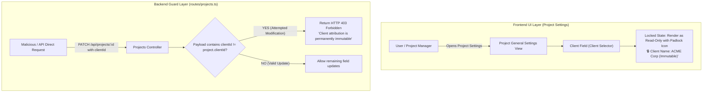

# Activate - SPH | WRICEF Functional Specification Document (FSD)

**Document Information**
- **Project Name**: SecureProfit Hub (SPH) Implementation
- **Parent Master FSD**: `10-03_Explore-05_WRICEF_Functional_Specification_FSD_SPH_v0.01.md`
- **Document Identifier**: SPH-FSD-E-DEMO-12
- **WRICEF Title**: Client Name & Attribution Immutability Lock on Converted Projects
- **WRICEF Type**: Enhancement (E)
- **Phase**: 03 - Explore / 04 - Realize
- **Workstream**: PMO Governance & Financial Audit Compliance
- **Sprint Allocation**: Sprint 2 (3 Story Points)
- **Complexity**: Simple
- **Functional Author**: Antigravity AI (PMO & Audit Track)
- **Business Process Owner**: Sari Pratiwi (PMO Lead) & Maya Anggraini (Finance Lead)
- **Version**: v0.02
- **Status**: Draft
- **Date**: 2026-08-28

---

## 1. Business Requirement & Objective
- **Business Need**: In enterprise professional services, modifying a project's client attribution post-creation causes severe audit vulnerabilities, tax invoice mismatches, corrupted billing histories, and invalid IFRS 15 revenue recognition schedules. Once a Project is spawned from a Lead or created under a Client, the Client attribution must be permanently immutable.
- **User Story**: *As a PMO Controller / Finance Auditor, I want the client name brought over upon project creation to be permanently locked against manual editing, so that client attribution cannot be modified post-creation.*
- **Trigger Event**: User opens Project Settings in `web/src/pages/ProjectDetail.tsx` or attempts an API update via `PUT /api/projects/:id` or `PATCH /api/projects/:id`.

---

## 2. Immediate Operational & System Effect Post-Implementation

> [!IMPORTANT]
> **Developer Goal & Operational Target**:
> This customization implements defense-in-depth immutability on project client attribution, preventing financial fraud, billing corruption, and tax document misalignments.

### Immediate Effects:
1. **Frontend UI Immutability**: The Client field in Project Settings is permanently disabled and rendered with a padlock icon (`🔒 Client Name (Immutable)`), preventing accidental reassignments.
2. **Backend API Defense**: The Projects controller intercepts any `PATCH /api/projects/:id` requests containing an altered `clientId` and immediately rejects them with `HTTP 403 Forbidden`.
3. **Statutory & Audit Protection**: Guarantees that historical Milestone Billing (`Stream 5`), BAST certificates, and Indonesian Tax Invoices (`F-01`) remain 100% consistent with the legal client entity without risk of post-facto tampering.

---

## 3. Functional Architecture & Data Flow



---

## 4. Detailed Functional Requirements & Business Rules

### 4.1 Frontend UI Implementation
- **Component**: `web/src/pages/ProjectDetail.tsx` (and `web/src/components/ProjectSettingsModal.tsx`).
- **Behavior**:
  - The Client selector is rendered with `disabled={true}` and `readOnly={true}`.
  - A contextual helper tooltip displays: *"Client attribution is locked post-creation for audit and compliance integrity."*
  - A padlock icon (`🔒`) is displayed beside the client name.

### 4.2 Backend Controller Guard Implementation
- **File**: `artifacts/api-server/src/routes/projects.ts` (and `artifacts/api-server/src/lib/projectValidators.ts`).
- **Validation Guard**:
  ```typescript
  // Reject any payload attempting to alter clientId post-creation
  if (req.body.clientId && req.body.clientId !== existingProject.clientId) {
    return res.status(403).json({
      error: "FORBIDDEN_MODIFICATION",
      message: "Client attribution is permanently immutable post-creation. Contact PMO for exceptional administrative reassignment."
    });
  }
  ```

---

## 5. Error Handling & Security Guard
- **API Defense-in-Depth**: Even if a user bypasses frontend UI controls via Postman or direct REST requests, the backend validation guard intercepts and rejects the request with `HTTP 403 Forbidden`.
- **Audit Logging**: Any rejected attempt to modify `clientId` is logged in `AuditLog` table with user identity and timestamp.

---

## 6. Test Scenarios & Acceptance Criteria

| Test Case ID | Test Scenario | Input Data | Expected Result | Pass / Fail |
| :---: | :--- | :--- | :--- | :---: |
| **TC-DEMO-12-01** | UI disabled state verification | Open Project Settings | Client field is disabled and displays padlock icon | [ ] |
| **TC-DEMO-12-02** | Direct API mutation defense | Send `PATCH /api/projects/:id` with new `clientId` | Request rejected with `HTTP 403 Forbidden` | [ ] |
| **TC-DEMO-12-03** | Standard project updates | Send `PATCH` updating project name/description | Request succeeds; client remains unchanged | [ ] |

---

## 7. Sign-off and Approvals

| Stakeholder Role | Name & Title | Signature | Date |
| :--- | :--- | :--- | :--- |
| **PMO Process Owner** | | ____________________ | YYYY-MM-DD |
| **Finance Process Owner** | | ____________________ | YYYY-MM-DD |
| **Lead Technical Architect** | | ____________________ | YYYY-MM-DD |

---

## 8. Document Revision History

| Version | Date | Author / Role | Summary of Changes |
| :---: | :--- | :--- | :--- |
| `v0.01` | 2026-08-28 | Antigravity AI | Initial functional specification creation. |
| `v0.02` | 2026-08-28 | Antigravity AI | Added dedicated Section 2: Immediate Operational & System Effect Post-Implementation. |
