# Master Recommendation Clarification & Go/No-Go Coverage Record

**Document Title**: SecureProfit Hub (SPH) — 12 FSD Master Recommendation Clarification & Go/No-Go Verification  
**Artifact ID**: `SPH-REC-CLARIF-01`  
**Current Version**: `v0.07` (Decision Baseline Candidate — Final Pre-Signoff Draft)  
**Status**: 🔄 **[SOURCE: AUTHOR REVIEW 2 - ITEM #1]** `Decision Baseline Candidate — Pending Stakeholder Approval and Implementation Validation`  
**Source Baseline Reference**: `Knowledge repository (read-only)/SecureProfitHub/Source code - 20 Aug 2026` (Commit `c7080af`)  
**Primary Master Audit**: `SecureProfit-Hub-Master-Recommendation-All-12-FSD-ID-2026-08.docx` (Version 2.0, 30 August 2026)  
**Author Review 1 Feedback**: `SPH-12-FSD-Required-Revisions-Response-ID.docx` (Dated 31 August 2026)  
**Author Review 2 Feedback**: `SPH-12-FSD-v0.06-Review-and-Remaining-Revisions-ID -2.docx` (Dated 1 September 2026)  
**Target Working Artifacts Location**: `SAP Activate artifacts/Activate - SPH/10_Working Artifacts/`  
**Date**: 1 September 2026  

---

## 📜 Document Control & Revision History

| Version | Release Date | Author / Role | Summary of Changes / Evolution & Source Reference | Status |
| :---: | :---: | :---: | :--- | :---: |
| **`v0.01`** | 31 Aug 2026 | Enterprise Solution Architect | Initial synthesis of all 21 Open Clarification Questions from Section 16 of the Master Rec document with Bahasa Indonesia source, English translations, simplest-term summaries, best-practice resolutions, and Go/No-Go coverage matrix. *(Source: Master Rec Document v2.0)* | Superseded |
| **`v0.02`** | 31 Aug 2026 | Enterprise Solution Architect | Deep architectural expansion adding Prisma DDL models, Express API contracts, HTTP error codes, KaTeX mathematical formulas (PPN 11%, Gross Margin %, NRR, EVM), and Separation of Duties (SoD) rules. *(Source: Codebase c7080af Audit)* | Superseded |
| **`v0.03`** | 31 Aug 2026 | Enterprise Solution Architect | Introduced dedicated, prominent **"Proposed Decision & Business Rationale"** blocks (Decisions 1.1 to 9.1) with narrative plain-English descriptions preceding all technical specifications. *(Source: Stakeholder Design Directives)* | Superseded |
| **`v0.04`** | 31 Aug 2026 | Enterprise Solution Architect | Explicitly designated all technical sections as **`(Optional / Reference Example)`**, clarifying that code snippets and schemas are illustrative reference patterns for the author/implementer. *(Source: Stakeholder Alignment)* | Superseded |
| **`v0.05`** | 31 Aug 2026 | Enterprise Solution Architect | Integrated dedicated **`Operational Ambiguity & Resolved Edge Case`** blocks across all 21 items. *(Source: Operational Risk Audit)* | Superseded |
| **`v0.06`** | 1 Sep 2026 | Enterprise Solution Architect | Decision Baseline Candidate incorporating 14 major revisions: status split, DEMO-12 Phase 1 vs Phase 2 split, dual PMO/Finance approvals, invoice financial states, actual roles, primary sector, join otherDetail, normalized secondary BU, Pipedrive mapping, configurable VAT snapshot. *(Source: Author Review 1 - SPH-12-FSD-Required-Revisions-Response-ID.docx)* | Superseded |
| **`v0.07`** | 1 Sep 2026 | Enterprise Solution Architect | 🔄 **[SOURCE: AUTHOR REVIEW 2]** **Final Pre-Signoff Decision Baseline Candidate**: (1) Harmonized decision statuses to `PROPOSED`, `PENDING APPROVAL`, and `APPROVED / IMPLEMENTED`; (2) Added full **FSD Traceability Matrix (DEMO-01 to DEMO-12)**; (3) Added dedicated **DEMO-11 Project Baseline Auto-Sync Section**; (4) Added PostgreSQL Partial Unique Index for primary sector; (5) Refactored DEMO-12 Phase 2 dual-status state machine (`pmoStatus`, `financeStatus`, `executedBy`); (6) Defined single-instance Pipedrive connection key; (7) Harmonized lead numbering gap wording & out-of-transaction audit; (8) Replaced all machine-local links with portable repository-relative paths. | **Current Active Candidate** |
| *`v1.00`* | *Upcoming* | *Project Lead / Stakeholders* | Formal baseline promotion upon final stakeholder sign-off and implementation validation. | *Pending Sign-off* |

---

## 1. Executive Summary & Context

This artifact establishes the formal technical baseline, **proposed business decisions**, **resolved operational ambiguities**, **reference implementation specifications**, and a **comprehensive FSD traceability matrix** for all **21 Open Business & Architectural Decisions** identified in Section 16 of the *Master Recommendation Document (v2.0, 30 August 2026)* for the 12 WRICEF Functional Specification Documents (`DEMO-01` through `DEMO-12`).

It strictly integrates all feedback from **Author Review 1** (`SPH-12-FSD-Required-Revisions-Response-ID.docx`) and **Author Review 2** (`SPH-12-FSD-v0.06-Review-and-Remaining-Revisions-ID -2.docx`) by distinguishing **current codebase reality** from **proposed target architecture**, ensuring transparent governance across the Lead-to-Project lifecycle.

```mermaid
flowchart LR
    subgraph Intake ["1. Commercial Intake & Lineage"]
        direction TB
        D01["DEMO-01: Industry Sector (Normalized + Partial Index)"]
        D03["DEMO-03: Client Contacts (Point-in-Time Snapshot)"]
        D04["DEMO-04: BU & Principal Mapping (MANAGEMENT Authority)"]
        D05["DEMO-05: Deal Lineage & NRR (Project-Only Anchor)"]
        D06["DEMO-06: Atomic Sequential Lead ID (Out-of-Tx Audit)"]
    end

    subgraph Governance ["2. Presales & Margin Governance"]
        direction TB
        D09["DEMO-09: Opt-In Presales CAC (Isolated from Delivery EVM)"]
        D08["DEMO-08: Stage Probability Policy (Audited Overrides)"]
        D02["DEMO-02: Offering Catalog Snapshots (Immutable Lines)"]
        D07["DEMO-07: Inbound CRM Sync (PipedriveProductMapping)"]
        D10["DEMO-10: Versioned Finance Gate (Decimal VAT Snapshot)"]
    end

    subgraph Delivery ["3. Delivery & Baseline Control"]
        direction TB
        D11["DEMO-11: Baseline Auto-Sync (ACTIVATION vs CR)"]
        D12P1["DEMO-12 Phase 1: Hard Lock (BUILT in c7080af)"]
        D12P2["DEMO-12 Phase 2: Dual Approval Workflow (TARGET DESIGN)"]
    end

    Intake --> Governance --> Delivery
```



---

## 2. Proposed Decisions, Resolved Ambiguities & Technical Specifications (Questions 1 to 21)

---

### 🏷️ Category 1: Industry Sector Classification (`DEMO-01`)

---

#### Question 1: Catalog Governance & Hierarchy
* **Bahasa Indonesia**: *"Siapa pemilik catalog sektor dan apakah hierarchy/sub-sector diperlukan?"*
* **English Translation**: "Who owns the sector catalog, and is a hierarchy/sub-sector structure required?"
* **In the Simplest Terms**: Only Admins can manage the master list of sectors. We start with a clean flat list of sectors, but design the database table with an optional parent ID so sub-sectors can be added later without schema migrations.
* **Proposed Decision & Business Rationale**:
  > **Decision 1.1** `[PENDING APPROVAL]`: Centralize catalog administration exclusively under `SITE_ADMIN` and `MANAGEMENT` roles. Implement a flat operational list of sectors for initial go-live while incorporating a self-referencing `parentSectorId` column in the database model. *(Source: Master Rec Doc Section 16 & Author Review 1)*  
  > **Rationale**: Ungoverned sector creation leads to messy duplicates (e.g., "Fintech" vs "Financial Technology"). Building the parent-child relationship into the data model now allows future sub-sector rollouts without disruptive database migrations.
* **Operational Ambiguity & Resolved Edge Case**:
  - *Ambiguity*: If an admin creates sub-sectors in the future (e.g. `Financial Services` $\rightarrow$ `Digital Banking`), can users select both a parent and child sector on the same lead?
  - *Resolved Policy*: If a sub-sector exists, selecting the child automatically tags the deal with the parent for roll-up reporting. Users cannot create redundant double entries for both parent and child.
* **Technical Implementation Specification (Optional / Reference Example)**:
  - **Prisma Schema DDL (Example)**:
    ```prisma
    model IndustrySector {
      id             String           @id @default(cuid())
      code           String           @unique // e.g. "FIN_BANKING", "GOV_PUBLIC"
      name           String           // e.g. "Banking & Financial Services"
      description    String?
      isActive       Boolean          @default(true)
      sortOrder      Int              @default(0)
      parentSectorId String?
      parentSector   IndustrySector?  @relation("SectorHierarchy", fields: [parentSectorId], references: [id])
      subSectors     IndustrySector[] @relation("SectorHierarchy")
      createdAt      DateTime         @default(now())
      updatedAt      DateTime         @updatedAt

      leadSectors    LeadSector[]
      clientSectors  ClientSector[]

      @@index([isActive, sortOrder])
    }
    ```
  - **API Contract (Example)**:
    - `GET /api/industry-sectors?isActive=true`: Open to all authenticated users.
    - `POST /api/admin/industry-sectors`: Restricted to `SITE_ADMIN` / `MANAGEMENT`. Returns `201 Created`.
    - `PATCH /api/admin/industry-sectors/:id`: Soft-deactivates or updates names. Returns `200 OK`.

---

#### Question 2: Mandatory Stage Enforcement
* **Bahasa Indonesia**: *"Pada stage apa 1–5 sektor menjadi mandatory?"*
* **English Translation**: "At what stage does selecting 1–5 sectors become mandatory?"
* **In the Simplest Terms**: Don't make sectors mandatory when quickly creating a draft lead. Make it mandatory only when qualifying the deal or preparing a formal proposal.
* **Proposed Decision & Business Rationale**:
  > **Decision 1.2** `[PENDING APPROVAL]`: Keep sector assignment optional (`0..5`) during initial lead capture (`NEW` stage). Enforce the mandatory rule (minimum 1, maximum 5 active sectors) server-side when advancing the lead to `QUALIFIED` or `PROPOSAL` stage. *(Source: Master Rec Doc Section 16 & Author Review 1)*  
  > **Rationale**: Forcing mandatory classification at creation causes fast intake, bulk CSV uploads, and Pipedrive inbound webhooks to fail whenever sector info is not immediately known.
* **Operational Ambiguity & Resolved Edge Case**:
  - *Ambiguity*: What happens if a lead is imported from CSV without sectors, and a salesperson immediately tries to submit a proposal (`PROPOSAL` stage)?
  - *Resolved Policy*: The API rejects the transition with `422 Unprocessable Entity`, prompting the user with a modal: *"Please assign at least 1 industry sector before advancing to Proposal stage"*.
* **Technical Implementation Specification (Optional / Reference Example)**:
  - **Validation Logic (Example)**:
    ```typescript
    // Inside PATCH /api/leads/:id/stage
    if (targetStage === 'QUALIFIED' || targetStage === 'PROPOSAL') {
      const activeSectorCount = await prisma.leadSector.count({
        where: { leadId, sector: { isActive: true } }
      });
      if (activeSectorCount < 1 || activeSectorCount > 5) {
        return res.status(422).json({
          error: "SECTOR_VALIDATION_FAILED",
          message: "Lead must have between 1 and 5 active industry sectors before advancing to QUALIFIED or PROPOSAL stage."
        });
      }
    }
    ```

---

#### Question 3: Client Sectors Snapshot & `otherDetail` Placement
* **Bahasa Indonesia**: *"Apakah Client sectors menjadi default snapshot atau live inheritance pada Lead?"*
* **English Translation**: "Should Client sectors be a default point-in-time snapshot or live inheritance on the Lead?"
* **In the Simplest Terms**: It is a snapshot. When creating a lead, the system auto-fills the client's sectors as a starting suggestion, but sales can adjust them for that specific deal without altering the client's master record.
* **Proposed Decision & Business Rationale**:
  > **Decision 1.3** `[PENDING APPROVAL]`: Implement a **Point-in-Time Snapshot** mechanism. When a Lead is created with a selected Client, the client's current sectors are copied into `LeadSector` join records. Sales can customize sectors for the opportunity without mutating the master Client record.  
  > **Decision 1.3b** `[PENDING APPROVAL]`: Place `otherDetail: String?` directly on the join tables (`LeadSector` and `ClientSector`) rather than on the root `Lead` table. *(Source: Author Review 1 - Revision #8)*  
  > **Rationale**: A client company may operate in Banking, but a specific lead may be purely for their Healthcare insurance subsidiary. Placing `otherDetail` on the join record ensures clean multi-tenant and multi-sector precision without root table ambiguity.
* **Operational Ambiguity & Resolved Edge Case**:
  - *Ambiguity*: For unregistered prospective clients, how are contacts and sectors handled when the prospect is later formally converted into a real `Client`?
  - *Resolved Policy*: During deal conversion (`POST /leads/:id/convert`), the API automatically migrates the lead's scalar contact and custom `LeadSector` records into the newly created `Client` master profile as default initial values.
* **Technical Implementation Specification (Optional / Reference Example)**:
  - **Join Models with otherDetail (Example)**:
    ```prisma
    model ClientSector {
      id          String         @id @default(cuid())
      clientId    String
      client      Client         @relation(fields: [clientId], references: [id], onDelete: Cascade)
      sectorId    String
      sector      IndustrySector @relation(fields: [sectorId], references: [id])
      isPrimary   Boolean        @default(false)
      otherDetail String?        // Specific text when sector code == "OTHER"
      createdAt   DateTime       @default(now())

      @@unique([clientId, sectorId])
    }

    model LeadSector {
      id          String         @id @default(cuid())
      leadId      String
      lead        Lead           @relation(fields: [leadId], references: [id], onDelete: Cascade)
      sectorId    String
      sector      IndustrySector @relation(fields: [sectorId], references: [id])
      isPrimary   Boolean        @default(false)
      otherDetail String?        // Specific text when sector code == "OTHER"
      source      String         @default("CLIENT_SNAPSHOT") // CLIENT_SNAPSHOT | MANUAL_OVERRIDE
      createdAt   DateTime       @default(now())

      @@unique([leadId, sectorId])
    }
    ```

---

#### Question 4: Multi-Sector Pipeline Attribution & PostgreSQL Partial Unique Index
* **Bahasa Indonesia**: *"Bagaimana multi-sector value attribution mencegah double counting?"*
* **English Translation**: "How does multi-sector value attribution prevent double counting in pipeline analytics?"
* **In the Simplest Terms**: In executive summary dashboards, each lead is counted once for total company revenue. In sector breakdown charts, deals are categorized by their primary sector.
* **Proposed Decision & Business Rationale**:
  > **Decision 1.4** `[PENDING APPROVAL]`: Implement a **Two-Tier Attribution Architecture**: (1) Executive total pipeline metrics use strict distinct-lead aggregation. (2) Sector breakdown reports categorize revenue by the `isPrimary = true` sector for 100% additive slices, alongside an optional cross-sector tag frequency matrix.  
  > 🔄 **[SOURCE: AUTHOR REVIEW 2 - ITEM #6]** **Decision 1.4b** `[PENDING APPROVAL]`: Enforce the strict invariant: **If a Lead has $\ge 1$ sector assigned, EXACTLY ONE sector must have `isPrimary = true`**. Concurrency protection is guaranteed via a **PostgreSQL Partial Unique Index** and advisory locking during transaction updates.  
  > **Rationale**: Naive grouping by sector multiplies total pipeline value across sectors. The partial unique index at the database layer makes it physically impossible for concurrent API calls to mark multiple sectors as primary for the same lead.
* **Operational Ambiguity & Resolved Edge Case**:
  - *Ambiguity*: How is the `isPrimary` sector chosen when multiple sectors are assigned in the UI?
  - *Resolved Policy*: When multiple sectors are selected, the first selected sector defaults to `isPrimary = true`. The UI provides an explicit star/radio selector allowing the salesperson to designate a different primary sector.
* **Technical Implementation Specification (Optional / Reference Example)**:
  - 🔄 **[SOURCE: AUTHOR REVIEW 2 - ITEM #6]** **PostgreSQL Partial Unique Index Migration (Example)**:
    ```sql
    -- Enforce that at most one LeadSector per lead can be marked isPrimary = true
    CREATE UNIQUE INDEX one_primary_sector_per_lead 
    ON "LeadSector" ("leadId") 
    WHERE "isPrimary" = true;
    ```
  - **Atomic Primary Switch Transaction with Advisory Lock (Example)**:
    ```typescript
    await prisma.$transaction(async (tx) => {
      // 1. Acquire per-lead transaction advisory lock
      await tx.$executeRaw`SELECT pg_advisory_xact_lock(hashtext(${leadId}))`;

      // 2. Reset existing primary flags for the lead
      await tx.leadSector.updateMany({
        where: { leadId },
        data: { isPrimary: false }
      });

      // 3. Set the new designated primary sector
      await tx.leadSector.update({
        where: { leadId_sectorId: { leadId, sectorId: newPrimarySectorId } },
        data: { isPrimary: true }
      });
    });
    ```

---

#### Question 5: Handling "OTHER", Inactive Sector Historical Validation, & CRM Ingestion
* **Bahasa Indonesia**: *"Bagaimana OTHER, sector deactivation, dan Pipedrive unknown mapping ditangani?"*
* **English Translation**: "How are 'OTHER', sector deactivation, and unmapped Pipedrive sectors handled?"
* **In the Simplest Terms**: If someone picks "OTHER", they must write a description. Deactivated sectors stay valid on old leads for history, but can't be chosen for new ones. Unknown sectors from CRM go to a review queue instead of making junk data.
* **Proposed Decision & Business Rationale**:
  > **Decision 1.5** `[PENDING APPROVAL]`: Enforce mandatory text details when selecting the `"OTHER"` sector code; apply soft-deletion (`isActive = false`) to preserve historical joins; and route unrecognized CRM sectors into a dedicated `UNCLASSIFIED` quarantine queue for admin review.  
  > 🔄 **[SOURCE: AUTHOR REVIEW 2 - ITEM #5]** **Decision 1.5b** `[PENDING APPROVAL]`: **Harmonized Inactive Sector Lifecycle**: Deactivated sectors remain valid for historical classification and reporting; existing historical leads retain their classification without error on unrelated edits; deactivated sectors are blocked from new assignments; and the system prompts `SECTOR_RECLASSIFICATION_REQUIRED` only upon major deal renegotiations or scope revisions.  
  > **Rationale**: Prevents users from abusing "OTHER" without explanation, and ensures that retiring an industry sector does not retroactively break validation on thousands of historical leads.
* **Technical Implementation Specification (Optional / Reference Example)**:
  - 🔄 **[SOURCE: AUTHOR REVIEW 2 - ITEM #5]** **Historical-Aware Validation Logic (Example)**:
    ```typescript
    // Validation allows existing inactive assignments, but blocks new inactive selections
    async function validateLeadSectorAssignments(leadId: string, requestedSectorIds: string[], isNewAssignment: boolean) {
      if (isNewAssignment) {
        const inactiveRequested = await prisma.industrySector.count({
          where: { id: { in: requestedSectorIds }, isActive: false }
        });
        if (inactiveRequested > 0) {
          throw new Error("CANNOT_ASSIGN_DEACTIVATED_SECTOR: One or more selected sectors are deactivated for new deals.");
        }
      }
      
      // Check that existing leads retain valid historical count
      const totalCount = await prisma.leadSector.count({ where: { leadId } });
      if (totalCount === 0) {
        throw new Error("SECTOR_RECLASSIFICATION_REQUIRED: Lead must be assigned at least one valid industry sector.");
      }
    }
    ```

---

### 🏢 Category 2: Organization Structure & Principal Routing (`DEMO-03` & `DEMO-04`)

---

#### Question 6: Business Unit (BU) Cardinality & Normalized Secondary BUs
* **Bahasa Indonesia**: *"Satu atau banyak BU per Lead?"*
* **English Translation**: "Single or multiple Business Units per Lead?"
* **In the Simplest Terms**: Exactly one Primary BU owns the deal for commercial accountability. If other departments help, they join through project workstreams upon project creation.
* **Proposed Decision & Business Rationale**:
  > **Decision 2.1** `[PENDING APPROVAL]`: Exactly **one Primary Business Unit** (`primaryBusinessUnitId`) per `Lead`.  
  > **Decision 2.1b** `[PENDING APPROVAL]`: Replace scalar string arrays with a **Normalized Junction Table (`LeadSupportingBusinessUnit`)** to record secondary/participating BUs with full referential integrity and role attribution during proposal/presales. Multi-BU delivery participation is formally realized via `ProjectWorkstream` records upon project conversion. *(Source: Author Review 1 - Revision #9)*  
  > **Rationale**: Single Primary BU ownership ensures unambiguous sales quota attribution and deterministic approval routing, while a normalized supporting BU table enables cross-practice collaboration without corrupting referential integrity.
* **Operational Ambiguity & Resolved Edge Case**:
  - *Ambiguity*: How do secondary BUs participate during the proposal stage before project conversion?
  - *Resolved Policy*: Secondary BU Principals recorded in `LeadSupportingBusinessUnit` receive read access and presales task assignment capabilities, while the Primary BU Principal retains sole commercial budget sign-off authority.
* **Technical Implementation Specification (Optional / Reference Example)**:
  - **Prisma Schema (Example)**:
    ```prisma
    model BusinessUnit {
      id          String   @id @default(cuid())
      code        String   @unique // e.g. "BU-SEC", "BU-CLOUD", "BU-GOV"
      name        String   @unique
      description String?
      isActive    Boolean  @default(true)
      createdAt   DateTime @default(now())
      updatedAt   DateTime @updatedAt

      leadsPrimary        Lead[]
      leadsSupporting     LeadSupportingBusinessUnit[]
      principals          BusinessUnitPrincipal[]
      users               User[]
    }

    model LeadSupportingBusinessUnit {
      id                  String       @id @default(cuid())
      leadId              String
      lead                Lead         @relation(fields: [leadId], references: [id], onDelete: Cascade)
      businessUnitId      String
      businessUnit        BusinessUnit @relation(fields: [businessUnitId], references: [id])
      assignedPrincipalId String?
      assignedPrincipal   User?        @relation(fields: [assignedPrincipalId], references: [id])
      role                String?      // e.g. "Cloud Architecture Support", "Security Audit"
      createdAt           DateTime     @default(now())

      @@unique([leadId, businessUnitId])
    }
    ```

---

#### Question 7: Principal Assignment & Leave-Aware Fallback Routing
* **Bahasa Indonesia**: *"Satu atau banyak Principal per BU dan fallback?"*
* **English Translation**: "Single or multiple Principals per BU, and what is the fallback routing?"
* **In the Simplest Terms**: A BU can have multiple Principals. One is designated as the Primary Approver, with an automated fallback to a Backup Principal if the primary is on leave.
* **Proposed Decision & Business Rationale**:
  > **Decision 2.2** `[PENDING APPROVAL]`: Introduce a `BusinessUnitPrincipal` junction table supporting multiple Principals per BU with explicit `isPrimary: Boolean` flags and an automated leave-aware fallback routing engine.  
  > **Decision 2.2b** `[PENDING APPROVAL]`: Use actual system roles (`PRINCIPAL_KONSULTAN`, `PRINCIPAL_TECHNICAL_WRITER`, `PRINCIPAL_ADMIN_PROJECT`) and explicitly map PMO approval authority to `MANAGEMENT`. *(Source: Author Review 1 - Revision #5)*  
  > **Rationale**: Without a structured mapping table and leave integration, approval workflows stall indefinitely whenever a single key Principal is out of office.
* **Operational Ambiguity & Resolved Edge Case**:
  - *Ambiguity*: If both the Primary and Backup Principals are active and in the office, can the Backup Principal approve a budget?
  - *Resolved Policy*: Yes. Any designated Principal belonging to that BU can approve, but the system alerts the Primary Principal. If the Primary is on approved leave (`UserLeave`), tasks automatically reassign to the Backup Principal without manual intervention.
* **Technical Implementation Specification (Optional / Reference Example)**:
  - **Dynamic Fallback Resolver (Example)**:
    ```typescript
    async function resolveApprovingPrincipal(businessUnitId: string): Promise<string> {
      const principals = await prisma.businessUnitPrincipal.findMany({
        where: { businessUnitId, user: { isActive: true } },
        include: {
          user: {
            include: {
              leaves: {
                where: { startDate: { lte: new Date() }, endDate: { gte: new Date() } }
              }
            }
          }
        },
        orderBy: [{ isPrimary: 'desc' }, { createdAt: 'asc' }]
      });

      const activePrincipal = principals.find(p => p.user.leaves.length === 0);
      if (activePrincipal) return activePrincipal.userId;

      // Fallback to Management role if all BU principals are on leave
      const fallbackAdmin = await prisma.user.findFirst({ where: { role: 'MANAGEMENT', isActive: true } });
      return fallbackAdmin!.id;
    }
    ```

---

### 🌲 Category 3: Lead Identity, Types, & Lineage (`DEMO-05` & `DEMO-06`)

---

#### Question 8: Deal Types & Net Revenue Retention (NRR) Formula
* **Bahasa Indonesia**: *"Rules NEW/RENEWAL/UP_SELL/CROSS_SELL serta NRR formula?"*
* **English Translation**: "What are the rules for NEW/RENEWAL/UP_SELL/CROSS_SELL deal types and the NRR formula?"
* **In the Simplest Terms**: `NEW` is a new customer or product. `RENEWAL` and `UP_SELL` must link to an existing active project with the same client. NRR measures how much revenue we retain and grow from existing clients.
* **Proposed Decision & Business Rationale**:
  > **Decision 3.1** `[PENDING APPROVAL]`: Establish 4 strict `LeadType` enum values (`NEW_OPPORTUNITY`, `RENEWAL`, `UP_SELL`, `CROSS_SELL`). Mandate `parentProjectId` for `RENEWAL` and `UP_SELL`. Standardize NRR calculation based on cohort ARR expansion, contraction, and churn. *(Source: Master Rec Doc Section 16)*  
  > **Rationale**: Creating renewals without an existing contract link makes it impossible to calculate customer retention or identify recurring revenue expansion.
* **Operational Ambiguity & Resolved Edge Case**:
  - *Ambiguity*: In multi-year consulting retainers (e.g. 3-year contract worth Rp 3.6 Billion), how is ARR calculated for NRR?
  - *Resolved Policy*: For recurring/retainer contracts, the system annualizes contract value: $\text{ARR} = \frac{\text{Contract Value}}{\text{Duration in Months} / 12}$. For fixed-price one-off projects, revenue expansions are reported under a dedicated "Project Expansion" KPI rather than recurring SaaS NRR.
* **Technical Implementation Specification (Optional / Reference Example)**:
  - **NRR Mathematical Formula**:
    $$\text{NRR}_{\text{Cohort}} = \frac{\sum \text{Starting ARR} + \sum \text{Expansion ARR} - \sum \text{Contraction ARR} - \sum \text{Churn ARR}}{\sum \text{Starting ARR}} \times 100\%$$

---

#### Question 9: Permitted Lineage Anchor (Parent Project vs. Parent Lead)
* **Bahasa Indonesia**: *"Apakah parent Lead diizinkan atau hanya parent Project?"*
* **English Translation**: "Is a parent Lead allowed, or strictly a parent Project?"
* **In the Simplest Terms**: Deals can only link to an existing completed or active Project. Linking lead-to-lead is forbidden to prevent infinite loops and confusing history.
* **Proposed Decision & Business Rationale**:
  > **Decision 3.2** `[PENDING APPROVAL]`: Restrict deal lineage strictly to parent `Project` records (`parentProjectId`). Disallow lead-to-lead parentage. *(Source: Master Rec Doc Section 16)*  
  > **Rationale**: Lead-to-lead links create circular graph loops (Lead A $\rightarrow$ Lead B $\rightarrow$ Lead A) and orphan dependencies when leads are deleted or lost. Anchoring to executed `Project` records guarantees solid contractual lineage.
* **Operational Ambiguity & Resolved Edge Case**:
  - *Ambiguity*: For `CROSS_SELL` deals where a client has multiple past projects across different BUs, is `parentProjectId` mandatory?
  - *Resolved Policy*: `parentProjectId` is **optional for `CROSS_SELL`** (mandatory only for `RENEWAL` and `UP_SELL`). If the salesperson knows the referring engagement, they link the specific project; otherwise, linking to the verified `clientId` satisfies the cross-sell requirement.
* **Technical Implementation Specification (Optional / Reference Example)**:
  - **Prisma Model (Example)**:
    ```prisma
    // In Model Lead:
    parentProjectId String?
    parentProject   Project? @relation("ProjectDealLineage", fields: [parentProjectId], references: [id])
    ```

---

#### Question 10: Sequential Lead Numbering, Atomic Allocation & Out-of-Transaction Audit
* **Bahasa Indonesia**: *"Lead numbering format/timezone?"*
* **English Translation**: "What is the Lead numbering format and timezone rule?"
* **In the Simplest Terms**: Lead numbers are generated automatically in Jakarta time (e.g., `LEAD-2026-0001`). The database guarantees numbers are never duplicated. If a server crash causes a skipped number, the system logs the reason in an audit record.
* **Proposed Decision & Business Rationale**:
  > **Decision 3.3** `[PENDING APPROVAL]`: Adopt the sequential format `LEAD-{YYYY}-{0000}` resetting annually on January 1 at 00:00 `Asia/Jakarta` (WIB/UTC+7).  
  > 🔄 **[SOURCE: AUTHOR REVIEW 2 - ITEM #4]** **Decision 3.3b** `[PENDING APPROVAL]`: **Harmonized Atomic Lead Allocation & Audit**:  
  > *"Lead numbers are allocated atomically to guarantee uniqueness and prevent duplication. Exceptional gaps may occur under ambiguous infrastructure failures and must be reconciled and audited outside the failed transaction."*  
  > **Rationale**: Allocating sequence numbers inside database transactions guarantees uniqueness. If an outer transaction aborts or encounters a network drop after sequence generation, logging the aborted sequence counter in an independent out-of-transaction audit record ensures compliance reconciliation without transaction rollback interference.
* **Technical Implementation Specification (Optional / Reference Example)**:
  - **Atomic Allocator with Out-of-Transaction Audit Handling (Example)**:
    ```typescript
    async function allocateNextLeadNumber(): Promise<string> {
      const now = new Date();
      const jakartaYear = parseInt(
        new Intl.DateTimeFormat("en-US", { timeZone: "Asia/Jakarta", year: "numeric" }).format(now),
        10
      );

      try {
        const counter = await prisma.$transaction(async (tx) => {
          return await tx.leadNumberCounter.upsert({
            where: { year: jakartaYear },
            update: { currentSequence: { increment: 1 } },
            create: { year: jakartaYear, currentSequence: 1 },
          });
        });

        return `LEAD-${jakartaYear}-${String(counter.currentSequence).padStart(4, '0')}`;
      } catch (err: any) {
        // Out-of-transaction audit log to record potential gap/failure
        await prisma.auditLog.create({
          data: {
            action: "LEAD_NUMBER_ALLOCATION_FAILED",
            entityType: "Lead",
            details: { year: jakartaYear, error: err.message }
          }
        });
        throw err;
      }
    }
    ```

---

### 🛡️ Category 4: Presales Workspace & Cost Capture (`DEMO-09`)

---

#### Question 11: Presales Workspace Creation Timing & Authority
* **Bahasa Indonesia**: *"Kapan PRESALES workspace dibuat dan siapa yang boleh memulai?"*
* **English Translation**: "When is a PRESALES workspace created, and who is authorized to initiate it?"
* **In the Simplest Terms**: Never auto-create projects for every lead. Sales or Principals can click "Start Presales Workspace" only when a lead is qualified and needs technical effort.
* **Proposed Decision & Business Rationale**:
  > **Decision 4.1** `[PENDING APPROVAL]`: **Strictly Opt-In Presales Workspace**. A workspace is never auto-spawned on lead creation. It can only be initiated via explicit user action (`POST /api/leads/:id/presales-workspace`) by the assigned `SALES` owner or BU `PRINCIPAL_KONSULTAN` once the lead reaches `QUALIFIED` stage. *(Source: Master Rec Doc Section 16 & Author Review 1)*  
  > **Rationale**: Auto-creating projects for every inbound lead causes project dashboard explosion, leaks confidential prospect data, and creates orphan records for deals that never progress.
* **Operational Ambiguity & Resolved Edge Case**:
  - *Ambiguity*: Can a deal be won and converted to a delivery project if a presales workspace was never created (e.g. standard repeat transaction)?
  - *Resolved Policy*: Yes. Having a presales workspace is optional. If no presales workspace exists, deal conversion proceeds directly to creating the delivery project.
* **Technical Implementation Specification (Optional / Reference Example)**:
  - **Workspace Lifecycle Handler (Example)**:
    ```typescript
    // Inside POST /api/leads/:id/presales-workspace
    if (lead.stage === 'NEW' || !lead.clientId || !lead.primaryBusinessUnitId) {
      return res.status(422).json({
        error: "LEAD_NOT_ELIGIBLE_FOR_PRESALES",
        message: "Lead must have a valid client and BU assigned before starting a presales workspace."
      });
    }
    if (lead.presalesProjectId) {
      return res.status(409).json({ error: "PRESALES_WORKSPACE_ALREADY_EXISTS" });
    }

    const presalesProject = await tx.project.create({
      data: {
        name: `[PRESALES] ${lead.title}`,
        kind: 'PRESALES',
        status: 'OBSERVATION',
        clientId: lead.clientId,
        salesId: lead.ownerId,
        autoArchiveExempt: true,
        useWorkstreams: false,
        tasks: {
          create: [
            { title: "PRE-01 Proposal & Architecture Design", status: "TODO" },
            { title: "PRE-02 Solution Demo & PoC", status: "TODO" },
            { title: "PRE-03 Commercial Costing & SOW Drafting", status: "TODO" }
          ]
        }
      }
    });
    ```

---

#### Question 12: Won Deal Conversion (Promotion vs. Dedicated Delivery Project)
* **Bahasa Indonesia**: *"Saat WON: promote PRESALES workspace atau create delivery Project terpisah?"*
* **English Translation**: "When a deal is WON: promote the PRESALES workspace or create a separate delivery Project?"
* **In the Simplest Terms**: Create a fresh, official delivery Project with its own project code, link it to the Lead, and close the presales workspace.
* **Proposed Decision & Business Rationale**:
  > **Decision 4.2** `[PENDING APPROVAL]`: Implement a **Deterministic Conversion Flow**. When a lead is marked `WON`, create a dedicated delivery `Project` (`ProjectKind.CLIENT`) with an official project code (`PRJ-YYYY-NNNN`), transfer the approved commercial scope/budget, link `Lead.convertedProjectId = project.id`, and transition the linked presales workspace to `ProjectStatus.CLOSED`. *(Source: Master Rec Doc Section 16)*  
  > **Rationale**: Converting the presales workspace directly into a delivery project mixes proposal drafting tasks with actual client deliverable milestones and confuses delivery project status history.
* **Operational Ambiguity & Resolved Edge Case**:
  - *Ambiguity*: If a deal is marked `LOST`, what happens to the presales workspace?
  - *Resolved Policy*: Transition the presales workspace to `ProjectStatus.CLOSED` with `lastStatusReason = "DEAL_LOST"`. All logged hours and expenses remain preserved for CAC efficiency analytics.
* **Technical Implementation Specification (Optional / Reference Example)**:
  - **Conversion Steps (Example)**:
    1. Verify current `CommercialBudgetRevision` is in status `APPROVED`.
    2. Allocate sequential `projectId` (e.g. `PRJ-2026-0042`) using `nextProjectId()`.
    3. Insert `Project` (`kind: 'CLIENT'`, `status: 'DRAFT'`, `contractValue: approvedRevision.dppAmount`, `estimatedCost: approvedRevision.totalCost`).
    4. If `lead.presalesProjectId` exists, update `presalesProject.status = 'CLOSED'`, `closedAt = new Date()`.
    5. Update `lead.stage = 'WON'`, `lead.wonAt = new Date()`, `lead.convertedProjectId = deliveryProject.id`.

---

#### Question 13: Presales Cost Accounting (CAC vs. Delivery EVM)
* **Bahasa Indonesia**: *"Apakah presales cost menjadi bagian project total cost atau separate CAC ledger/report?"*
* **English Translation**: "Is presales cost part of the total project delivery cost or a separate CAC ledger/report?"
* **In the Simplest Terms**: Keep presales costs in a separate CAC (Customer Acquisition Cost) report. Do not add it to the delivery project so project delivery profit and EVM stay 100% accurate.
* **Proposed Decision & Business Rationale**:
  > **Decision 4.3** `[PENDING APPROVAL]`: **Hard Isolation of Presales Costs into Commercial CAC**. Presales timesheets and expenses are booked to `ProjectKind.PRESALES` and reported under Customer Acquisition Cost (CAC). They are strictly excluded from the delivery project's Planned Value (PV), Budget at Completion (BAC), and client billing milestones. *(Source: Master Rec Doc Section 16)*  
  > **Rationale**: Mixing presales proposal hours into delivery project costs artificially depresses delivery gross margin and corrupts Earned Value Management (EVM) indices (CPI/SPI).
* **Operational Ambiguity & Resolved Edge Case**:
  - *Ambiguity*: How are presales expenses for LOST deals absorbed in executive financial reporting?
  - *Resolved Policy*: SPH aggregates presales expenses into a quarterly "Cost-of-Sale (CAC) Report" grouped by Business Unit. Accounting absorption (OPEX vs sales commission deduction) is governed in general ledger reporting in Xero.
* **Technical Implementation Specification (Optional / Reference Example)**:
  - **Delivery EVM Query (Example)**:
    ```sql
    SELECT SUM(t.hours * u."dailyRate"/8) AS deliveryActualLaborCost
    FROM "Timesheet" t
    JOIN "Project" p ON t."projectId" = p.id
    JOIN "User" u ON t."userId" = u.id
    WHERE p.id = :deliveryProjectId AND p.kind = 'CLIENT' AND t.status = 'APPROVED';
    ```

---

### 📊 Category 5: Sales Stages & Probability Forecasting (`DEMO-08`)

---

#### Question 14: Sales Stage Taxonomy
* **Bahasa Indonesia**: *"Apakah CONTACTED/CONTRACTING menjadi stage resmi?"*
* **English Translation**: "Are CONTACTED/CONTRACTING official stages in the system?"
* **In the Simplest Terms**: No. Keep the current 6 clean stages (NEW, QUALIFIED, PROPOSAL, NEGOTIATION, WON, LOST) to avoid breaking existing funnels and integrations.
* **Proposed Decision & Business Rationale**:
  > **Decision 5.1** `[PENDING APPROVAL]`: Retain the existing 6 canonical `LeadStage` Prisma enum values (`NEW`, `QUALIFIED`, `PROPOSAL`, `NEGOTIATION`, `WON`, `LOST`). Map external CRM sub-stages (such as "Contacted" or "Contract Sent") into these 6 stages. *(Source: Codebase c7080af Audit & Master Rec Doc)*  
  > **Rationale**: Altering core database enums breaks historical reporting funnels, frontend pipeline Kanban views, and CRM sync adapters.
* **Operational Ambiguity & Resolved Edge Case**:
  - *Ambiguity*: How do users record granular sales progress without altering core database enums?
  - *Resolved Policy*: Track granular micro-milestones via `LeadActivity` log entries (`CALL`, `EMAIL`, `MEETING`, `NOTE`) and optional `statusReason` tags.
* **Technical Implementation Specification (Optional / Reference Example)**:
  - **Prisma Canonical Enums (Example)**:
    ```prisma
    enum LeadStage {
      NEW
      QUALIFIED
      PROPOSAL
      NEGOTIATION
      WON
      LOST
    }
    ```

---

#### Question 15: Default Win Probability & Manual Override Governance
* **Bahasa Indonesia**: *"Default probability dan override policy?"*
* **English Translation**: "What are the default stage probabilities and the manual override policy?"
* **In the Simplest Terms**: The system automatically sets win probability based on stage (e.g., NEW=20%, PROPOSAL=60%, WON=100%, LOST=0%). Sales can override it, but they must enter a reason that gets saved in an audit log.
* **Proposed Decision & Business Rationale**:
  > **Decision 5.2** `[PENDING APPROVAL]`: Automate default win probability on stage changes (`NEW` 20%, `QUALIFIED` 40%, `PROPOSAL` 60%, `NEGOTIATION` 80%, `WON` 100%, `LOST` 0%). Allow manual overrides only when accompanied by a mandatory written justification reason, capturing the actor ID and timestamp. *(Source: Master Rec Doc Section 16)*  
  > **Rationale**: Free-text un-audited probability input leads to distorted weighted pipeline revenue forecasts.
* **Operational Ambiguity & Resolved Edge Case**:
  - *Ambiguity*: What happens if a lead moves *backwards* (e.g. from `NEGOTIATION` back to `QUALIFIED`), or if a custom override was set prior to moving stages?
  - *Resolved Policy*: Standard stage transitions (forward or backward) reset probability to the target stage's default **unless** the user explicitly checks *"Preserve manual override probability"* in the stage change dialog.
* **Technical Implementation Specification (Optional / Reference Example)**:
  - **Prisma Schema Model Fields (Example)**:
    ```prisma
    // In Model Lead:
    probability              Int       @default(20)
    probabilitySource        String    @default("DEFAULT") // DEFAULT | MANUAL_OVERRIDE | LEGACY
    probabilityOverrideReason String?
    probabilityOverriddenAt  DateTime?
    probabilityOverriddenById String?
    probabilityOverriddenBy  User?     @relation("LeadProbOverrider", fields: [probabilityOverriddenById], references: [id])
    ```

---

### 💰 Category 6: Commercial Offerings, Margin Evaluation, & Finance Approval (`DEMO-02`, `DEMO-07`, `DEMO-10`)

---

#### Question 16: Offering Scope-to-Project Delivery Mapping
* **Bahasa Indonesia**: *"Offering-to-project scope/workstream/task/billing mappings?"*
* **English Translation**: "How do commercial offerings map to project scope, workstreams, tasks, and billing upon conversion?"
* **In the Simplest Terms**: The products/services chosen during sales automatically generate the project workstreams, initial scope descriptions, and standard task templates when the deal is won.
* **Proposed Decision & Business Rationale**:
  > **Decision 6.1** `[PENDING APPROVAL]`: Introduce a BU-owned `OfferingCatalog` and point-in-time `LeadOffering` line snapshots. On project conversion, each selected offering automatically instantiates a corresponding `ProjectWorkstream` and attaches standard BU `TaskTemplate` items. *(Source: Master Rec Doc Section 16)*  
  > **Rationale**: Prevents re-keying of agreed commercial deliverables and ensures that delivery workstreams align exactly with the signed scope of work.
* **Operational Ambiguity & Resolved Edge Case**:
  - *Ambiguity*: If an offering price in `OfferingCatalog` is modified in master data next year, does it alter historical proposal values?
  - *Resolved Policy*: No. `LeadOffering` stores an immutable point-in-time snapshot (`unitPrice`, `quantity`, `discountPct`, `totalAmount`). Changes in master catalog prices affect only future selections.
* **Technical Implementation Specification (Optional / Reference Example)**:
  - **Prisma Schema DDL (Example)**:
    ```prisma
    model OfferingCatalog {
      id             String        @id @default(cuid())
      code           String        @unique // e.g. "OFF-VAPT-WEB"
      name           String
      description    String?
      businessUnitId String
      businessUnit   BusinessUnit  @relation(fields: [businessUnitId], references: [id])
      defaultPrice   Decimal       @db.Decimal(15, 2)
      unitOfMeasure  String        @default("MANDAYS")
      isActive       Boolean       @default(true)
      createdAt      DateTime      @default(now())

      leadOfferings     LeadOffering[]
      pipedriveMappings PipedriveProductMapping[]
    }
    ```

---

#### Question 17: Margin Evaluation Formulas, Configurable VAT, & Pass-Through Costs
* **Bahasa Indonesia**: *"Margin thresholds, VAT, currency, discount/pass-through formula?"*
* **English Translation**: "What are the margin thresholds, VAT handling, currency conversions, and calculation formulas?"
* **In the Simplest Terms**: Target margin: $\ge 30\%$ is Green (Healthy), $20–29\%$ is Yellow (Moderate), $< 20\%$ is Red (Critical). VAT is calculated dynamically from system settings so profit calculations reflect real net revenue.
* **Proposed Decision & Business Rationale**:
  > **Decision 6.2** `[PENDING APPROVAL]`: Calculate margins on net revenue (DPP) using exact Decimal arithmetic. Establish 3 commercial health tiers: 🟢 **Healthy** ($\ge 30.0\%$), 🟡 **Moderate** ($20.0\% \le M < 30.0\%$), and 🔴 **Critical** ($< 20.0\%$).  
  > **Decision 6.2b** `[PENDING APPROVAL]`: **Make VAT Configurable & Versioned**. VAT rate is retrieved from global system settings (`AppSetting`) or tax policy, confirmed by Finance, and stored as an immutable point-in-time snapshot on `CommercialBudgetRevision.vatPercent` using exact `Decimal(5, 2)`. Future tax rate changes will not alter historical calculations. *(Source: Author Review 1 - Revision #13)*  
  > **Rationale**: Hardcoding VAT as 11% breaks whenever statutory tax rates change (e.g. planned increase to 12%). Storing the snapshot guarantees reproducibility.
* **Operational Ambiguity & Resolved Edge Case**:
  - *Ambiguity*: If a deal bundles 3rd-party hardware/licenses at 0% markup alongside consulting services, does the hardware cost trigger false Critical margin alarms?
  - *Resolved Policy*: Commercial cost sheets distinguish between `Labor Cost` and `Pass-Through / License Cost`. The $30\%$ health gate evaluates **Professional Services DPP vs. Labor Cost**. Pass-through items require non-negative markup and are factored into overall blended contract reporting without blocking service margin approval.
* **Technical Implementation Specification (Optional / Reference Example)**:
  - **Mathematical Formulations**:
    $$\text{DPP (Dasar Pengenaan Pajak)} = \begin{cases} \dfrac{\text{Gross Value}}{1 + \text{vatPercent} / 100} & \text{if contract includes VAT} \\ \text{Gross Value} & \text{if contract excludes VAT} \end{cases}$$
    $$\text{Gross Margin} = \text{DPP} - \text{Total Estimated Direct Cost}$$
    $$\text{Gross Margin \%} = \left( \frac{\text{DPP} - \text{Total Estimated Direct Cost}}{\text{DPP}} \right) \times 100\%$$

---

#### Question 18: Approver Roles, Escalation, & Non-Financial Edits
* **Bahasa Indonesia**: *"Approver/escalation dan separation of duties?"*
* **English Translation**: "Who are the approvers, how does escalation work, and how is Separation of Duties enforced?"
* **In the Simplest Terms**: Finance approves standard budgets ($\ge 20\%$). If margin is Critical ($< 20\%$), Management must also approve. The salesperson who owns the deal can never approve their own budget.
* **Proposed Decision & Business Rationale**:
  > **Decision 6.3** `[PENDING APPROVAL]`: Implement versioned, immutable `CommercialBudgetRevision` records. Enforce **Separation of Duties (SoD)** so a deal owner cannot approve their own budget. Require `FINANCE` approval for standard margins ($\ge 20\%$) and joint `FINANCE` + `MANAGEMENT` escalation for Critical margins ($< 20\%$). *(Source: Author Review 1 - Revision #5)*  
  > **Rationale**: Storing approval as a simple boolean on a mutable Lead allows sales to change prices after approval without detection.
* **Operational Ambiguity & Resolved Edge Case**:
  - *Ambiguity*: If a salesperson edits non-financial lead details (e.g. updating notes, close date, or contact phone) after Finance approval, does this invalidate the approved budget revision?
  - *Resolved Policy*: No. The revision hash (`revisionHash`) computes a SHA256 signature strictly over monetary lines (`contractValue`, `vatPercent`, `dppAmount`, `totalCost`, offering lines). Non-financial edits do **not** invalidate the approval. Only monetary/scope modifications create a new revision requiring re-approval.
* **Technical Implementation Specification (Optional / Reference Example)**:
  - **Prisma Schema (Example)**:
    ```prisma
    model CommercialBudgetRevision {
      id             String               @id @default(cuid())
      leadId         String
      lead           Lead                 @relation(fields: [leadId], references: [id], onDelete: Cascade)
      version        Int                  @default(1)
      status         BudgetRevisionStatus @default(DRAFT)
      contractValue  Decimal              @db.Decimal(15, 2)
      vatPercent     Decimal              @db.Decimal(5, 2) // e.g. 11.00 or 12.00
      dppAmount      Decimal              @db.Decimal(15, 2)
      totalCost      Decimal              @db.Decimal(15, 2)
      grossMarginPct Decimal              @db.Decimal(5, 2)
      revisionHash   String               // SHA256 of monetary lines
      submittedById  String?
      submittedBy    User?                @relation("BudgetSubmitter", fields: [submittedById], references: [id])
      approvedById   String?
      approvedBy     User?                @relation("BudgetApprover", fields: [approvedById], references: [id])
      approvedAt     DateTime?
      rejectionNote  String?
      createdAt      DateTime             @default(now())

      @@unique([leadId, version])
    }
    ```

---

### 📈 Category 7: Project Baseline Auto-Sync (`DEMO-11`)

---

#### 🔄 [SOURCE: AUTHOR REVIEW 2 - ITEM #11] Dedicated Decision Section for DEMO-11: Project Baseline Synchronization & Change Control
* **In the Simplest Terms**: When a deal is won, the system automatically takes the approved commercial budget and saves it as the official delivery Project Baseline (Baseline #1). If the scope changes later, PMO and Finance must approve a formal Change Request to create Baseline #2.
* **Proposed Decision & Business Rationale**:
  > **Decision 7.0** `[PENDING APPROVAL]`: Implement an **Automated Baseline Synchronization Engine** leveraging the existing `ProjectBaseline` Prisma model.  
  > 1. **Initial Baseline Trigger (`source: "ACTIVATION"`)**: When a lead is converted to a delivery project upon `WON` stage, the active `CommercialBudgetRevision` is automatically converted into the initial `ProjectBaseline` (Version 1, `isCurrent = true`).  
  > 2. **Subsequent Baselines (`source: "CHANGE_REQUEST"`)**: Any post-activation scope or contract value adjustment requires a formal approved Change Request, generating Baseline Version $N+1$ and archiving Version $N$ (`isCurrent = false`).  
  > 3. **Idempotency & Exactly-One-Current Invariant**: Enforce that each delivery project has **exactly one baseline** with `isCurrent = true` at any point in time.  
  > **Rationale**: Reusing the existing `ProjectBaseline` architecture preserves schema simplicity while guaranteeing that delivery Earned Value Management (Planned Value / Budget at Completion) is permanently locked to the signed commercial agreement.
* **Operational Ambiguity & Resolved Edge Case**:
  - *Ambiguity*: What happens if an initial delivery project is activated, but the client negotiates a minor addendum before work begins?
  - *Resolved Policy*: Direct editing of the active baseline is blocked. The project manager must submit a formal Change Request (`POST /api/projects/:id/baselines/change-request`) with PMO (`MANAGEMENT`) and `FINANCE` approval to generate Version 2.
* **Technical Implementation Specification (Optional / Reference Example)**:
  - **Prisma Existing Model Alignment (Example)**:
    ```prisma
    // Model ProjectBaseline (Already exists in lib/db/prisma/schema.prisma)
    model ProjectBaseline {
      id                  String   @id @default(cuid())
      projectId           String
      project             Project  @relation(fields: [projectId], references: [id], onDelete: Cascade)
      version             Int      @default(1)
      source              String   @default("ACTIVATION") // ACTIVATION | CHANGE_REQUEST | MANUAL
      contractValue       Decimal  @db.Decimal(15, 2)
      estimatedCost       Decimal  @db.Decimal(15, 2)
      isCurrent           Boolean  @default(true)
      approvedById        String?
      approvedBy          User?    @relation("BaselineApprover", fields: [approvedById], references: [id])
      approvedAt          DateTime?
      scopeSummary        String?
      createdAt           DateTime @default(now())

      @@unique([projectId, version])
      @@index([projectId, isCurrent])
    }
    ```
  - **Atomic Baseline Sync Logic (Example)**:
    ```typescript
    async function syncProjectBaselineFromCommercial(
      tx: Prisma.TransactionClient, 
      projectId: string, 
      budgetRevision: CommercialBudgetRevision, 
      source: "ACTIVATION" | "CHANGE_REQUEST"
    ) {
      // 1. Archive current baseline
      await tx.projectBaseline.updateMany({
        where: { projectId, isCurrent: true },
        data: { isCurrent: false }
      });

      // 2. Fetch latest version number
      const latest = await tx.projectBaseline.findFirst({
        where: { projectId },
        orderBy: { version: 'desc' }
      });
      const nextVersion = latest ? latest.version + 1 : 1;

      // 3. Create new current baseline
      return await tx.projectBaseline.create({
        data: {
          projectId,
          version: nextVersion,
          source,
          contractValue: budgetRevision.dppAmount,
          estimatedCost: budgetRevision.totalCost,
          isCurrent: true,
          approvedById: budgetRevision.approvedById,
          approvedAt: budgetRevision.approvedAt || new Date(),
          scopeSummary: `Auto-synced from Commercial Budget Revision v${budgetRevision.version}`
        }
      });
    }
    ```

---

### 🔄 Category 8: External CRM & Inbound Data Ingestion (`DEMO-07`)

---

#### Question 19: Dedicated Pipedrive Product Mapping & Inbound Sync Directionality
* **Bahasa Indonesia**: *"Pipedrive Person/Product/Cost mappings?"*
* **English Translation**: "How are Pipedrive Person, Product, and Cost fields mapped into SPH?"
* **In the Simplest Terms**: Pipedrive Person becomes a Client Contact; Product maps through an explicit mapping table to an Offering. SPH is designed for our company's single official Pipedrive instance.
* **Proposed Decision & Business Rationale**:
  > **Decision 8.0** `[PENDING APPROVAL]`: Map Pipedrive Organizations to `Client` and Persons to `ClientContact`.  
  > 🔄 **[SOURCE: AUTHOR REVIEW 2 - ITEM #8]** **Decision 8.0b** `[PENDING APPROVAL]`: Establish that **SPH operates against a Single Authoritative Pipedrive Connection (`connectionKey = "DEFAULT"`)**, while implementing composite uniqueness `@@unique([connectionKey, pipedriveId])` on `PipedriveProductMapping` for robust database integrity. Unknown products route to a CRM review queue. Designate Pipedrive product sync as a **Target Design (Not Yet Implemented)**.  
  > **Rationale**: Direct 1-to-1 code matching fails because Pipedrive product IDs are arbitrary integers and custom sales labels.
* **Operational Ambiguity & Resolved Edge Case**:
  - *Ambiguity*: What happens if someone edits a deal in Pipedrive *after* the lead has already been converted to an active delivery project in SPH?
  - *Resolved Policy*: SPH is the **authoritative master** post-conversion. Inbound Pipedrive webhook updates targeting already-converted leads (`convertedProjectId != null`) are ignored, logging an informational audit notice: *"Pipedrive webhook ignored: Lead already converted to Project"*.
* **Technical Implementation Specification (Optional / Reference Example)**:
  - 🔄 **[SOURCE: AUTHOR REVIEW 2 - ITEM #8]** **Integration Mapping Model with Connection Key (Example)**:
    ```prisma
    model PipedriveProductMapping {
      id                String           @id @default(cuid())
      connectionKey     String           @default("DEFAULT") // Single authoritative connection
      pipedriveId       Int
      name              String
      offeringCatalogId String?
      offeringCatalog   OfferingCatalog? @relation(fields: [offeringCatalogId], references: [id])
      isActive          Boolean          @default(true)
      createdAt         DateTime         @default(now())

      @@unique([connectionKey, pipedriveId])
    }
    ```

---

### 🔒 Category 9: Project Client Attribution Lock & Corrections (`DEMO-12`)

---

#### Question 20: Project Client Attribution Lock (Phase 1 Built vs. Phase 2 Design)
* **Bahasa Indonesia**: *"Client attribution correction sebelum/after invoice?"*
* **English Translation**: "How is client attribution corrected before vs. after invoice generation?"
* **In the Simplest Terms**: You cannot change which Client owns a Project (`Project.clientId` is locked). If there's a typo in the client name, edit `Client.name` directly. If the wrong client was assigned before invoicing, PMO and Finance must both approve an exception. After invoicing, you must void and reissue through Xero.
* **Proposed Decision & Business Rationale**:
  > **Decision 9.0 (DEMO-12 Phase 1)** `[APPROVED / IMPLEMENTED]`: **Permanently lock `Project.clientId`** across all roles once created or converted. Re-submitting the identical `clientId` is accepted for backward compatibility. Direct mutation attempts are rejected with error `CLIENT_ATTRIBUTION_LOCKED` (*"Client attribution cannot be changed after project creation."*). UI displays Client as read-only. *(Source: Implemented in Codebase c7080af)*  
  > 🔄 **[SOURCE: AUTHOR REVIEW 2 - ITEM #7]** **Decision 9.0b (DEMO-12 Phase 2)** `[PENDING APPROVAL]`: Establish a formal **Dual-Approval State Machine (`ClientAttributionCorrection`)** requiring independent sign-offs from both **PMO (`MANAGEMENT`)** AND **`FINANCE`** with explicit statuses (`pmoStatus`, `financeStatus`), timestamps, rejection reasons, and an `executedBy` user relation.  
  > **Rationale**: Prevents project hijacking and ledger corruption while preserving legal flexibility for legitimate corporate corrections.
* **Operational Ambiguity & Resolved Financial History Rules**:
  1. **No invoice yet**: Processable via Phase 2 dual approval (`MANAGEMENT` + `FINANCE`).
  2. **Draft local invoice exists**: Draft invoice must be deleted/cancelled in SPH before correction is executed.
  3. **Invoice sent to Xero**: Must issue a formal Credit Note / Void in Xero and reissue under the new client.
  4. **Invoice already Paid**: Direct database reassignment is **strictly prohibited**. Requires a formal **Contract Novation** with an effective start date or creating a successor project.
  5. **BAST / Billing Milestone signed**: Mandatory accounting impact assessment and PMO sign-off.
* **Technical Implementation Specification (Optional / Reference Example)**:
  - **Live Codebase Error Contract (DEMO-12 Phase 1 - Built)**:
    ```json
    {
      "error": "CLIENT_ATTRIBUTION_LOCKED",
      "message": "Client attribution cannot be changed after project creation."
    }
    ```
  - 🔄 **[SOURCE: AUTHOR REVIEW 2 - ITEM #7]** **Dual-Status State Machine Schema (DEMO-12 Phase 2 - Target Design Example)**:
    ```prisma
    model ClientAttributionCorrection {
      id                     String    @id @default(cuid())
      projectId              String
      project                Project   @relation(fields: [projectId], references: [id])
      previousClientId       String
      requestedClientId      String
      reason                 String
      evidenceUrl            String?
      requestedById          String
      requestedBy            User      @relation("CorrectionRequester", fields: [requestedById], references: [id])
      
      // Independent PMO (MANAGEMENT) Approval State
      pmoStatus              String    @default("PENDING") // PENDING | APPROVED | REJECTED
      pmoApprovedById        String?
      pmoApprovedBy          User?     @relation("CorrectionPmoApprover", fields: [pmoApprovedById], references: [id])
      pmoActedAt             DateTime?
      pmoRejectionReason     String?
      
      // Independent FINANCE Approval State
      financeStatus          String    @default("PENDING") // PENDING | APPROVED | REJECTED
      financeApprovedById    String?
      financeApprovedBy      User?     @relation("CorrectionFinanceApprover", fields: [financeApprovedById], references: [id])
      financeActedAt         DateTime?
      financeRejectionReason String?
      
      status                 String    @default("PENDING_APPROVAL") // PENDING_APPROVAL | APPROVED | REJECTED | EXECUTED
      invoiceImpactSnapshot  Json?
      executedAt             DateTime?
      executedById           String?
      executedBy             User?     @relation("CorrectionExecutor", fields: [executedById], references: [id])
      createdAt              DateTime  @default(now())
    }
    ```

---

### 📦 Category 10: Data Migration & Backward Compatibility

---

#### Question 21: Direct-Write Compatibility & Retention Policy
* **Bahasa Indonesia**: *"Retention period untuk compatibility fields?"*
* **English Translation**: "What is the retention period for legacy compatibility fields?"
* **In the Simplest Terms**: Keep the old text fields (like free-text contact and industry) for 6 months (2 major release cycles) while data is cleaned up, then safely remove them.
* **Proposed Decision & Business Rationale**:
  > **Decision 10.1** `[PENDING APPROVAL]`: Retain legacy scalar columns (`Lead.contactName`, `Lead.industry`, `Client.industry`) as nullable shadow fields for a **6-month / 2-release deprecation grace period**.  
  > **Decision 10.1b** `[PENDING APPROVAL]`: **Explicit Direct-Write Policy**. All external integrations MUST use the REST API. Direct database writes for legacy tools require PostgreSQL triggers or scheduled batch reconciliation scripts. Unmapped free-text strings route to the `UNCLASSIFIED` review queue, never auto-creating master rows. *(Source: Author Review 1 - Revision #11)*  
  > **Rationale**: ORM middleware cannot catch direct SQL scripts. A clear API-first mandate and database trigger policy protects master data integrity.
* **Technical Implementation Specification (Optional / Reference Example)**:
  - **Deprecation Timeline**:
    - *Sprint 1–2*: Schema expansion & backfill.
    - *Sprint 3–4*: API dual-write & UI migration.
    - *Sprint 5–6*: Reconciliation audit.
    - *Release v2.00*: Final column drop.

---

## 3. Comprehensive FSD Traceability Matrix (DEMO-01 to DEMO-12)

🔄 **[SOURCE: AUTHOR REVIEW 2 - ITEM #3]** The following matrix maps every Functional Specification Document (FSD) across decisions, models, live implementation reality, test evidence, dependencies, and acceptance criteria.

| FSD Code | FSD Title | Decision References | Target Model / API Route | Implementation Status | Test / Evidence Status | Upstream Dependencies | Primary Acceptance Criteria |
| :--- | :--- | :--- | :--- | :---: | :---: | :--- | :--- |
| **`DEMO-01`** | Industry Sector Classification | Decisions 1.1, 1.2, 1.3, 1.4, 1.5 | `IndustrySector`, `LeadSector`, `ClientSector` | `NOT IMPLEMENTED` | `NOT TESTED` | DB Migration | 1–5 sectors mandatory at `QUALIFIED`/`PROPOSAL`; exactly 1 primary sector; partial unique index. |
| **`DEMO-02`** | Offering Catalog & Workstreams | Decision 6.1 | `OfferingCatalog`, `LeadOffering`, `ProjectWorkstream` | `NOT IMPLEMENTED` | `NOT TESTED` | `DEMO-04` (BU) | Offering lines create corresponding `ProjectWorkstream` on project conversion. |
| **`DEMO-03`** | Client Management & Contacts | Decisions 1.3, 7.1 | `Client`, `ClientContact` | `PARTIALLY IMPLEMENTED` | `NOT TESTED` | Base Auth | Point-in-time contact snapshot; scalar contact fallback for unregistered leads. |
| **`DEMO-04`** | Business Unit & Principal Routing | Decisions 2.1, 2.2 | `BusinessUnit`, `BusinessUnitPrincipal`, `LeadSupportingBusinessUnit` | `PARTIALLY IMPLEMENTED` | `NOT TESTED` | Base Users | Single Primary BU; normalized supporting BU junction table; `MANAGEMENT` fallback routing. |
| **`DEMO-05`** | Deal Types, Lineage & NRR | Decisions 3.1, 3.2 | `LeadType`, `Lead.parentProjectId` | `NOT IMPLEMENTED` | `NOT TESTED` | `Project` Master | Strict Project-only parentage for `RENEWAL`/`UP_SELL`; cohort ARR retention formula. |
| **`DEMO-06`** | Sequential Lead Numbering | Decisions 3.3, 3.3b | `LeadNumberCounter`, `allocateNextLeadNumber()` | `NOT IMPLEMENTED` | `NOT TESTED` | DB Sequence | Atomic `LEAD-YYYY-NNNN` allocation in WIB; out-of-transaction audit on failure. |
| **`DEMO-07`** | Inbound CRM (Pipedrive) Sync | Decisions 8.0, 8.0b | `PipedriveProductMapping`, Webhook handler | `NOT IMPLEMENTED` | `NOT TESTED` | `DEMO-02` | Single-instance connection key; quarantine review for unmapped products; converted leads locked from CRM overwrite. |
| **`DEMO-08`** | Sales Stage & Probability Policy | Decisions 5.1, 5.2 | `LeadStage`, `Lead.probability` | `PARTIALLY IMPLEMENTED` | `NOT TESTED` | Base Stages | 6 canonical stages; automated default win probability; audited manual overrides with reason. |
| **`DEMO-09`** | Presales Workspace & CAC | Decisions 4.1, 4.2, 4.3 | `ProjectKind.PRESALES`, Timesheet CAC ledger | `NOT IMPLEMENTED` | `NOT TESTED` | `DEMO-04` | Strictly opt-in at `QUALIFIED`; presales hours isolated from delivery EVM/BAC. |
| **`DEMO-10`** | Margin Governance & Finance SoD | Decisions 6.2, 6.3 | `CommercialBudgetRevision`, `calculateMargin()` | `NOT IMPLEMENTED` | `NOT TESTED` | `DEMO-02` | Configurable VAT snapshot (`Decimal(5, 2)`); Separation of Duties (owner cannot approve); dual Management escalation for $<20\%$. |
| **`DEMO-11`** | Project Baseline Auto-Sync | Decision 7.0 | `ProjectBaseline` (`source: ACTIVATION / CHANGE_REQUEST`) | `PARTIALLY IMPLEMENTED` | `NOT TESTED` | `DEMO-10` | Auto-creates initial baseline from approved commercial revision on `WON`; exactly one `isCurrent = true`. |
| **`DEMO-12 (P1)`** | Project Client Attribution Hard Lock | Decision 9.0 | `PATCH /api/projects/:id` | `IMPLEMENTED` | `TESTED` | Live API | `Project.clientId` locked for all roles; returns `CLIENT_ATTRIBUTION_LOCKED` (`409`); read-only UI. |
| **`DEMO-12 (P2)`** | Client Attribution Dual Approval | Decision 9.0b | `ClientAttributionCorrection` | `NOT IMPLEMENTED` | `NOT TESTED` | `DEMO-12 (P1)` | Dual independent sign-off from `MANAGEMENT` and `FINANCE`; strictly blocked if invoice paid (requires Novation). |

---

## 4. Go/No-Go Compliance Matrix

### 🛑 10 NO-GO Pitfalls Evaluation (Section 18)

| # | NO-GO Condition (Author Threat) | Decision Status | Design Status | Implementation Status | Test / Evidence Status | Target Safeguard & Codebase Reality |
| :---: | :--- | :---: | :---: | :---: | :---: | :--- |
| **1** | *Auto-spawn makes CLIENT OBSERVATION for every Lead* | `PENDING APPROVAL` | `SPECIFIED` | `NOT IMPLEMENTED` | `NOT TESTED` | **Target Safeguard**: Opt-in restricted PRESALES workspace; zero auto-spawning on lead creation. |
| **2** | *Lead ID preview treated as reserved* | `PENDING APPROVAL` | `SPECIFIED` | `NOT IMPLEMENTED` | `NOT TESTED` | **Target Safeguard**: UI badge is non-authoritative; sequence allocated atomically on DB commit. |
| **3** | *Lineage / contact validated in UI only* | `PENDING APPROVAL` | `SPECIFIED` | `NOT IMPLEMENTED` | `NOT TESTED` | **Target Safeguard**: Multi-tenant isolation and same-client validation enforced server-side. |
| **4** | *Approval is only a timestamp on mutable Lead* | `PENDING APPROVAL` | `SPECIFIED` | `NOT IMPLEMENTED` | `NOT TESTED` | **Target Safeguard**: Immutable `CommercialBudgetRevision` hash binding; edits create new revisions. |
| **5** | *Manual and Pipedrive margins calculate differently* | `PENDING APPROVAL` | `SPECIFIED` | `NOT IMPLEMENTED` | `NOT TESTED` | **Target Safeguard**: Unified `calculateMargin()` engine shared across manual and CRM deals. |
| **6** | *approve-margin auto-creates delivery Project* | `PENDING APPROVAL` | `SPECIFIED` | `NOT IMPLEMENTED` | `NOT TESTED` | **Target Safeguard**: Approval only unlocks sales stages; delivery project created strictly on `WON`. |
| **7** | *New baseline engine outside ProjectBaseline* | `PENDING APPROVAL` | `SPECIFIED` | `PARTIALLY IMPLEMENTED` | `NOT TESTED` | **Target Safeguard**: Reuses existing `ProjectBaseline` (`source: ACTIVATION / CHANGE_REQUEST`). |
| **8** | *Client.name permanently frozen* | `APPROVED / IMPLEMENTED` | `SPECIFIED` | `IMPLEMENTED` (Phase 1) | `TESTED` (Phase 1) | **Target Safeguard**: Locks `Project.clientId` (`CLIENT_ATTRIBUTION_LOCKED`) while keeping `Client.name` editable. |
| **9** | *New fields mandatory before imports are ready* | `PENDING APPROVAL` | `SPECIFIED` | `NOT IMPLEMENTED` | `NOT TESTED` | **Target Safeguard**: Optional at `NEW` stage; mandatory validation enforced at `QUALIFIED`/`PROPOSAL`. |
| **10** | *New Float fields without precision policy* | `PENDING APPROVAL` | `SPECIFIED` | `NOT IMPLEMENTED` | `NOT TESTED` | **Target Safeguard**: Strict `Decimal` precision policy and explicit rounding rules. |

---

### 🟢 8 GO Prerequisites Evaluation (Section 18)

| # | GO Prerequisite (Author Requirement) | Decision Status | Design Status | Implementation Status | Test / Evidence Status | Target Verification Scope |
| :---: | :--- | :---: | :---: | :---: | :---: | :--- |
| **1** | *Domain decisions and role/security matrix approved* | `PENDING APPROVAL` | `SPECIFIED` | `NOT IMPLEMENTED` | `NOT TESTED` | Complete role matrix and Separation of Duties (SoD) specified. |
| **2** | *Canonical models and immutable revision strategy accepted* | `PENDING APPROVAL` | `SPECIFIED` | `NOT IMPLEMENTED` | `NOT TESTED` | Normalized models and versioned `CommercialBudgetRevision` specified. |
| **3** | *Client/contact/lineage/BU constraints enforced server-side* | `PENDING APPROVAL` | `SPECIFIED` | `NOT IMPLEMENTED` | `NOT TESTED` | Server-side validation middleware and Prisma transaction constraints specified. |
| **4** | *PRESALES workspace isolated and idempotent* | `PENDING APPROVAL` | `SPECIFIED` | `NOT IMPLEMENTED` | `NOT TESTED` | Presales CAC isolated from delivery EVM, BAC, and billing milestones. |
| **5** | *Pipedrive/CSV mappings have quarantine path* | `PENDING APPROVAL` | `SPECIFIED` | `NOT IMPLEMENTED` | `NOT TESTED` | `UNCLASSIFIED` sector and `UNVERIFIED` margin quarantine workflows specified. |
| **6** | *Approval/conversion/baseline lifecycle atomic* | `PENDING APPROVAL` | `SPECIFIED` | `NOT IMPLEMENTED` | `NOT TESTED` | Atomic conversion transaction and baseline auto-sync specified. |
| **7** | *Project.clientId lock and correction workflow tested* | `APPROVED / IMPLEMENTED` | `SPECIFIED` | `IMPLEMENTED` (Phase 1 Lock) | `TESTED` (Phase 1 Lock) | Hard lock (`CLIENT_ATTRIBUTION_LOCKED`) verified live; Phase 2 dual-approval specified. |
| **8** | *Legacy compatibility and invoice regressions verified* | `PENDING APPROVAL` | `SPECIFIED` | `NOT IMPLEMENTED` | `NOT TESTED` | 6-month dual-write compatibility window and invoice protection rules specified. |

---

## 5. Implementation Readiness & Sign-Off

> [!IMPORTANT]
> **Document Status**: `Decision Baseline Candidate — Pending Stakeholder Approval and Implementation Validation`  
> With all 21 clarification items resolved with proposed decisions, complete narrative rationales, edge-case ambiguity resolutions, illustrative technical reference specifications, dedicated DEMO-11 baseline sync architecture, and the complete FSD Traceability Matrix (DEMO-01 to DEMO-12), this document is formally submitted as the **Final Decision Baseline Candidate (v0.07)** for stakeholder review and approval.
