# Master Recommendation Clarification & Go/No-Go Coverage Record

**Document Title**: SecureProfit Hub (SPH) — 12 FSD Master Recommendation Clarification & Go/No-Go Verification  
**Artifact ID**: `SPH-REC-CLARIF-01`  
**Current Version**: `v0.05` (Working Draft Baseline)  
**Status**: `In-Progress Review / Ready for Baseline Promotion`  
**Source Baseline Reference**: `Knowledge repository (read-only)/SecureProfitHub/Source code - 20 Aug 2026` (Commit `c7080af`)  
**Reference Document**: [`SecureProfit-Hub-Master-Recommendation-All-12-FSD-ID-2026-08.docx`](file:///Users/raihansyahramadhan/Downloads/ANTIGRAVITY%20-%20WORK/SecureProfit-Hub-Master-Recommendation-All-12-FSD-ID-2026-08.docx)  
**Target Working Artifacts Location**: [`SAP Activate artifacts/Activate - SPH/10_Working Artifacts/`](file:///Users/raihansyahramadhan/Downloads/ANTIGRAVITY%20-%20WORK/SAP%20Activate%20artifacts/Activate%20-%20SPH/10_Working%20Artifacts)  
**Date**: 31 August 2026  

---

## 📜 Document Control & Revision History

| Version | Release Date | Author / Role | Summary of Changes / Evolution | Status |
| :---: | :---: | :---: | :--- | :---: |
| **`v0.01`** | 31 Aug 2026 | Enterprise Solution Architect | Initial synthesis of all 21 Open Clarification Questions from Section 16 of the Master Rec document with Bahasa Indonesia source, English translations, simplest-term summaries, best-practice resolutions, and Go/No-Go coverage matrix. | Superseded |
| **`v0.02`** | 31 Aug 2026 | Enterprise Solution Architect | Deep architectural expansion adding Prisma DDL models, Express API contracts, HTTP error codes, KaTeX mathematical formulas (PPN 11%, Gross Margin %, NRR, EVM), and Separation of Duties (SoD) rules. | Superseded |
| **`v0.03`** | 31 Aug 2026 | Enterprise Solution Architect | Introduced dedicated, prominent **"Dedicated Decision & Business Rationale"** blocks (Decisions 1.1 to 9.1) with narrative plain-English descriptions preceding all technical specifications. | Superseded |
| **`v0.04`** | 31 Aug 2026 | Enterprise Solution Architect | Explicitly designated all technical sections as **`(Optional / Reference Example)`**, clarifying that code snippets and schemas are illustrative reference patterns for the author/implementer. | Superseded |
| **`v0.05`** | 31 Aug 2026 | Enterprise Solution Architect | **Current Working Version**: Integrated dedicated **`Operational Ambiguity & Resolved Edge Case`** blocks across all 21 items (cross-BU proposal visibility, pass-through hardware costs, non-financial edits post-approval, CRM sync post-conversion, M&A novation). | **Current Active** |
| *`v1.00`* | *Upcoming* | *Project Lead / Stakeholders* | Formal baseline promotion upon final user sign-off and stakeholder alignment. | *Pending Sign-off* |

---

## 1. Executive Summary & Context

This artifact establishes the formal technical baseline, **dedicated business decisions**, **resolved operational ambiguities**, and **reference implementation specifications** for all **21 Open Business & Architectural Decisions** identified in Section 16 of the *Master Recommendation Document (v2.0, 30 August 2026)* for the 12 WRICEF Functional Specification Documents (`DEMO-01` through `DEMO-12`).

Each item is structured into:
1. **Bahasa Indonesia Question** (verbatim from the Master Recommendation document).
2. **English Translation**.
3. **In the Simplest Terms** (1–2 sentence plain-language summary).
4. **Dedicated Decision & Business Rationale** (the binding policy and architectural choice).
5. **Operational Ambiguity & Resolved Edge Case** (practical edge-case analysis and explicit handling rule).
6. **Technical Implementation Specification (Optional / Reference Example)** (illustrative Prisma DDL, API signatures, and algorithms provided as concrete reference patterns; actual implementation details depend on the author/implementer).

```mermaid
flowchart LR
    subgraph Intake ["1. Commercial Intake & Lineage"]
        direction TB
        D01["DEMO-01: Industry Sector"]
        D03["DEMO-03: Client Contacts"]
        D04["DEMO-04: BU & Principal"]
        D05["DEMO-05: Deal Lineage & NRR"]
        D06["DEMO-06: Sequential Lead ID"]
    end

    subgraph Governance ["2. Presales & Margin Governance"]
        direction TB
        D09["DEMO-09: Opt-In Presales CAC"]
        D08["DEMO-08: Stage Probability Policy"]
        D02["DEMO-02: Offering Catalog"]
        D07["DEMO-07: Inbound CRM Evaluator"]
        D10["DEMO-10: Versioned Finance Gate"]
    end

    subgraph Delivery ["3. Delivery & Baseline Control"]
        direction TB
        D11["DEMO-11: Baseline Auto-Sync"]
        D12["DEMO-12: Client Attribution Lock"]
    end

    Intake --> Governance --> Delivery
```



---

## 2. Dedicated Decisions, Resolved Ambiguities & Technical Specifications (Questions 1 to 21)

---

### 🏷️ Category 1: Industry Sector Classification (`DEMO-01`)

---

#### Question 1: Catalog Governance & Hierarchy
* **Bahasa Indonesia**: *"Siapa pemilik catalog sektor dan apakah hierarchy/sub-sector diperlukan?"*
* **English Translation**: "Who owns the sector catalog, and is a hierarchy/sub-sector structure required?"
* **In the Simplest Terms**: Only Admins can manage the master list of sectors. We start with a clean flat list of sectors, but design the database table with an optional parent ID so sub-sectors can be added later without schema migrations.
* **Dedicated Decision & Business Rationale**:
  > **Decision 1.1**: Centralize catalog administration exclusively under `SITE_ADMIN` and `MANAGEMENT` roles. Implement a flat operational list of sectors for initial go-live while incorporating a self-referencing `parentSectorId` column in the database model.  
  > **Rationale**: Ungoverned sector creation leads to messy duplicates (e.g., "Fintech" vs "Financial Technology"). Building the parent-child relationship into the data model now allows future sub-sector rollouts without disruptive database migrations.
* **Operational Ambiguity & Resolved Edge Case**:
  - *Ambiguity*: If an admin creates sub-sectors in the future (e.g. `Financial Services` $\rightarrow$ `Digital Banking`), can users select both a parent and child sector on the same lead?
  - *Resolved Policy*: If a sub-sector exists, selecting the child automatically tags the deal with the parent for roll-up reporting. Users cannot create redundant double entries for both parent and child.
* **Technical Implementation Specification (Optional / Reference Example)**:
  - **Prisma Schema DDL (Example)**:
    ```prisma
    model IndustrySector {
      id             String           @id @default(cuid())
      code           String           @unique // e.g. "FIN_BANKING", "GOV_PUBLIC"
      name           String           // e.g. "Banking & Financial Services"
      description    String?
      isActive       Boolean          @default(true)
      sortOrder      Int              @default(0)
      parentSectorId String?
      parentSector   IndustrySector?  @relation("SectorHierarchy", fields: [parentSectorId], references: [id])
      subSectors     IndustrySector[] @relation("SectorHierarchy")
      createdAt      DateTime         @default(now())
      updatedAt      DateTime         @updatedAt

      leadSectors    LeadSector[]
      clientSectors  ClientSector[]

      @@index([isActive, sortOrder])
    }
    ```
  - **API Contract (Example)**:
    - `GET /api/industry-sectors?isActive=true`: Open to all authenticated users.
    - `POST /api/admin/industry-sectors`: Restricted to `SITE_ADMIN` / `MANAGEMENT`. Returns `201 Created`.
    - `PATCH /api/admin/industry-sectors/:id`: Soft-deactivates or updates names. Returns `200 OK`.

---

#### Question 2: Mandatory Stage Enforcement
* **Bahasa Indonesia**: *"Pada stage apa 1–5 sektor menjadi mandatory?"*
* **English Translation**: "At what stage does selecting 1–5 sectors become mandatory?"
* **In the Simplest Terms**: Don't make sectors mandatory when quickly creating a draft lead. Make it mandatory only when qualifying the deal or preparing a formal proposal.
* **Dedicated Decision & Business Rationale**:
  > **Decision 1.2**: Keep sector assignment optional (`0..5`) during initial lead capture (`NEW` stage). Enforce the mandatory rule (minimum 1, maximum 5 active sectors) server-side when advancing the lead to `QUALIFIED` or `PROPOSAL` stage.  
  > **Rationale**: Forcing mandatory classification at creation causes fast intake, bulk CSV uploads, and Pipedrive inbound webhooks to fail whenever sector info is not immediately known.
* **Operational Ambiguity & Resolved Edge Case**:
  - *Ambiguity*: What happens if a lead is imported from CSV without sectors, and a salesperson immediately tries to submit a proposal (`PROPOSAL` stage)?
  - *Resolved Policy*: The API rejects the transition with `422 Unprocessable Entity`, prompting the user with a modal: *"Please assign at least 1 industry sector before advancing to Proposal stage"*.
* **Technical Implementation Specification (Optional / Reference Example)**:
  - **Validation Logic (Example)**:
    ```typescript
    // Inside PATCH /api/leads/:id/stage
    if (targetStage === 'QUALIFIED' || targetStage === 'PROPOSAL') {
      const activeSectorCount = await prisma.leadSector.count({
        where: { leadId, sector: { isActive: true } }
      });
      if (activeSectorCount < 1 || activeSectorCount > 5) {
        return res.status(422).json({
          error: "SECTOR_VALIDATION_FAILED",
          message: "Lead must have between 1 and 5 active industry sectors before advancing to QUALIFIED or PROPOSAL stage."
        });
      }
    }
    ```

---

#### Question 3: Client Sectors Snapshot vs. Live Inheritance
* **Bahasa Indonesia**: *"Apakah Client sectors menjadi default snapshot atau live inheritance pada Lead?"*
* **English Translation**: "Should Client sectors be a default point-in-time snapshot or live inheritance on the Lead?"
* **In the Simplest Terms**: It is a snapshot. When creating a lead, the system auto-fills the client's sectors as a starting suggestion, but sales can adjust them for that specific deal without altering the client's master record.
* **Dedicated Decision & Business Rationale**:
  > **Decision 1.3**: Implement a **Point-in-Time Snapshot** mechanism. When a Lead is created with a selected Client, the client's current sectors are copied into `LeadSector` join records. Sales can customize sectors for the opportunity without mutating the master Client record.  
  > **Rationale**: A client company may operate in Banking, but a specific lead may be purely for their Healthcare insurance subsidiary. Live inheritance would either distort the deal or improperly mutate the client's global profile.
* **Operational Ambiguity & Resolved Edge Case**:
  - *Ambiguity*: For unregistered prospective clients, how are contacts and sectors handled when the prospect is later formally converted into a real `Client`?
  - *Resolved Policy*: During deal conversion (`POST /leads/:id/convert`), the API automatically migrates the lead's scalar contact and custom `LeadSector` records into the newly created `Client` master profile as default initial values.
* **Technical Implementation Specification (Optional / Reference Example)**:
  - **Join Models (Example)**:
    ```prisma
    model ClientSector {
      id        String         @id @default(cuid())
      clientId  String
      client    Client         @relation(fields: [clientId], references: [id], onDelete: Cascade)
      sectorId  String
      sector    IndustrySector @relation(fields: [sectorId], references: [id])
      isPrimary Boolean        @default(false)
      createdAt DateTime       @default(now())

      @@unique([clientId, sectorId])
    }

    model LeadSector {
      id        String         @id @default(cuid())
      leadId    String
      lead      Lead           @relation(fields: [leadId], references: [id], onDelete: Cascade)
      sectorId  String
      sector    IndustrySector @relation(fields: [sectorId], references: [id])
      isPrimary Boolean        @default(false)
      source    String         @default("CLIENT_SNAPSHOT") // CLIENT_SNAPSHOT | MANUAL_OVERRIDE
      createdAt DateTime       @default(now())

      @@unique([leadId, sectorId])
    }
    ```

---

#### Question 4: Multi-Sector Pipeline Value Attribution & Primary Selection
* **Bahasa Indonesia**: *"Bagaimana multi-sector value attribution mencegah double counting?"*
* **English Translation**: "How does multi-sector value attribution prevent double counting in pipeline analytics?"
* **In the Simplest Terms**: In executive summary dashboards, each lead is counted once for total company revenue. In sector breakdown charts, deals are categorized by their primary sector or shown with clear multi-tag labels.
* **Dedicated Decision & Business Rationale**:
  > **Decision 1.4**: Implement a **Two-Tier Attribution Architecture**: (1) Executive total pipeline metrics use strict distinct-lead aggregation. (2) Sector breakdown reports categorize revenue by the `isPrimary = true` sector for 100% additive slices, alongside an optional cross-sector tag frequency matrix.  
  > **Rationale**: Naive grouping by sector on multi-tagged leads multiplies total pipeline value across sectors, producing false commercial revenue forecasts.
* **Operational Ambiguity & Resolved Edge Case**:
  - *Ambiguity*: How is the `isPrimary` sector determined when a user selects multiple sectors in the UI?
  - *Resolved Policy*: When multiple sectors are selected, the first selected sector defaults to `isPrimary = true`. The UI provides an explicit star/radio selector allowing the salesperson to designate a different sector as the primary driver of the deal.
* **Technical Implementation Specification (Optional / Reference Example)**:
  - **Executive Query (Strictly Deduplicated Example)**:
    ```sql
    SELECT COUNT(DISTINCT l.id) AS totalDeals,
           COALESCE(SUM(l."estimatedValue"), 0) AS totalPipelineValue
    FROM "Lead" l
    WHERE l."deletedAt" IS NULL AND l.stage NOT IN ('WON', 'LOST');
    ```
  - **Primary Sector Breakdown Query (Example)**:
    ```sql
    SELECT s.code, s.name,
           COUNT(l.id) AS dealCount,
           COALESCE(SUM(l."estimatedValue"), 0) AS primarySectorValue
    FROM "Lead" l
    JOIN "LeadSector" ls ON ls."leadId" = l.id AND ls."isPrimary" = true
    JOIN "IndustrySector" s ON ls."sectorId" = s.id
    WHERE l."deletedAt" IS NULL AND l.stage NOT IN ('WON', 'LOST')
    GROUP BY s.code, s.name;
    ```

---

#### Question 5: Handling "OTHER", Sector Deactivation, & CRM Ingestion
* **Bahasa Indonesia**: *"Bagaimana OTHER, sector deactivation, dan Pipedrive unknown mapping ditangani?"*
* **English Translation**: "How are 'OTHER', sector deactivation, and unmapped Pipedrive sectors handled?"
* **In the Simplest Terms**: If someone picks "OTHER", they must write a description. Deactivated sectors stay on old leads but can't be chosen for new ones. Unknown sectors from CRM go to a review queue instead of making junk data.
* **Dedicated Decision & Business Rationale**:
  > **Decision 1.5**: Enforce mandatory text details when selecting the `"OTHER"` sector code; apply soft-deletion (`isActive = false`) to preserve historical joins; and route unrecognized CRM sectors into a dedicated `UNCLASSIFIED` quarantine queue for admin review.  
  > **Rationale**: Prevents users from abusing "OTHER" without explanation, prevents broken historical foreign keys when sectors are retired, and prevents CRM webhooks from polluting the master catalog with uncurated strings.
* **Operational Ambiguity & Resolved Edge Case**:
  - *Ambiguity*: When filtering historical reports by sector, how do deactivated sectors appear?
  - *Resolved Policy*: Deactivated sectors remain searchable in historical filter views with a `(Deactivated)` label suffix, ensuring historical audit reports remain 100% complete and accurate.
* **Technical Implementation Specification (Optional / Reference Example)**:
  - **"OTHER" Invariant (Example)**: When `IndustrySector.code === 'OTHER'` is selected, the API requires `Lead.otherSectorDetail: String (min 3 chars)`.
  - **Deactivation Handling**: `PATCH /api/admin/industry-sectors/:id` sets `isActive = false`. `GET /api/industry-sectors?isActive=true` automatically filters it from active dropdowns.
  - **CRM Quarantine Triage**: Inbound Pipedrive payloads with unknown sector strings write to `Lead.unmappedSectorRaw: String?` and set `Lead.sectorStatus = "UNCLASSIFIED"`, creating a notification for PMO review.

---

### 🏢 Category 2: Organization Structure & Principal Routing (`DEMO-03` & `DEMO-04`)

---

#### Question 6: Business Unit (BU) Cardinality & Cross-BU Proposal Visibility
* **Bahasa Indonesia**: *"Satu atau banyak BU per Lead?"*
* **English Translation**: "Single or multiple Business Units per Lead?"
* **In the Simplest Terms**: Exactly one Primary BU owns the deal for commercial accountability. If other departments help, they join through project workstreams upon project creation.
* **Dedicated Decision & Business Rationale**:
  > **Decision 2.1**: Exactly **one Primary Business Unit** (`primaryBusinessUnitId`) per `Lead`. Multi-BU delivery participation is handled downstream via `ProjectWorkstream` records upon project conversion.  
  > **Rationale**: Single BU ownership ensures unambiguous sales quota attribution, clear executive accountability, and deterministic approval routing.
* **Operational Ambiguity & Resolved Edge Case**:
  - *Ambiguity*: For complex multi-practice deals (e.g. 70% Cyber Security + 30% Cloud Infrastructure), how does the secondary BU view the lead and assign presales consultants before project conversion?
  - *Resolved Policy*: Introduce an optional `secondaryBusinessUnitIds: String[]` field on `Lead`. Secondary BU Principals receive read and presales-task-assignment permissions on the proposal workspace, while the Primary BU Principal retains sole commercial quota ownership and final budget sign-off authority.
* **Technical Implementation Specification (Optional / Reference Example)**:
  - **Prisma Schema Update (Example)**:
    ```prisma
    model BusinessUnit {
      id          String   @id @default(cuid())
      code        String   @unique // e.g. "BU-SEC", "BU-CLOUD", "BU-GOV"
      name        String   @unique
      description String?
      isActive    Boolean  @default(true)
      createdAt   DateTime @default(now())
      updatedAt   DateTime @updatedAt

      leads       Lead[]
      principals  BusinessUnitPrincipal[]
      users       User[]
    }

    // In Model Lead:
    // primaryBusinessUnitId   String?
    // primaryBusinessUnit     BusinessUnit? @relation(fields: [primaryBusinessUnitId], references: [id])
    // secondaryBusinessUnitIds String[]      @default([])
    ```

---

#### Question 7: Principal Assignment & Backup Fallback
* **Bahasa Indonesia**: *"Satu atau banyak Principal per BU dan fallback?"*
* **English Translation**: "Single or multiple Principals per BU, and what is the fallback routing?"
* **In the Simplest Terms**: A BU can have multiple Principals. One is designated as the Primary Approver, with an automated fallback to a Backup Principal if the primary is on leave.
* **Dedicated Decision & Business Rationale**:
  > **Decision 2.2**: Introduce a `BusinessUnitPrincipal` junction table supporting multiple Principals per BU with explicit `isPrimary: Boolean` flags and an automated leave-aware fallback routing engine.  
  > **Rationale**: Without a structured mapping table and leave integration, approval workflows stall indefinitely whenever a single key Principal is out of office.
* **Operational Ambiguity & Resolved Edge Case**:
  - *Ambiguity*: If both the Primary and Backup Principals are active and in the office, can the Backup Principal approve a budget?
  - *Resolved Policy*: Yes. Any designated Principal belonging to that BU can approve, but the system alerts the Primary Principal. If the Primary is on approved leave (`UserLeave`), tasks automatically reassign to the Backup Principal without manual intervention.
* **Technical Implementation Specification (Optional / Reference Example)**:
  - **Prisma Relational Model (Example)**:
    ```prisma
    model BusinessUnitPrincipal {
      id             String       @id @default(cuid())
      businessUnitId String
      businessUnit   BusinessUnit @relation(fields: [businessUnitId], references: [id], onDelete: Cascade)
      userId         String
      user           User         @relation(fields: [userId], references: [id])
      isPrimary      Boolean      @default(false)
      effectiveFrom  DateTime     @default(now())
      effectiveTo    DateTime?
      createdAt      DateTime     @default(now())

      @@unique([businessUnitId, userId])
      @@index([businessUnitId, isPrimary])
    }
    ```

---

### 🌲 Category 3: Lead Identity, Types, & Lineage (`DEMO-05` & `DEMO-06`)

---

#### Question 8: Deal Types & Net Revenue Retention (NRR) Formula
* **Bahasa Indonesia**: *"Rules NEW/RENEWAL/UP_SELL/CROSS_SELL serta NRR formula?"*
* **English Translation**: "What are the rules for NEW/RENEWAL/UP_SELL/CROSS_SELL deal types and the NRR formula?"
* **In the Simplest Terms**: `NEW` is a new customer or product. `RENEWAL` and `UP_SELL` must link to an existing active project with the same client. NRR measures how much revenue we retain and grow from existing clients.
* **Dedicated Decision & Business Rationale**:
  > **Decision 3.1**: Establish 4 strict `LeadType` enum values (`NEW_OPPORTUNITY`, `RENEWAL`, `UP_SELL`, `CROSS_SELL`). Mandate `parentProjectId` for `RENEWAL` and `UP_SELL`. Standardize NRR calculation based on cohort ARR expansion, contraction, and churn.  
  > **Rationale**: Creating renewals without an existing contract link makes it impossible to calculate customer retention or identify recurring revenue expansion.
* **Operational Ambiguity & Resolved Edge Case**:
  - *Ambiguity*: In multi-year consulting retainers (e.g. 3-year contract worth Rp 3.6 Billion), how is ARR calculated for NRR?
  - *Resolved Policy*: For recurring/retainer contracts, the system annualizes contract value: $\text{ARR} = \frac{\text{Contract Value}}{\text{Duration in Months} / 12}$. For fixed-price one-off projects, revenue expansions are reported under a dedicated "Project Expansion" KPI rather than recurring SaaS NRR.
* **Technical Implementation Specification (Optional / Reference Example)**:
  - **LeadType Enum & Validation (Example)**:
    ```prisma
    enum LeadType {
      NEW_OPPORTUNITY
      RENEWAL
      UP_SELL
      CROSS_SELL
    }
    ```
  - **NRR Mathematical Formula**:
    $$\text{NRR}_{\text{Cohort}} = \frac{\sum \text{Starting ARR} + \sum \text{Expansion ARR} - \sum \text{Contraction ARR} - \sum \text{Churn ARR}}{\sum \text{Starting ARR}} \times 100\%$$

---

#### Question 9: Permitted Lineage Anchor (Parent Project vs. Parent Lead)
* **Bahasa Indonesia**: *"Apakah parent Lead diizinkan atau hanya parent Project?"*
* **English Translation**: "Is a parent Lead allowed, or strictly a parent Project?"
* **In the Simplest Terms**: Deals can only link to an existing completed or active Project. Linking lead-to-lead is forbidden to prevent infinite loops and confusing history.
* **Dedicated Decision & Business Rationale**:
  > **Decision 3.2**: Restrict deal lineage strictly to parent `Project` records (`parentProjectId`). Disallow lead-to-lead parentage.  
  > **Rationale**: Lead-to-lead links create circular graph loops (Lead A $\rightarrow$ Lead B $\rightarrow$ Lead A) and orphan dependencies when leads are deleted or lost. Anchoring to executed `Project` records guarantees solid contractual lineage.
* **Operational Ambiguity & Resolved Edge Case**:
  - *Ambiguity*: For `CROSS_SELL` deals where a client has multiple past projects across different BUs, is `parentProjectId` mandatory?
  - *Resolved Policy*: `parentProjectId` is **optional for `CROSS_SELL`** (mandatory only for `RENEWAL` and `UP_SELL`). If the salesperson knows the referring engagement, they link the specific project; otherwise, linking to the verified `clientId` satisfies the cross-sell requirement.
* **Technical Implementation Specification (Optional / Reference Example)**:
  - **Prisma Schema Model (Example)**:
    ```prisma
    // In Model Lead:
    parentProjectId String?
    parentProject   Project? @relation("ProjectDealLineage", fields: [parentProjectId], references: [id])
    ```

---

#### Question 10: Sequential Lead Numbering & Generation Timezone
* **Bahasa Indonesia**: *"Lead numbering format/timezone?"*
* **English Translation**: "What is the Lead numbering format and timezone rule?"
* **In the Simplest Terms**: Numbers follow the format `LEAD-2026-0001` based on Jakarta time (WIB), generated atomically on database save so numbers are never skipped or lost.
* **Dedicated Decision & Business Rationale**:
  > **Decision 3.3**: Adopt the sequential format `LEAD-{YYYY}-{0000}` resetting annually on January 1 at 00:00 `Asia/Jakarta` (WIB/UTC+7). Allocate sequence numbers atomically on database commit using a dedicated counter table; display a non-binding preview in the UI.  
  > **Rationale**: Pre-allocating sequence numbers when a form opens causes missing sequence gaps whenever a user cancels or closes their browser.
* **Operational Ambiguity & Resolved Edge Case**:
  - *Ambiguity*: What happens if an API request fails or rolls back after incrementing the counter?
  - *Resolved Policy*: Allocations execute inside the final Prisma `$transaction` commit block immediately before `Lead.create`. This minimizes rollback window to near zero. If a database network error occurs, the skipped number is recorded in `AuditLog` as an aborted attempt.
* **Technical Implementation Specification (Optional / Reference Example)**:
  - **Counter Table Model (Example)**:
    ```prisma
    model LeadNumberCounter {
      year            Int      @id // e.g. 2026
      currentSequence Int      @default(0)
      updatedAt       DateTime @updatedAt
    }
    ```
  - **Atomic Allocator (Example)**:
    ```typescript
    async function allocateNextLeadNumber(tx: Prisma.TransactionClient): Promise<string> {
      const now = new Date();
      const jakartaYear = parseInt(
        new Intl.DateTimeFormat("en-US", { timeZone: "Asia/Jakarta", year: "numeric" }).format(now),
        10
      );

      const counter = await tx.leadNumberCounter.upsert({
        where: { year: jakartaYear },
        update: { currentSequence: { increment: 1 } },
        create: { year: jakartaYear, currentSequence: 1 },
      });

      return `LEAD-${jakartaYear}-${String(counter.currentSequence).padStart(4, '0')}`;
    }
    ```

---

### 🛡️ Category 4: Presales Workspace & Cost Capture (`DEMO-09`)

---

#### Question 11: Presales Workspace Creation Timing & Authority
* **Bahasa Indonesia**: *"Kapan PRESALES workspace dibuat dan siapa yang boleh memulai?"*
* **English Translation**: "When is a PRESALES workspace created, and who is authorized to initiate it?"
* **In the Simplest Terms**: Never auto-create projects for every lead. Sales or Principals can click "Start Presales Workspace" only when a lead is qualified and needs technical effort.
* **Dedicated Decision & Business Rationale**:
  > **Decision 4.1**: **Strictly Opt-In Presales Workspace**. A workspace is never auto-spawned on lead creation. It can only be initiated via explicit user action (`POST /api/leads/:id/presales-workspace`) by the assigned `SALES` owner or BU `PRINCIPAL` once the lead reaches `QUALIFIED` stage.  
  > **Rationale**: Auto-creating projects for every inbound lead causes project dashboard explosion, leaks confidential prospect data, and creates orphan records for deals that never progress.
* **Operational Ambiguity & Resolved Edge Case**:
  - *Ambiguity*: Can a deal be won and converted to a delivery project if a presales workspace was never created (e.g. standard repeat transaction)?
  - *Resolved Policy*: Yes. Having a presales workspace is optional. If no presales workspace exists, deal conversion proceeds directly to creating the delivery project.
* **Technical Implementation Specification (Optional / Reference Example)**:
  - **Workspace Lifecycle Handler (Example)**:
    ```typescript
    // Inside POST /api/leads/:id/presales-workspace
    if (lead.stage === 'NEW' || !lead.clientId || !lead.primaryBusinessUnitId) {
      return res.status(422).json({
        error: "LEAD_NOT_ELIGIBLE_FOR_PRESALES",
        message: "Lead must have a valid client and BU assigned before starting a presales workspace."
      });
    }
    if (lead.presalesProjectId) {
      return res.status(409).json({ error: "PRESALES_WORKSPACE_ALREADY_EXISTS" });
    }

    const presalesProject = await tx.project.create({
      data: {
        name: `[PRESALES] ${lead.title}`,
        kind: 'PRESALES',
        status: 'OBSERVATION',
        clientId: lead.clientId,
        salesId: lead.ownerId,
        autoArchiveExempt: true,
        useWorkstreams: false,
        tasks: {
          create: [
            { title: "PRE-01 Proposal & Architecture Design", status: "TODO" },
            { title: "PRE-02 Solution Demo & PoC", status: "TODO" },
            { title: "PRE-03 Commercial Costing & SOW Drafting", status: "TODO" }
          ]
        }
      }
    });

    await tx.lead.update({
      where: { id: lead.id },
      data: { presalesProjectId: presalesProject.id }
    });
    ```

---

#### Question 12: Won Deal Conversion (Promotion vs. Dedicated Delivery Project)
* **Bahasa Indonesia**: *"Saat WON: promote PRESALES workspace atau create delivery Project terpisah?"*
* **English Translation**: "When a deal is WON: promote the PRESALES workspace or create a separate delivery Project?"
* **In the Simplest Terms**: Create a fresh, official delivery Project with its own project code, link it to the Lead, and close the presales workspace.
* **Dedicated Decision & Business Rationale**:
  > **Decision 4.2**: Implement a **Deterministic Conversion Flow**. When a lead is marked `WON`, create a dedicated delivery `Project` (`ProjectKind.CLIENT`) with an official project code (`PRJ-YYYY-NNNN`), transfer the approved commercial scope/budget, link `Lead.convertedProjectId = project.id`, and transition the linked presales workspace to `ProjectStatus.CLOSED`.  
  > **Rationale**: Converting the presales workspace directly into a delivery project mixes proposal drafting tasks with actual client deliverable milestones and confuses delivery project status history.
* **Operational Ambiguity & Resolved Edge Case**:
  - *Ambiguity*: If a deal is marked `LOST`, what happens to the presales workspace?
  - *Resolved Policy*: Transition the presales workspace to `ProjectStatus.CLOSED` with `lastStatusReason = "DEAL_LOST"`. All logged hours and expenses remain preserved for CAC efficiency analytics.
* **Technical Implementation Specification (Optional / Reference Example)**:
  - **Prisma Transaction Steps (Example)**:
    1. Verify current `CommercialBudgetRevision` is in status `APPROVED`.
    2. Allocate sequential `projectId` (e.g. `PRJ-2026-0042`) using `nextProjectId()`.
    3. Insert `Project` (`kind: 'CLIENT'`, `status: 'DRAFT'` or `'OBSERVATION'`, `contractValue: approvedRevision.dppAmount`, `estimatedCost: approvedRevision.totalCost`).
    4. If `lead.presalesProjectId` exists, update `presalesProject.status = 'CLOSED'`, `closedAt = new Date()`.
    5. Update `lead.stage = 'WON'`, `lead.wonAt = new Date()`, `lead.convertedProjectId = deliveryProject.id`.

---

#### Question 13: Presales Cost Accounting (CAC vs. Delivery EVM)
* **Bahasa Indonesia**: *"Apakah presales cost menjadi bagian project total cost atau separate CAC ledger/report?"*
* **English Translation**: "Is presales cost part of the total project delivery cost or a separate CAC ledger/report?"
* **In the Simplest Terms**: Keep presales costs in a separate CAC (Customer Acquisition Cost) report. Do not add it to the delivery project so project delivery profit and EVM stay 100% accurate.
* **Dedicated Decision & Business Rationale**:
  > **Decision 4.3**: **Hard Isolation of Presales Costs into Commercial CAC**. Presales timesheets and expenses are booked to `ProjectKind.PRESALES` and reported under Customer Acquisition Cost (CAC). They are strictly excluded from the delivery project's Planned Value (PV), Budget at Completion (BAC), and client billing milestones.  
  > **Rationale**: Mixing presales proposal hours into delivery project costs artificially depresses delivery gross margin and corrupts Earned Value Management (EVM) indices (CPI/SPI).
* **Operational Ambiguity & Resolved Edge Case**:
  - *Ambiguity*: How are presales expenses for LOST deals absorbed in executive financial reporting?
  - *Resolved Policy*: SPH aggregates presales expenses into a quarterly "Cost-of-Sale (CAC) Report" grouped by Business Unit. Accounting absorption (OPEX vs sales commission deduction) is governed in general ledger reporting in Xero.
* **Technical Implementation Specification (Optional / Reference Example)**:
  - **Delivery EVM Query (Example)**:
    ```sql
    SELECT SUM(t.hours * u."dailyRate"/8) AS deliveryActualLaborCost
    FROM "Timesheet" t
    JOIN "Project" p ON t."projectId" = p.id
    JOIN "User" u ON t."userId" = u.id
    WHERE p.id = :deliveryProjectId AND p.kind = 'CLIENT' AND t.status = 'APPROVED';
    ```
  - **Commercial CAC Query (Example)**:
    ```sql
    SELECT l."leadNumber", l.title,
           COALESCE(SUM(t.hours * u."dailyRate"/8), 0) AS totalPresalesLaborCost,
           COALESCE(SUM(pe.amount), 0) AS totalPresalesExpenses
    FROM "Lead" l
    JOIN "Project" p ON l."presalesProjectId" = p.id
    LEFT JOIN "Timesheet" t ON t."projectId" = p.id AND t.status = 'APPROVED'
    LEFT JOIN "User" u ON t."userId" = u.id
    LEFT JOIN "ProjectExpense" pe ON pe."projectId" = p.id AND pe.status = 'APPROVED'
    GROUP BY l."leadNumber", l.title;
    ```

---

### 📊 Category 5: Sales Stages & Probability Forecasting (`DEMO-08`)

---

#### Question 14: Sales Stage Taxonomy
* **Bahasa Indonesia**: *"Apakah CONTACTED/CONTRACTING menjadi stage resmi?"*
* **English Translation**: "Are CONTACTED/CONTRACTING official stages in the system?"
* **In the Simplest Terms**: No. Keep the current 6 clean stages (NEW, QUALIFIED, PROPOSAL, NEGOTIATION, WON, LOST) to avoid breaking existing funnels and integrations.
* **Dedicated Decision & Business Rationale**:
  > **Decision 5.1**: Retain the existing 6 canonical `LeadStage` Prisma enum values (`NEW`, `QUALIFIED`, `PROPOSAL`, `NEGOTIATION`, `WON`, `LOST`). Map external CRM sub-stages (such as "Contacted" or "Contract Sent") into these 6 stages.  
  > **Rationale**: Altering core database enums breaks historical reporting funnels, frontend pipeline Kanban views, and CRM sync adapters.
* **Operational Ambiguity & Resolved Edge Case**:
  - *Ambiguity*: How do users record granular sales progress (e.g. "Security Questionnaire Sent" or "Contract Legal Review") without new enum stages?
  - *Resolved Policy*: Track granular micro-milestones via `LeadActivity` log entries (`CALL`, `EMAIL`, `MEETING`, `NOTE`) and optional `statusReason` tags.
* **Technical Implementation Specification (Optional / Reference Example)**:
  - **Prisma Canonical Enums (Example)**:
    ```prisma
    enum LeadStage {
      NEW
      QUALIFIED
      PROPOSAL
      NEGOTIATION
      WON
      LOST
    }
    ```

---

#### Question 15: Default Win Probability & Manual Override Governance
* **Bahasa Indonesia**: *"Default probability dan override policy?"*
* **English Translation**: "What are the default stage probabilities and the manual override policy?"
* **In the Simplest Terms**: The system automatically sets win probability based on stage (e.g., NEW=20%, PROPOSAL=60%, WON=100%, LOST=0%). Sales can override it, but they must enter a reason that gets saved in an audit log.
* **Dedicated Decision & Business Rationale**:
  > **Decision 5.2**: Automate default win probability on stage changes (`NEW` 20%, `QUALIFIED` 40%, `PROPOSAL` 60%, `NEGOTIATION` 80%, `WON` 100%, `LOST` 0%). Allow manual overrides only when accompanied by a mandatory written justification reason, capturing the actor ID and timestamp.  
  > **Rationale**: Free-text un-audited probability input leads to distorted weighted pipeline revenue forecasts.
* **Operational Ambiguity & Resolved Edge Case**:
  - *Ambiguity*: What happens if a lead moves *backwards* (e.g. from `NEGOTIATION` back to `QUALIFIED`), or if a custom override was set prior to moving stages?
  - *Resolved Policy*: Standard stage transitions (forward or backward) reset probability to the target stage's default **unless** the user explicitly checks *"Preserve manual override probability"* in the stage change dialog.
* **Technical Implementation Specification (Optional / Reference Example)**:
  - **Prisma Schema Model Fields (Example)**:
    ```prisma
    // In Model Lead:
    probability              Int       @default(20)
    probabilitySource        String    @default("DEFAULT") // DEFAULT | MANUAL_OVERRIDE | LEGACY
    probabilityOverrideReason String?
    probabilityOverriddenAt  DateTime?
    probabilityOverriddenById String?
    probabilityOverriddenBy  User?     @relation("LeadProbOverrider", fields: [probabilityOverriddenById], references: [id])
    ```

---

### 💰 Category 6: Commercial Offerings, Margin Evaluation, & Finance Approval (`DEMO-02`, `DEMO-07`, `DEMO-10`, `DEMO-11`)

---

#### Question 16: Offering Scope-to-Project Delivery Mapping
* **Bahasa Indonesia**: *"Offering-to-project scope/workstream/task/billing mappings?"*
* **English Translation**: "How do commercial offerings map to project scope, workstreams, tasks, and billing upon conversion?"
* **In the Simplest Terms**: The products/services chosen during sales automatically generate the project workstreams, initial scope descriptions, and standard task templates when the deal is won.
* **Dedicated Decision & Business Rationale**:
  > **Decision 6.1**: Introduce a BU-owned `OfferingCatalog` and point-in-time `LeadOffering` line snapshots. On project conversion, each selected offering automatically instantiates a corresponding `ProjectWorkstream` and attaches standard BU `TaskTemplate` items.  
  > **Rationale**: Prevents re-keying of agreed commercial deliverables and ensures that delivery workstreams align exactly with the signed scope of work.
* **Operational Ambiguity & Resolved Edge Case**:
  - *Ambiguity*: If an offering price in `OfferingCatalog` is modified in master data next year, does it alter historical proposal values?
  - *Resolved Policy*: No. `LeadOffering` stores an immutable point-in-time snapshot (`unitPrice`, `quantity`, `discountPct`, `totalAmount`). Changes in master catalog prices affect only future selections.
* **Technical Implementation Specification (Optional / Reference Example)**:
  - **Prisma Schema DDL (Example)**:
    ```prisma
    model OfferingCatalog {
      id             String        @id @default(cuid())
      code           String        @unique // e.g. "OFF-VAPT-WEB"
      name           String
      description    String?
      businessUnitId String
      businessUnit   BusinessUnit  @relation(fields: [businessUnitId], references: [id])
      defaultPrice   Decimal       @db.Decimal(15, 2)
      unitOfMeasure  String        @default("MANDAYS")
      isActive       Boolean       @default(true)
      createdAt      DateTime      @default(now())

      leadOfferings  LeadOffering[]
    }

    model LeadOffering {
      id             String          @id @default(cuid())
      leadId         String
      lead           Lead            @relation(fields: [leadId], references: [id], onDelete: Cascade)
      offeringId     String
      offering       OfferingCatalog @relation(fields: [offeringId], references: [id])
      unitPrice      Decimal         @db.Decimal(15, 2)
      quantity       Decimal         @db.Decimal(8, 2)
      discountPct    Decimal         @default(0) @db.Decimal(5, 2)
      totalAmount    Decimal         @db.Decimal(15, 2)
      scopeSummary   String?
      createdAt      DateTime        @default(now())
    }
    ```

---

#### Question 17: Margin Evaluation Formulas, VAT, & Pass-Through Costs
* **Bahasa Indonesia**: *"Margin thresholds, VAT, currency, discount/pass-through formula?"*
* **English Translation**: "What are the margin thresholds, VAT handling, currency conversions, and calculation formulas?"
* **In the Simplest Terms**: Target margin: $\ge 30\%$ is Green (Healthy), $20–29\%$ is Yellow (Moderate), $< 20\%$ is Red (Critical). VAT (11% PPN) is calculated separately so profit calculations reflect real net revenue.
* **Dedicated Decision & Business Rationale**:
  > **Decision 6.2**: Calculate margins on net revenue (DPP) using exact Decimal arithmetic. Establish 3 commercial health tiers: 🟢 **Healthy** ($\ge 30.0\%$), 🟡 **Moderate** ($20.0\% \le M < 30.0\%$), and 🔴 **Critical** ($< 20.0\%$).  
  > **Rationale**: Including VAT (11% PPN) in margin calculations creates false profitability numbers because tax is a pass-through liability owed to the government.
* **Operational Ambiguity & Resolved Edge Case**:
  - *Ambiguity*: If a deal bundles 3rd-party hardware/licenses at 0% markup alongside consulting services, does the hardware cost trigger false Critical margin alarms?
  - *Resolved Policy*: Commercial cost sheets distinguish between `Labor Cost` and `Pass-Through / License Cost`. The $30\%$ health gate evaluates **Professional Services DPP vs. Labor Cost**. Pass-through items require non-negative markup and are factored into overall blended contract reporting without blocking service margin approval.
* **Technical Implementation Specification (Optional / Reference Example)**:
  - **Mathematical Formulations**:
    $$\text{DPP (Dasar Pengenaan Pajak)} = \begin{cases} \dfrac{\text{Gross Value}}{1 + \text{VAT\%} / 100} & \text{if contract includes VAT} \\ \text{Gross Value} & \text{if contract excludes VAT} \end{cases}$$
    $$\text{Gross Margin} = \text{DPP} - \text{Total Estimated Direct Cost}$$
    $$\text{Gross Margin \%} = \left( \frac{\text{DPP} - \text{Total Estimated Direct Cost}}{\text{DPP}} \right) \times 100\%$$
  - **Health Gates**:
    - 🟢 **HEALTHY**: $\text{Gross Margin \%} \ge 30.0\%$
    - 🟡 **MODERATE**: $20.0\% \le \text{Gross Margin \%} < 30.0\%$
    - 🔴 **CRITICAL**: $\text{Gross Margin \%} < 20.0\%$

---

#### Question 18: Approver Roles, Escalation, & Non-Financial Edits
* **Bahasa Indonesia**: *"Approver/escalation dan separation of duties?"*
* **English Translation**: "Who are the approvers, how does escalation work, and how is Separation of Duties enforced?"
* **In the Simplest Terms**: Finance approves standard budgets ($\ge 20\%$). If margin is Critical ($< 20\%$), Management must also approve. The salesperson who owns the deal can never approve their own budget.
* **Dedicated Decision & Business Rationale**:
  > **Decision 6.3**: Implement versioned, immutable `CommercialBudgetRevision` records. Enforce **Separation of Duties (SoD)** so a deal owner cannot approve their own budget. Require `FINANCE` approval for standard margins ($\ge 20\%$) and joint `FINANCE` + `MANAGEMENT` escalation for Critical margins ($< 20\%$).  
  > **Rationale**: Storing approval as a simple boolean on a mutable Lead allows sales to change prices after approval without detection.
* **Operational Ambiguity & Resolved Edge Case**:
  - *Ambiguity*: If a salesperson edits non-financial lead details (e.g. updating notes, close date, or contact phone) after Finance approval, does this invalidate the approved budget revision?
  - *Resolved Policy*: No. The revision hash (`revisionHash`) computes a SHA256 signature strictly over monetary lines (`contractValue`, `dppAmount`, `totalCost`, offering lines). Non-financial edits do **not** invalidate the approval. Only monetary/scope modifications create a new revision requiring re-approval.
* **Technical Implementation Specification (Optional / Reference Example)**:
  - **Prisma Schema DDL (Example)**:
    ```prisma
    enum BudgetRevisionStatus {
      DRAFT
      SUBMITTED
      APPROVED
      REJECTED
      SUPERSEDED
    }

    model CommercialBudgetRevision {
      id             String               @id @default(cuid())
      leadId         String
      lead           Lead                 @relation(fields: [leadId], references: [id], onDelete: Cascade)
      version        Int                  @default(1)
      status         BudgetRevisionStatus @default(DRAFT)
      contractValue  Decimal              @db.Decimal(15, 2)
      vatPercent     Decimal              @default(11.0) @db.Decimal(5, 2)
      dppAmount      Decimal              @db.Decimal(15, 2)
      totalCost      Decimal              @db.Decimal(15, 2)
      grossMarginPct Decimal              @db.Decimal(5, 2)
      revisionHash   String               // SHA256 of monetary lines preventing tampering
      submittedById  String?
      submittedBy    User?                @relation("BudgetSubmitter", fields: [submittedById], references: [id])
      approvedById   String?
      approvedBy     User?                @relation("BudgetApprover", fields: [approvedById], references: [id])
      approvedAt     DateTime?
      rejectionNote  String?
      createdAt      DateTime             @default(now())

      @@unique([leadId, version])
    }
    ```

---

### 🔄 Category 7: External CRM & Inbound Data Ingestion (`DEMO-07`)

---

#### Question 19: Pipedrive Entity Mapping & Inbound Sync Directionality
* **Bahasa Indonesia**: *"Pipedrive Person/Product/Cost mappings?"*
* **English Translation**: "How are Pipedrive Person, Product, and Cost fields mapped into SPH?"
* **In the Simplest Terms**: Pipedrive Person becomes a Client Contact; Product becomes an Offering. If a deal imported from CRM has no cost data, mark it as "UNVERIFIED" rather than assuming 0% profit.
* **Dedicated Decision & Business Rationale**:
  > **Decision 7.1**: Map Pipedrive Organizations to `Client`, Persons to `ClientContact`, and Products to `OfferingCatalog`. If a Pipedrive deal arrives without cost estimates, set `marginStatus = "UNVERIFIED"` and gate proposal dispatch until commercial costs are supplied.  
  > **Rationale**: Treating missing CRM costs as 0% margin triggers false executive alarms, while treating missing costs as 100% margin leads to unapproved financial commitments.
* **Operational Ambiguity & Resolved Edge Case**:
  - *Ambiguity*: What happens if someone edits a deal in Pipedrive *after* the lead has already been converted to an active delivery project in SPH?
  - *Resolved Policy*: SPH is the **authoritative master** post-conversion. Inbound Pipedrive webhook updates targeting already-converted leads (`convertedProjectId != null`) are ignored, logging an informational audit notice: *"Pipedrive webhook ignored: Lead already converted to Project"*.
* **Technical Implementation Specification (Optional / Reference Example)**:
  - **Entity Ingestion Engine (Example)**:
    - `Pipedrive.Org` $\rightarrow$ `Client` (matched via `pipedriveOrgId`).
    - `Pipedrive.Person` $\rightarrow$ `ClientContact` (matched via `pipedrivePersonId`).
    - `Pipedrive.Product` $\rightarrow$ `OfferingCatalog` (matched via `code`).
  - **Missing Cost Engine**: If a Pipedrive webhook arrives without estimated cost data, set `marginStatus = "UNVERIFIED"` and block stage progression past `PROPOSAL` until cost lines are entered.

---

### 🔒 Category 8: Project Client Attribution Lock & Corrections (`DEMO-12`)

---

#### Question 20: Client Attribution Lock vs. Legal Corporate Novation
* **Bahasa Indonesia**: *"Client attribution correction sebelum/after invoice?"*
* **English Translation**: "How is client attribution corrected before vs. after invoice generation?"
* **In the Simplest Terms**: You cannot change which Client owns a Project (`Project.clientId` is locked). If there's a typo in the client name, edit `Client.name` directly. If the wrong client was assigned before invoicing, PMO and Finance must approve an exception. After invoicing, you must void and reissue through Xero.
* **Dedicated Decision & Business Rationale**:
  > **Decision 8.1**: **Permanently lock `Project.clientId`** across all roles once created or converted. Allow audited `Client.name` edits for legitimate legal entity renames or typo corrections. Provide a formal dual-sign-off exception workflow (`ClientAttributionCorrection`) for pre-invoice corrections, and strictly prohibit direct reassignments once invoices exist.  
  > **Rationale**: Freezing `Client.name` prevents fixing typos, while allowing unrestricted `Project.clientId` editing allows project hijacking and corrupts accounting ledgers.
* **Operational Ambiguity & Resolved Edge Case**:
  - *Ambiguity*: What happens if Client A is acquired by Client B (corporate M&A / novation) and an in-flight project must legally transfer to Client B?
  - *Resolved Policy*: The PMO submits a `ClientAttributionCorrection` request with the legal Contract Novation agreement attached. Upon joint `PMO_LEAD` + `FINANCE` digital authorization, the project attribution transitions to Client B, recording a permanent immutable audit trail.
* **Technical Implementation Specification (Optional / Reference Example)**:
  - **Immutable Lock Invariant (Example)**:
    ```typescript
    // Inside PATCH /api/projects/:id
    if (body.clientId && body.clientId !== existingProject.clientId) {
      return res.status(409).json({
        error: "CLIENT_ATTRIBUTION_IMMUTABLE",
        message: "Project.clientId cannot be mutated directly. Use the formal Client Attribution Correction workflow."
      });
    }
    ```
  - **Prisma Correction Request Model (Example)**:
    ```prisma
    model ClientAttributionCorrection {
      id               String    @id @default(cuid())
      projectId        String
      project          Project   @relation(fields: [projectId], references: [id])
      previousClientId String
      newClientId      String
      reason           String
      evidenceUrl      String?
      requestedById    String
      requestedBy      User      @relation("CorrectionRequester", fields: [requestedById], references: [id])
      approvedById     String?
      approvedBy       User?     @relation("CorrectionApprover", fields: [approvedById], references: [id])
      status           String    @default("PENDING") // PENDING | APPROVED | REJECTED
      createdAt        DateTime  @default(now())
    }
    ```

---

### 📦 Category 9: Data Migration & Backward Compatibility

---

#### Question 21: Compatibility Fields Retention Period
* **Bahasa Indonesia**: *"Retention period untuk compatibility fields?"*
* **English Translation**: "What is the retention period for legacy compatibility fields?"
* **In the Simplest Terms**: Keep the old text fields (like free-text contact and industry) for 6 months (2 major release cycles) while data is cleaned up, then safely remove them.
* **Dedicated Decision & Business Rationale**:
  > **Decision 9.1**: Retain legacy scalar columns (`Lead.contactName`, `Lead.industry`, `Client.industry`) as nullable shadow fields for a **6-month / 2-release deprecation grace period**. Implement dual-write mirroring in API routes before dropping columns in Release v2.00.  
  > **Rationale**: Instant removal of legacy columns breaks third-party ETL scripts and older frontend builds.
* **Operational Ambiguity & Resolved Edge Case**:
  - *Ambiguity*: During the 6-month dual-write window, what happens if an external script writes directly to the legacy `Lead.industry` column?
  - *Resolved Policy*: Database triggers or backend ORM middleware intercept legacy column writes and upsert corresponding `LeadSector` join records with `source = "LEGACY_COMPATIBILITY"`.
* **Technical Implementation Specification (Optional / Reference Example)**:
  - **Dual-Write Timeline**:
    - *Sprint 1–2*: Schema expansion & backfill.
    - *Sprint 3–4*: API dual-write & UI migration.
    - *Sprint 5–6*: Reconciliation audit.
    - *Release v2.00*: Final column drop.

---

## 3. Go/No-Go Compliance Verification Matrix

### 🛑 Compliance with the 10 NO-GO Pitfalls (Section 18)

| # | Author's "NO-GO" Condition | Threat Addressed | Compliance Status & Architectural Safeguard |
| :---: | :--- | :--- | :--- |
| **1** | *Auto-spawn makes CLIENT OBSERVATION for every Lead* | Project explosion & confidentiality leaks | ✅ **COMPLIANT**: Opt-in restricted PRESALES workspace; zero auto-spawning on lead creation. |
| **2** | *Lead ID preview treated as reserved* | Sequence gaps & database locking | ✅ **COMPLIANT**: UI badge is non-authoritative; sequence allocated atomically on DB commit. |
| **3** | *Lineage / contact validated in UI only* | Cross-client leakage & cyclic graphs | ✅ **COMPLIANT**: Multi-tenant isolation and same-client validation enforced server-side. |
| **4** | *Approval is only a timestamp on mutable Lead* | Price changes after approval without re-audit | ✅ **COMPLIANT**: Immutable `CommercialBudgetRevision` hash binding; edits create new revisions. |
| **5** | *Manual and Pipedrive margins calculate differently* | Distorted financial KPIs & false alarms | ✅ **COMPLIANT**: Unified `calculateMargin()` engine shared across manual and CRM deals. |
| **6** | *approve-margin auto-creates delivery Project* | Premature project creation prior to SPK/PO | ✅ **COMPLIANT**: Approval only unlocks sales stages; delivery project created strictly on `WON`. |
| **7** | *New baseline engine outside ProjectBaseline* | Fragmented sources of truth & broken EVM | ✅ **COMPLIANT**: Reuses existing `ProjectBaseline` (`source: ACTIVATION / CHANGE_REQUEST`). |
| **8** | *Client.name permanently frozen* | Inability to fix typos or legal entity renames | ✅ **COMPLIANT**: Locks `Project.clientId` (attribution) while keeping `Client.name` editable with audit. |
| **9** | *New fields mandatory before imports are ready* | CSV batch uploads and webhooks crash | ✅ **COMPLIANT**: Optional at `NEW` stage; mandatory validation enforced at `QUALIFIED`/`PROPOSAL`. |
| **10** | *New Float fields without precision policy* | Floating-point rounding errors in VAT/margins | ✅ **COMPLIANT**: Strict `Decimal` precision policy and explicit rounding rules. |

---

### 🟢 Satisfaction of the 8 GO Prerequisites (Section 18)

| # | Author's "GO" Condition | Compliance Status & Implementation Verification |
| :---: | :--- | :--- |
| **1** | *Domain decisions and role/security matrix approved* | ✅ **SATISFIED**: Complete role matrix and Separation of Duties (SoD) defined. |
| **2** | *Canonical models and immutable revision strategy accepted* | ✅ **SATISFIED**: Normalized models and versioned `CommercialBudgetRevision` specified. |
| **3** | *Client/contact/lineage/BU constraints enforced server-side* | ✅ **SATISFIED**: All constraints enforced via Express route middleware and Prisma transactions. |
| **4** | *PRESALES workspace isolated and idempotent* | ✅ **SATISFIED**: Presales CAC isolated from delivery EVM, BAC, and billing milestones. |
| **5** | *Pipedrive/CSV mappings have quarantine path* | ✅ **SATISFIED**: `UNCLASSIFIED` sector and `UNVERIFIED` margin quarantine workflows established. |
| **6** | *Approval/conversion/baseline lifecycle atomic* | ✅ **SATISFIED**: Conversion and baseline generation execute inside atomic Prisma transactions. |
| **7** | *Project.clientId lock and correction workflow tested* | ✅ **SATISFIED**: 409 Conflict lock on `clientId` paired with PMO + Finance exception workflow. |
| **8** | *Legacy compatibility and invoice regressions verified* | ✅ **SATISFIED**: 6-month dual-write compatibility window and invoice protection rules enforced. |

---

## 4. Implementation Readiness & Sign-Off

> [!IMPORTANT]
> With all 21 clarification items resolved with dedicated binding decisions, clear narrative rationales, edge-case ambiguity resolutions, illustrative technical reference specifications, and 100% Go/No-Go compliance verification, the Explore Phase specifications in [`SAP Activate artifacts/Activate - SPH/10_Working Artifacts/`](file:///Users/raihansyahramadhan/Downloads/ANTIGRAVITY%20-%20WORK/SAP%20Activate%20artifacts/Activate%20-%20SPH/10_Working%20Artifacts) are fully verified and ready for downstream Realize Phase execution.
