# Master Recommendation Clarification & Go/No-Go Coverage Record

**Document Title**: SecureProfit Hub (SPH) — 12 FSD Master Recommendation Clarification & Go/No-Go Verification  
**Artifact ID**: `SPH-REC-CLARIF-01`  
**Current Version**: `v1.00` (Approved Decision Baseline)  
**Status**: `Approved Decision Baseline — Formally Locked for Implementation Gating`  
**Source Baseline Reference**: `Knowledge repository (read-only)/SecureProfitHub/Source code - 20 Aug 2026` (Commit `c7080af`)  
**Primary Master Audit**: `SecureProfit-Hub-Master-Recommendation-All-12-FSD-ID-2026-08.docx` (Version 2.0, 30 August 2026)  
**Author Review 1 Feedback**: `SPH-12-FSD-Required-Revisions-Response-ID.docx` (Dated 31 August 2026)  
**Author Review 2 Feedback**: `SPH-12-FSD-v0.06-Review-and-Remaining-Revisions-ID -2.docx` (Dated 1 September 2026)  
**Author Review 3 Feedback**: `SPH-12-FSD-v0.07-Final-Pre-Signoff-Review-ID.docx` (Dated 1 September 2026)  
**Author Review 4 Feedback**: `SPH-12-FSD-v0.08-Review-and-Required-Revisions-ID.docx` (Dated 2 September 2026)  
**Author Review 5 Feedback**: `SPH-12-FSD-v0.09-Final-Review-and-Minor-Revisions-ID.docx` (Dated 2 September 2026)  
**Author Review 6 Feedback**: `SPH-12-FSD-v0.10-Final-Acceptance-and-Minor-Edits-ID.docx` (Dated 2 September 2026)  
**Author Final Sign-Off**: `SPH-12-FSD-v0.11-Final-Approval-for-Stakeholder-Sign-Off-ID (1).docx` (Dated 2 September 2026)  
**Target Working Artifacts Location**: `SAP Activate artifacts/Activate - SPH/10_Working Artifacts/`  
**Date**: 2 September 2026  

---

## 📜 Document Control & Revision History

| Version | Release Date | Author / Role | Summary of Changes / Evolution & Source Reference | Status |
| :---: | :---: | :---: | :--- | :---: |
| **`v0.01`** | 31 Aug 2026 | Enterprise Solution Architect | Initial synthesis of all 21 Open Clarification Questions from Section 16 of the Master Rec document with Bahasa Indonesia source, English translations, simplest-term summaries, best-practice resolutions, and Go/No-Go coverage matrix. *(Source: Master Rec Document v2.0)* | Superseded |
| **`v0.02`** | 31 Aug 2026 | Enterprise Solution Architect | Deep architectural expansion adding Prisma DDL models, Express API contracts, HTTP error codes, KaTeX mathematical formulas (PPN 11%, Gross Margin %, NRR, EVM), and Separation of Duties (SoD) rules. *(Source: Codebase c7080af Audit)* | Superseded |
| **`v0.03`** | 31 Aug 2026 | Enterprise Solution Architect | Introduced dedicated, prominent **"Proposed Decision & Business Rationale"** blocks (Decisions 1.1 to 9.1) with narrative plain-English descriptions preceding all technical specifications. *(Source: Stakeholder Design Directives)* | Superseded |
| **`v0.04`** | 31 Aug 2026 | Enterprise Solution Architect | Explicitly designated all technical sections as **`(Optional / Reference Example)`**, clarifying that code snippets and schemas are illustrative reference patterns for the author/implementer. *(Source: Stakeholder Alignment)* | Superseded |
| **`v0.05`** | 31 Aug 2026 | Enterprise Solution Architect | Integrated dedicated **`Operational Ambiguity & Resolved Edge Case`** blocks across all 21 items. *(Source: Operational Risk Audit)* | Superseded |
| **`v0.06`** | 1 Sep 2026 | Enterprise Solution Architect | Decision Baseline Candidate incorporating 14 major revisions: status split, DEMO-12 Phase 1 vs Phase 2 split, dual PMO/Finance approvals, invoice financial states, actual roles, primary sector, join otherDetail, normalized secondary BU, Pipedrive mapping, configurable VAT snapshot. *(Source: Author Review 1)* | Superseded |
| **`v0.07`** | 1 Sep 2026 | Enterprise Solution Architect | Pre-Signoff Candidate: status harmonization (`PROPOSED`/`PENDING APPROVAL`), FSD Traceability Matrix (DEMO-01 to 12), dedicated DEMO-11 section, partial unique index for primary sector, dual-status state machine, connectionKey for Pipedrive, portable relative paths. *(Source: Author Review 2)* | Superseded |
| **`v0.08`** | 1 Sep 2026 | Enterprise Solution Architect | Applied 4 mandatory corrections: same-tx lead creation, aligned inactive sector logic, baseline partial index, and granular DEMO-07/11 traceability. *(Source: Author Review 3)* | Superseded |
| **`v0.09`** | 2 Sep 2026 | Enterprise Solution Architect | Applied 7 corrections: inactive sector diff logic on replacement PUT, non-destructive target extension, exactly-one invariant architecture, realistic lead numbering wording, v1.00 governance definition. *(Source: Author Review 4)* | Superseded |
| **`v0.10`** | 2 Sep 2026 | Enterprise Solution Architect | Applied final technical adjustments: discriminated union for DEMO-11, verbatim TypeScript template syntax, relabeled c7080af source baseline model heading, corrected matrix references, decimal serialization policy. *(Source: Author Review 5)* | Superseded |
| **`v0.11`** | 2 Sep 2026 | Enterprise Solution Architect | Applied 3 minor edits: preserved idempotent retry ordering for Change Requests, exact source baseline model comment, and precise DEMO-01 acceptance criteria wording. *(Source: Author Review 6)* | Superseded |
| **`v1.00`** | 2 Sep 2026 | Enterprise Solution Architect / Stakeholders | 🏆 **[OFFICIAL BASELINE PROMOTION]** **Approved Decision Baseline**: Formally promoted following unconditional author approval (`SPH-12-FSD-v0.11-Final-Approval-for-Stakeholder-Sign-Off-ID (1).docx`). All 21 architectural decisions, schema models, invariant rules, and the 12 FSD Traceability Matrix locked for Explore Phase delivery cascading. *(Source: Final Author & Stakeholder Sign-Off)* | **APPROVED BASELINE** |

---

## 1. Executive Summary & Context

This artifact establishes the formal technical baseline, **approved business decisions**, **resolved operational ambiguities**, **reference implementation specifications**, and a **comprehensive FSD traceability matrix** for all **21 Open Business & Architectural Decisions** identified in Section 16 of the *Master Recommendation Document (v2.0, 30 August 2026)* for the 12 WRICEF Functional Specification Documents (`DEMO-01` through `DEMO-12`).

It strictly fulfills all requirements from **Author Final Sign-Off** (`SPH-12-FSD-v0.11-Final-Approval-for-Stakeholder-Sign-Off-ID (1).docx`), establishing a crystal-clear distinction between the **source baseline in the referenced codebase (`c7080af`)** and the **approved target design architecture**.

```mermaid
flowchart LR
    subgraph Intake ["1. Commercial Intake & Lineage"]
        direction TB
        D01["DEMO-01: Industry Sector (Normalized + Partial Index)"]
        D03["DEMO-03: Client Contacts (Point-in-Time Snapshot)"]
        D04["DEMO-04: BU & Principal Mapping (MANAGEMENT Authority)"]
        D05["DEMO-05: Deal Lineage & NRR (Project-Only Anchor)"]
        D06["DEMO-06: Atomic Lead ID (Same-Tx with Lead.create)"]
    end

    subgraph Governance ["2. Presales & Margin Governance"]
        direction TB
        D09["DEMO-09: Opt-In Presales CAC (Isolated from Delivery EVM)"]
        D08["DEMO-08: Stage Probability Policy (Audited Overrides)"]
        D02["DEMO-02: Offering Catalog Snapshots (Immutable Lines)"]
        D07["DEMO-07: Inbound CRM Sync (PipedriveProductMapping)"]
        D10["DEMO-10: Versioned Finance Gate (Decimal VAT Snapshot)"]
    end

    subgraph Delivery ["3. Delivery & Baseline Control"]
        direction TB
        D11["DEMO-11: Baseline Auto-Sync (ACTIVATION vs CR + Partial Index)"]
        D12P1["DEMO-12 Phase 1: Hard Lock (BUILT in c7080af)"]
        D12P2["DEMO-12 Phase 2: Dual Approval Workflow (TARGET DESIGN)"]
    end

    Intake --> Governance --> Delivery
```



---

## 2. Approved Decisions, Resolved Ambiguities & Technical Specifications (Questions 1 to 21)

---

### 🏷️ Category 1: Industry Sector Classification (`DEMO-01`)

---

#### Question 1: Catalog Governance & Hierarchy
* **Bahasa Indonesia**: *"Siapa pemilik catalog sektor dan apakah hierarchy/sub-sector diperlukan?"*
* **English Translation**: "Who owns the sector catalog, and is a hierarchy/sub-sector structure required?"
* **In the Simplest Terms**: Only Admins can manage the master list of sectors. We start with a clean flat list of sectors, but design the database table with an optional parent ID so sub-sectors can be added later without schema migrations.
* **Approved Decision & Business Rationale**:
  > **Decision 1.1** `[APPROVED]`: Centralize catalog administration exclusively under `SITE_ADMIN` and `MANAGEMENT` roles. Implement a flat operational list of sectors for initial go-live while incorporating a self-referencing `parentSectorId` column in the database model. *(Source: Master Rec Doc Section 16 & Author Review 1)*  
  > **Rationale**: Ungoverned sector creation leads to messy duplicates (e.g., "Fintech" vs "Financial Technology"). Building the parent-child relationship into the data model now allows future sub-sector rollouts without disruptive database migrations.
* **Operational Ambiguity & Resolved Edge Case**:
  - *Ambiguity*: If an admin creates sub-sectors in the future (e.g. `Financial Services` $\rightarrow$ `Digital Banking`), can users select both a parent and child sector on the same lead?
  - *Resolved Policy*: If a sub-sector exists, selecting the child automatically tags the deal with the parent for roll-up reporting. Users cannot create redundant double entries for both parent and child.
* **Technical Implementation Specification (Optional / Reference Example)**:
  - **Prisma Schema DDL (Example)**:
    ```prisma
    model IndustrySector {
      id             String           @id @default(cuid())
      code           String           @unique // e.g. "FIN_BANKING", "GOV_PUBLIC"
      name           String           // e.g. "Banking & Financial Services"
      description    String?
      isActive       Boolean          @default(true)
      sortOrder      Int              @default(0)
      parentSectorId String?
      parentSector   IndustrySector?  @relation("SectorHierarchy", fields: [parentSectorId], references: [id])
      subSectors     IndustrySector[] @relation("SectorHierarchy")
      createdAt      DateTime         @default(now())
      updatedAt      DateTime         @updatedAt

      leadSectors    LeadSector[]
      clientSectors  ClientSector[]

      @@index([isActive, sortOrder])
    }
    ```

---

#### Question 2: Mandatory Stage Enforcement & Replacement Diff Validation Logic
* **Bahasa Indonesia**: *"Pada stage apa 1–5 sektor menjadi mandatory?"*
* **English Translation**: "At what stage does selecting 1–5 sectors become mandatory?"
* **In the Simplest Terms**: Don't make sectors mandatory when quickly creating a draft lead. Make it mandatory (1–5 sectors) when advancing to qualified or proposal. On replacement updates, keeping existing inactive sectors is permitted, but newly added sectors must be active.
* **Approved Decision & Business Rationale**:
  > **Decision 1.2** `[APPROVED]`: **Aligned Inactive-Sector Validation Invariant**:  
  > *"A Lead must have between 1 and 5 sector assignments before advancing to `QUALIFIED` or `PROPOSAL` stage. Newly added assignments must reference active sectors (`isActive = true`), while existing inactive assignments remain valid for historical classification until a defined business reclassification trigger occurs."*  
  > **Diff-Based Validation Rule**: On full replacement (`PUT /api/leads/:id/sectors`), the system calculates the set difference (`requestedIds \ existingIds`). Only newly added sector IDs must have `isActive = true`. *(Source: Author Review 4 - Item #1)*  
  > **Rationale**: Prevents unexpected validation errors when updating a lead whose historical sector was subsequently retired in master data.
* **Technical Implementation Specification (Optional / Reference Example)**:
  - **Diff-Based Validation Logic (Example)**:
    ```typescript
    // Inside PUT /api/leads/:id/sectors or PATCH /api/leads/:id/stage
    async function validateLeadSectorAssignments(
      leadId: string, 
      requestedSectorIds: string[]
    ) {
      // 1. Normalize and deduplicate requested IDs
      const normalizedRequestedIds = Array.from(new Set(requestedSectorIds));

      // 2. Enforce 1..5 total sector assignment bounds
      if (normalizedRequestedIds.length < 1 || normalizedRequestedIds.length > 5) {
        throw new Error("SECTOR_VALIDATION_FAILED: Lead must have between 1 and 5 industry sectors assigned.");
      }

      // 3. Verify all requested IDs exist in database
      const existingDbSectors = await prisma.industrySector.findMany({
        where: { id: { in: normalizedRequestedIds } },
        select: { id: true, isActive: true }
      });
      if (existingDbSectors.length !== normalizedRequestedIds.length) {
        throw new Error("SECTOR_NOT_FOUND: One or more specified industry sector IDs do not exist.");
      }

      // 4. Fetch current assignments to compute newly added IDs
      const currentAssignments = await prisma.leadSector.findMany({
        where: { leadId },
        select: { sectorId: true }
      });
      const existingIds = new Set(currentAssignments.map(item => item.sectorId));
      const newlyAddedIds = normalizedRequestedIds.filter(sectorId => !existingIds.has(sectorId));

      // 5. Only newly added sectors are required to be active
      if (newlyAddedIds.length > 0) {
        const inactiveNewSectors = existingDbSectors.filter(
          s => newlyAddedIds.includes(s.id) && !s.isActive
        );
        if (inactiveNewSectors.length > 0) {
          throw new Error("CANNOT_ASSIGN_DEACTIVATED_SECTOR: Newly added sectors must be active.");
        }
      }

      // 6. Existing historical inactive assignments pass without error
    }
    ```

---

#### Question 3: Client Sectors Snapshot & `otherDetail` Placement
* **Bahasa Indonesia**: *"Apakah Client sectors menjadi default snapshot atau live inheritance pada Lead?"*
* **English Translation**: "Should Client sectors be a default point-in-time snapshot or live inheritance on the Lead?"
* **In the Simplest Terms**: It is a snapshot. When creating a lead, the system auto-fills the client's sectors as a starting suggestion, but sales can adjust them for that specific deal without altering the client's master record.
* **Approved Decision & Business Rationale**:
  > **Decision 1.3** `[APPROVED]`: Implement a **Point-in-Time Snapshot** mechanism. When a Lead is created with a selected Client, the client's current sectors are copied into `LeadSector` join records. Sales can customize sectors for the opportunity without mutating the master Client record.  
  > **Decision 1.3b** `[APPROVED]`: Place `otherDetail: String?` directly on the join tables (`LeadSector` and `ClientSector`) rather than on the root `Lead` table. *(Source: Author Review 1 - Revision #8)*  
  > **Rationale**: A client company may operate in Banking, but a specific lead may be purely for their Healthcare insurance subsidiary. Placing `otherDetail` on the join record ensures clean multi-tenant and multi-sector precision without root table ambiguity.
* **Technical Implementation Specification (Optional / Reference Example)**:
  - **Join Models with otherDetail (Example)**:
    ```prisma
    model ClientSector {
      id          String         @id @default(cuid())
      clientId    String
      client      Client         @relation(fields: [clientId], references: [id], onDelete: Cascade)
      sectorId    String
      sector      IndustrySector @relation(fields: [sectorId], references: [id])
      isPrimary   Boolean        @default(false)
      otherDetail String?        // Specific text when sector code == "OTHER"
      createdAt   DateTime       @default(now())

      @@unique([clientId, sectorId])
    }

    model LeadSector {
      id          String         @id @default(cuid())
      leadId      String
      lead        Lead           @relation(fields: [leadId], references: [id], onDelete: Cascade)
      sectorId    String
      sector      IndustrySector @relation(fields: [sectorId], references: [id])
      isPrimary   Boolean        @default(false)
      otherDetail String?        // Specific text when sector code == "OTHER"
      source      String         @default("CLIENT_SNAPSHOT") // CLIENT_SNAPSHOT | MANUAL_OVERRIDE
      createdAt   DateTime       @default(now())

      @@unique([leadId, sectorId])
    }
    ```

---

#### Question 4: Multi-Sector Pipeline Attribution & PostgreSQL Partial Unique Index
* **Bahasa Indonesia**: *"Bagaimana multi-sector value attribution mencegah double counting?"*
* **English Translation**: "How does multi-sector value attribution prevent double counting in pipeline analytics?"
* **In the Simplest Terms**: In executive summary dashboards, each lead is counted once for total company revenue. In sector breakdown charts, deals are categorized by their primary sector.
* **Approved Decision & Business Rationale**:
  > **Decision 1.4** `[APPROVED]`: Implement a **Two-Tier Attribution Architecture**: (1) Executive total pipeline metrics use strict distinct-lead aggregation. (2) Sector breakdown reports categorize revenue by the `isPrimary = true` sector for 100% additive slices.  
  > **Decision 1.4b** `[APPROVED]`: **Exactly-One-Primary Invariant Architecture**:  
  > - **Database Layer (At Most One)**: A PostgreSQL Partial Unique Index (`CREATE UNIQUE INDEX one_primary_sector_per_lead ON "LeadSector" ("leadId") WHERE "isPrimary" = true;`) guarantees that no more than one sector can ever be primary.  
  > - **Application Lifecycle Layer (At Least One)**: Application validation and transaction lifecycle ensure that every lead with $\ge 1$ sector assignment has at least one sector marked `isPrimary = true`.  
  > - **Combined Result**: Guarantees **exactly one primary sector per lead**. *(Source: Author Review 4 - Item #5)*
* **Technical Implementation Specification (Optional / Reference Example)**:
  - **PostgreSQL Partial Unique Index Migration (Example)**:
    ```sql
    -- Enforce that at most one LeadSector per lead can be marked isPrimary = true
    CREATE UNIQUE INDEX one_primary_sector_per_lead 
    ON "LeadSector" ("leadId") 
    WHERE "isPrimary" = true;
    ```
  - **Atomic Primary Switch Transaction with Tagged Advisory Lock (Example)**:
    ```typescript
    await prisma.$transaction(async (tx) => {
      // 1. Acquire per-lead transaction advisory lock using tagged template literal
      await tx.$executeRaw`SELECT pg_advisory_xact_lock(hashtext(${leadId}))`;

      // 2. Reset existing primary flags for the lead
      await tx.leadSector.updateMany({
        where: { leadId },
        data: { isPrimary: false }
      });

      // 3. Set the new designated primary sector
      await tx.leadSector.update({
        where: { leadId_sectorId: { leadId, sectorId: newPrimarySectorId } },
        data: { isPrimary: true }
      });
    });
    ```

---

#### Question 5: Handling "OTHER", Inactive Sector Lifecycle, & CRM Ingestion
* **Bahasa Indonesia**: *"Bagaimana OTHER, sector deactivation, dan Pipedrive unknown mapping ditangani?"*
* **English Translation**: "How are 'OTHER', sector deactivation, and unmapped Pipedrive sectors handled?"
* **In the Simplest Terms**: If someone picks "OTHER", they must write a description. Deactivated sectors stay valid on old leads for history, but can't be chosen for new ones. Unknown sectors from CRM go to a review queue instead of making junk data.
* **Approved Decision & Business Rationale**:
  > **Decision 1.5** `[APPROVED]`: Enforce mandatory text details when selecting the `"OTHER"` sector code; apply soft-deletion (`isActive = false`) to preserve historical joins; and route unrecognized CRM sectors into a dedicated `UNCLASSIFIED` quarantine queue for admin review.  
  > **Decision 1.5b** `[APPROVED]`: Deactivated sectors remain valid for historical classification and reporting; existing historical leads retain their classification without error; deactivated sectors are blocked from new assignments; and the system prompts `SECTOR_RECLASSIFICATION_REQUIRED` only upon major deal renegotiations or scope revisions. *(Source: Author Review 2 - Item #5)*

---

### 🏢 Category 2: Organization Structure & Principal Routing (`DEMO-03` & `DEMO-04`)

---

#### Question 6: Business Unit (BU) Cardinality & Normalized Secondary BUs
* **Bahasa Indonesia**: *"Satu atau banyak BU per Lead?"*
* **English Translation**: "Single or multiple Business Units per Lead?"
* **In the Simplest Terms**: Exactly one Primary BU owns the deal for commercial accountability. If other departments help, they join through project workstreams upon project creation.
* **Approved Decision & Business Rationale**:
  > **Decision 2.1** `[APPROVED]`: Exactly **one Primary Business Unit** (`primaryBusinessUnitId`) per `Lead`.  
  > **Decision 2.1b** `[APPROVED]`: Replace scalar string arrays with a **Normalized Junction Table (`LeadSupportingBusinessUnit`)** to record secondary/participating BUs with full referential integrity and role attribution during proposal/presales. Multi-BU delivery participation is formally realized via `ProjectWorkstream` records upon project conversion. *(Source: Author Review 1 - Revision #9)*  
  > **Rationale**: Single Primary BU ownership ensures unambiguous sales quota attribution and deterministic approval routing, while a normalized supporting BU table enables cross-practice collaboration without corrupting referential integrity.
* **Technical Implementation Specification (Optional / Reference Example)**:
  - **Prisma Schema (Example)**:
    ```prisma
    model BusinessUnit {
      id          String   @id @default(cuid())
      code        String   @unique // e.g. "BU-SEC", "BU-CLOUD", "BU-GOV"
      name        String   @unique
      description String?
      isActive    Boolean  @default(true)
      createdAt   DateTime @default(now())
      updatedAt   DateTime @updatedAt

      leadsPrimary        Lead[]
      leadsSupporting     LeadSupportingBusinessUnit[]
      principals          BusinessUnitPrincipal[]
      users               User[]
    }

    model LeadSupportingBusinessUnit {
      id                  String       @id @default(cuid())
      leadId              String
      lead                Lead         @relation(fields: [leadId], references: [id], onDelete: Cascade)
      businessUnitId      String
      businessUnit        BusinessUnit @relation(fields: [businessUnitId], references: [id])
      assignedPrincipalId String?
      assignedPrincipal   User?        @relation(fields: [assignedPrincipalId], references: [id])
      role                String?      // e.g. "Cloud Architecture Support", "Security Audit"
      createdAt           DateTime     @default(now())

      @@unique([leadId, businessUnitId])
    }
    ```

---

#### Question 7: Principal Assignment & Leave-Aware Fallback Routing
* **Bahasa Indonesia**: *"Satu atau banyak Principal per BU dan fallback?"*
* **English Translation**: "Single or multiple Principals per BU, and what is the fallback routing?"
* **In the Simplest Terms**: A BU can have multiple Principals. One is designated as the Primary Approver, with an automated fallback to a Backup Principal if the primary is on leave.
* **Approved Decision & Business Rationale**:
  > **Decision 2.2** `[APPROVED]`: Introduce a `BusinessUnitPrincipal` junction table supporting multiple Principals per BU with explicit `isPrimary: Boolean` flags and an automated leave-aware fallback routing engine.  
  > **Decision 2.2b** `[APPROVED]`: Use actual system roles (`PRINCIPAL_KONSULTAN`, `PRINCIPAL_TECHNICAL_WRITER`, `PRINCIPAL_ADMIN_PROJECT`) and explicitly map PMO approval authority to `MANAGEMENT`. *(Source: Author Review 1 - Revision #5)*  
  > **Rationale**: Without a structured mapping table and leave integration, approval workflows stall indefinitely whenever a single key Principal is out of office.

---

### 🌲 Category 3: Lead Identity, Types, & Lineage (`DEMO-05` & `DEMO-06`)

---

#### Question 8: Deal Types & Net Revenue Retention (NRR) Formula
* **Bahasa Indonesia**: *"Rules NEW/RENEWAL/UP_SELL/CROSS_SELL serta NRR formula?"*
* **English Translation**: "What are the rules for NEW/RENEWAL/UP_SELL/CROSS_SELL deal types and the NRR formula?"
* **In the Simplest Terms**: `NEW` is a new customer or product. `RENEWAL` and `UP_SELL` must link to an existing active project with the same client. NRR measures how much revenue we retain and grow from existing clients.
* **Approved Decision & Business Rationale**:
  > **Decision 3.1** `[APPROVED]`: Establish 4 strict `LeadType` enum values (`NEW_OPPORTUNITY`, `RENEWAL`, `UP_SELL`, `CROSS_SELL`). Mandate `parentProjectId` for `RENEWAL` and `UP_SELL`. Standardize NRR calculation based on cohort ARR expansion, contraction, and churn. *(Source: Master Rec Doc Section 16)*  
  > **Rationale**: Creating renewals without an existing contract link makes it impossible to calculate customer retention or identify recurring revenue expansion.
* **Technical Implementation Specification (Optional / Reference Example)**:
  - **NRR Mathematical Formula**:
    $$\text{NRR}_{\text{Cohort}} = \frac{\sum \text{Starting ARR} + \sum \text{Expansion ARR} - \sum \text{Contraction ARR} - \sum \text{Churn ARR}}{\sum \text{Starting ARR}} \times 100\%$$

---

#### Question 9: Permitted Lineage Anchor (Parent Project vs. Parent Lead)
* **Bahasa Indonesia**: *"Apakah parent Lead diizinkan atau hanya parent Project?"*
* **English Translation**: "Is a parent Lead allowed, or strictly a parent Project?"
* **In the Simplest Terms**: Deals can only link to an existing completed or active Project. Linking lead-to-lead is forbidden to prevent infinite loops and confusing history.
* **Approved Decision & Business Rationale**:
  > **Decision 3.2** `[APPROVED]`: Restrict deal lineage strictly to parent `Project` records (`parentProjectId`). Disallow lead-to-lead parentage. *(Source: Master Rec Doc Section 16)*  
  > **Rationale**: Anchoring to executed `Project` records guarantees solid contractual lineage.

---

#### Question 10: Sequential Lead Numbering & Same-Transaction Atomic Creation
* **Bahasa Indonesia**: *"Lead numbering format/timezone?"*
* **English Translation**: "What is the Lead numbering format and timezone rule?"
* **In the Simplest Terms**: Lead numbers (e.g., `LEAD-2026-0001`) are allocated atomically inside the exact same database transaction that creates the Lead. Ordinary application rollbacks do not waste numbers.
* **Approved Decision & Business Rationale**:
  > **Decision 3.3** `[APPROVED]`: Adopt the sequential format `LEAD-{YYYY}-{0000}` resetting annually on January 1 at 00:00 `Asia/Jakarta` (WIB/UTC+7).  
  > **Decision 3.3b** `[APPROVED]`: **Same-Transaction Allocation & Gap Reconciliation Policy**:  
  > *"Same-transaction allocation prevents ordinary sequence gaps caused by application validation failures or transaction rollback. The identifier remains uniqueness-first and is not intended as a statutory gapless sequence. Out-of-transaction reconciliation is reserved for ambiguous commit outcomes or infrastructure failures where the client cannot determine whether the transaction committed. Audit logging under total database failure is best-effort."* *(Source: Author Review 4 - Item #6)*  
  > **Rationale**: Running counter increment in the same transaction as lead creation prevents ordinary gaps, while recognizing that network timeouts during commit require automated reconciliation.
* **Technical Implementation Specification (Optional / Reference Example)**:
  - **Atomic Allocator inside Same Transaction (Example)**:
    ```typescript
    async function allocateNextLeadNumber(tx: Prisma.TransactionClient, jakartaYear: number): Promise<string> {
      const counter = await tx.leadNumberCounter.upsert({
        where: { year: jakartaYear },
        update: { currentSequence: { increment: 1 } },
        create: { year: jakartaYear, currentSequence: 1 },
      });

      return `LEAD-${jakartaYear}-${String(counter.currentSequence).padStart(4, "0")}`;
    }

    // Atomic Execution Flow:
    async function createLeadAtomically(input: CreateLeadInput) {
      const now = new Date();
      const jakartaYear = parseInt(
        new Intl.DateTimeFormat("en-US", { timeZone: "Asia/Jakarta", year: "numeric" }).format(now),
        10
      );

      return await prisma.$transaction(async (tx) => {
        // 1. Allocate sequence inside the transaction using template literal
        const leadNumber = await allocateNextLeadNumber(tx, jakartaYear);

        // 2. Create the Lead record with the allocated sequence
        const newLead = await tx.lead.create({
          data: {
            ...input,
            leadNumber,
          }
        });

        return newLead;
      });
    }
    ```

---

### 🛡️ Category 4: Presales Workspace & Cost Capture (`DEMO-09`)

---

#### Question 11: Presales Workspace Creation Timing & Authority
* **Bahasa Indonesia**: *"Kapan PRESALES workspace dibuat dan siapa yang boleh memulai?"*
* **English Translation**: "When is a PRESALES workspace created, and who is authorized to initiate it?"
* **In the Simplest Terms**: Never auto-create projects for every lead. Sales or Principals can click "Start Presales Workspace" only when a lead is qualified and needs technical effort.
* **Approved Decision & Business Rationale**:
  > **Decision 4.1** `[APPROVED]`: **Strictly Opt-In Presales Workspace**. A workspace is never auto-spawned on lead creation. It can only be initiated via explicit user action (`POST /api/leads/:id/presales-workspace`) by the assigned `SALES` owner or BU `PRINCIPAL_KONSULTAN` once the lead reaches `QUALIFIED` stage. *(Source: Master Rec Doc Section 16 & Author Review 1)*  
  > **Rationale**: Prevents project dashboard explosion and keeps presales proposal tasks isolated from delivery projects.

---

#### Question 12: Won Deal Conversion (Promotion vs. Dedicated Delivery Project)
* **Bahasa Indonesia**: *"Saat WON: promote PRESALES workspace atau create delivery Project terpisah?"*
* **English Translation**: "When a deal is WON: promote the PRESALES workspace or create a separate delivery Project?"
* **In the Simplest Terms**: Create a fresh, official delivery Project with its own project code, link it to the Lead, and close the presales workspace.
* **Approved Decision & Business Rationale**:
  > **Decision 4.2** `[APPROVED]`: Implement a **Deterministic Conversion Flow**. When a lead is marked `WON`, create a dedicated delivery `Project` (`ProjectKind.CLIENT`) with an official project code (`PRJ-YYYY-NNNN`), transfer the approved commercial scope/budget, link `Lead.convertedProjectId = project.id`, and transition the linked presales workspace to `ProjectStatus.CLOSED`. *(Source: Master Rec Doc Section 16)*

---

#### Question 13: Presales Cost Accounting (CAC vs. Delivery EVM)
* **Bahasa Indonesia**: *"Apakah presales cost menjadi bagian project total cost atau separate CAC ledger/report?"*
* **English Translation**: "Is presales cost part of the total project delivery cost or a separate CAC ledger/report?"
* **In the Simplest Terms**: Keep presales costs in a separate CAC (Customer Acquisition Cost) report. Do not add it to the delivery project so project delivery profit and EVM stay 100% accurate.
* **Approved Decision & Business Rationale**:
  > **Decision 4.3** `[APPROVED]`: **Hard Isolation of Presales Costs into Commercial CAC**. Presales timesheets and expenses are booked to `ProjectKind.PRESALES` and reported under Customer Acquisition Cost (CAC). They are strictly excluded from the delivery project's Planned Value (PV), Budget at Completion (BAC), and client billing milestones. *(Source: Master Rec Doc Section 16)*

---

### 📊 Category 5: Sales Stages & Probability Forecasting (`DEMO-08`)

---

#### Question 14: Sales Stage Taxonomy
* **Bahasa Indonesia**: *"Apakah CONTACTED/CONTRACTING menjadi stage resmi?"*
* **English Translation**: "Are CONTACTED/CONTRACTING official stages in the system?"
* **In the Simplest Terms**: No. Keep the current 6 clean stages (NEW, QUALIFIED, PROPOSAL, NEGOTIATION, WON, LOST) to avoid breaking existing funnels and integrations.
* **Approved Decision & Business Rationale**:
  > **Decision 5.1** `[APPROVED]`: Retain the existing 6 canonical `LeadStage` Prisma enum values (`NEW`, `QUALIFIED`, `PROPOSAL`, `NEGOTIATION`, `WON`, `LOST`). Map external CRM sub-stages into these 6 stages. *(Source: Codebase c7080af Audit & Master Rec Doc)*

---

#### Question 15: Default Win Probability & Manual Override Governance
* **Bahasa Indonesia**: *"Default probability dan override policy?"*
* **English Translation**: "What are the default stage probabilities and the manual override policy?"
* **In the Simplest Terms**: The system automatically sets win probability based on stage (e.g., NEW=20%, PROPOSAL=60%, WON=100%, LOST=0%). Sales can override it, but they must enter a reason that gets saved in an audit log.
* **Approved Decision & Business Rationale**:
  > **Decision 5.2** `[APPROVED]`: Automate default win probability on stage changes (`NEW` 20%, `QUALIFIED` 40%, `PROPOSAL` 60%, `NEGOTIATION` 80%, `WON` 100%, `LOST` 0%). Allow manual overrides only when accompanied by a mandatory written justification reason, capturing the actor ID and timestamp. *(Source: Master Rec Doc Section 16)*

---

### 💰 Category 6: Commercial Offerings, Margin Evaluation, & Finance Approval (`DEMO-02`, `DEMO-07`, `DEMO-10`)

---

#### Question 16: Offering Scope-to-Project Delivery Mapping
* **Bahasa Indonesia**: *"Offering-to-project scope/workstream/task/billing mappings?"*
* **English Translation**: "How do commercial offerings map to project scope, workstreams, tasks, and billing upon conversion?"
* **In the Simplest Terms**: The products/services chosen during sales automatically generate the project workstreams, initial scope descriptions, and standard task templates when the deal is won.
* **Approved Decision & Business Rationale**:
  > **Decision 6.1** `[APPROVED]`: Introduce a BU-owned `OfferingCatalog` and point-in-time `LeadOffering` line snapshots. On project conversion, each selected offering automatically instantiates a corresponding `ProjectWorkstream` and attaches standard BU `TaskTemplate` items. *(Source: Master Rec Doc Section 16)*

---

#### Question 17: Margin Evaluation Formulas, Configurable VAT, & Pass-Through Costs
* **Bahasa Indonesia**: *"Margin thresholds, VAT, currency, discount/pass-through formula?"*
* **English Translation**: "What are the margin thresholds, VAT handling, currency conversions, and calculation formulas?"
* **In the Simplest Terms**: Target margin: $\ge 30\%$ is Green (Healthy), $20–29\%$ is Yellow (Moderate), $< 20\%$ is Red (Critical). VAT is calculated dynamically from system settings so profit calculations reflect real net revenue.
* **Approved Decision & Business Rationale**:
  > **Decision 6.2** `[APPROVED]`: Calculate margins on net revenue (DPP) using exact Decimal arithmetic. Establish 3 commercial health tiers: 🟢 **Healthy** ($\ge 30.0\%$), 🟡 **Moderate** ($20.0\% \le M < 30.0\%$), and 🔴 **Critical** ($< 20.0\%$).  
  > **Decision 6.2b** `[APPROVED]`: **Make VAT Configurable & Versioned**. VAT rate is retrieved from global system settings (`AppSetting`) or tax policy, confirmed by Finance, and stored as an immutable point-in-time snapshot on `CommercialBudgetRevision.vatPercent` using exact `Decimal(5, 2)`. *(Source: Author Review 1 - Revision #13)*

---

#### Question 18: Approver Roles, Escalation, & Non-Financial Edits
* **Bahasa Indonesia**: *"Approver/escalation dan separation of duties?"*
* **English Translation**: "Who are the approvers, how does escalation work, and how is Separation of Duties enforced?"
* **In the Simplest Terms**: Finance approves standard budgets ($\ge 20\%$). If margin is Critical ($< 20\%$), Management must also approve. The salesperson who owns the deal can never approve their own budget.
* **Approved Decision & Business Rationale**:
  > **Decision 6.3** `[APPROVED]`: Implement versioned, immutable `CommercialBudgetRevision` records. Enforce **Separation of Duties (SoD)** so a deal owner cannot approve their own budget. Require `FINANCE` approval for standard margins ($\ge 20\%$) and joint `FINANCE` + `MANAGEMENT` escalation for Critical margins ($< 20\%$). *(Source: Author Review 1 - Revision #5)*

---

### 📈 Category 7: Project Baseline Auto-Sync (`DEMO-11`)

---

#### Dedicated Decision Section for DEMO-11: Project Baseline Synchronization, c7080af Source Schema, Target Extension, Discriminated Union Guards & Concurrency Control
* **In the Simplest Terms**: When a deal is won, the system takes the approved budget and creates Baseline #1. Any later scope changes require an approved Change Request to create Baseline #2. The database guarantees that at most one baseline is active, while application lifecycle guarantees that at least one baseline is active, resulting in exactly one active baseline.
* **Approved Decision & Business Rationale**:
  > **Decision 7.0** `[APPROVED]`: Implement an **Automated Baseline Synchronization Engine** extending the existing `ProjectBaseline` architecture.  
  > 1. **Initial Baseline Trigger (`source: "ACTIVATION"`)**: When a lead converts to a delivery project upon `WON` stage, the active `CommercialBudgetRevision` automatically generates the initial `ProjectBaseline` (Version 1, `isCurrent = true`).  
  > 2. **Change Request Baselines (`source: "CHANGE_REQUEST"`)**: Any post-activation scope or budget adjustment requires a formal approved Change Request, generating Baseline Version $N+1$ and archiving Version $N$ (`isCurrent = false`).  
  > 3. **Exactly-One-Current Baseline Invariant Architecture**:  
  >    - **Database Partial Unique Index (At Most One)**: `CREATE UNIQUE INDEX one_current_baseline_per_project ON "ProjectBaseline" ("projectId") WHERE "isCurrent" = true;` guarantees that no more than one baseline per project can be marked current simultaneously.  
  >    - **Application Lifecycle Invariant (At Least One)**: Project creation and change request transactions guarantee that active delivery projects always maintain an active baseline (`isCurrent = true`).  
  >    - **Combined Enforcement**: Delivers an **exactly-one-current baseline guarantee**.  
  > 4. **Discriminated Union & Idempotent Retry Ordering Invariant**: `ACTIVATION` does not generate a duplicate baseline if one already exists; `CHANGE_REQUEST` baseline creation strictly searches for an existing baseline by `changeRequestId` first to guarantee idempotent retry safety before validating `status: "APPROVED"`.
* **Technical Implementation Specification (Optional / Reference Example)**:

  - **Source Baseline Model in Referenced Codebase (Commit c7080af)**:
    ```prisma
    // Exact source baseline model from the referenced codebase:
    // lib/db/prisma/schema.prisma at commit c7080af (Lines 310-330)
    enum ProjectBaselineSource {
      ACTIVATION
      CHANGE_REQUEST
      MANUAL
    }

    model ProjectBaseline {
      id              String                @id @default(cuid())
      projectId       String
      project         Project               @relation(fields: [projectId], references: [id], onDelete: Cascade)
      version         Int
      isCurrent       Boolean               @default(true)
      source          ProjectBaselineSource @default(ACTIVATION)
      changeRequestId String?
      changeRequest   ChangeRequest?        @relation("BaselineChangeRequest", fields: [changeRequestId], references: [id])
      startDate       DateTime?
      endDate         DateTime?
      plannedMandays  Float                 @default(0)
      estimatedCost   Float                 @default(0)
      contractValue   Float                 @default(0)
      createdById     String?
      createdBy       User?                 @relation("ProjectBaselineCreator", fields: [createdById], references: [id])
      createdAt       DateTime              @default(now())

      @@unique([projectId, version])
      @@index([projectId, isCurrent])
    }
    ```

  - **Proposed Non-Destructive Target Extension for DEMO-11 (Decimal Migration & Commercial Link)**:
    ```prisma
    // Proposed Non-Destructive Target Extension:
    // Preserves all existing operational fields (startDate, endDate, plannedMandays, createdBy, changeRequest)
    // while migrating financial fields Float -> Decimal(15, 2) and adding CommercialBudgetRevision link.
    model ProjectBaseline {
      id                         String                @id @default(cuid())
      projectId                  String
      project                    Project               @relation(fields: [projectId], references: [id], onDelete: Cascade)
      version                    Int                   @default(1)
      source                     ProjectBaselineSource @default(ACTIVATION)
      changeRequestId            String?               @unique // Idempotency: 1 CR -> 1 Baseline
      changeRequest              ChangeRequest?        @relation("BaselineChangeRequest", fields: [changeRequestId], references: [id])
      startDate                  DateTime?             // Preserved from c7080af
      endDate                    DateTime?             // Preserved from c7080af
      plannedMandays             Decimal               @default(0) @db.Decimal(8, 2) // Migrated Float -> Decimal (deterministic effort precision)
      estimatedCost              Decimal               @default(0) @db.Decimal(15, 2) // Migrated Float -> Decimal
      contractValue              Decimal               @default(0) @db.Decimal(15, 2) // Migrated Float -> Decimal
      commercialBudgetRevisionId String?
      commercialBudgetRevision   CommercialBudgetRevision? @relation(fields: [commercialBudgetRevisionId], references: [id])
      approvedById               String?
      approvedBy                 User?                 @relation("BaselineApprover", fields: [approvedById], references: [id])
      approvedAt                 DateTime?
      scopeSummary               String?
      createdById                String?               // Preserved from c7080af
      createdBy                  User?                 @relation("ProjectBaselineCreator", fields: [createdById], references: [id])
      createdAt                  DateTime              @default(now())

      @@unique([projectId, version])
    }
    ```

  - **Authoritative Monetary Decimal Serialization & Migration Policy**:
    - *Monetary Decimal Serialization*: Monetary `Decimal` values are serialized across REST APIs as **canonical decimal strings** (e.g. `"150000000.00"`) or integer minor units where explicitly required by banking interfaces. JavaScript floating-point numbers must NOT be used for authoritative monetary calculations to prevent precision corruption.
    - *plannedMandays Effort Precision*: `plannedMandays` is typed as `Decimal(8, 2)` for deterministic manday effort tracking and variance calculations.
    - *Data Conversion*: Database migration converts existing `Float` rows to `Decimal(15, 2)` using standard half-up rounding: `ROUND(contractValue::numeric, 2)`.
    - *Legacy Migration Acceptance Criteria*: (1) Backfill initial baseline for active legacy projects lacking a baseline; (2) Detect and repair projects with zero active baselines; (3) Reconcile legacy multiple-current records prior to applying the PostgreSQL partial unique index.

  - **PostgreSQL Partial Unique Index DDL**:
    ```sql
    CREATE UNIQUE INDEX one_current_baseline_per_project 
    ON "ProjectBaseline" ("projectId") 
    WHERE "isCurrent" = true;
    ```

  - **Atomic & Idempotent Baseline Synchronization Function with Preserved Retry Ordering (Example)**:
    ```typescript
    type BaselineSyncOptions =
      | { source: "ACTIVATION"; changeRequestId?: never }
      | { source: "CHANGE_REQUEST"; changeRequestId: string };

    async function syncProjectBaselineFromCommercial(
      tx: Prisma.TransactionClient, 
      projectId: string, 
      budgetRevision: CommercialBudgetRevision, 
      options: BaselineSyncOptions
    ) {
      // 1. Acquire per-project transaction advisory lock using tagged template literal
      await tx.$executeRaw`SELECT pg_advisory_xact_lock(hashtext(${projectId}))`;

      // 2. Idempotent check for ACTIVATION: return existing baseline if already activated
      if (options.source === "ACTIVATION") {
        const existingActivation = await tx.projectBaseline.findFirst({
          where: { projectId, source: "ACTIVATION" }
        });
        if (existingActivation) {
          return existingActivation; // Idempotently return existing baseline
        }
      }

      // 3. Idempotent check and validation for CHANGE_REQUEST
      if (options.source === "CHANGE_REQUEST") {
        if (!options.changeRequestId) {
          throw new Error("CHANGE_REQUEST_ID_REQUIRED: A change request baseline requires a valid changeRequestId.");
        }

        // STEP 3A: Check existing baseline FIRST to preserve retry safety after CR is APPLIED
        const existingCRBaseline = await tx.projectBaseline.findUnique({
          where: { changeRequestId: options.changeRequestId }
        });
        if (existingCRBaseline) {
          if (existingCRBaseline.projectId !== projectId) {
            throw new Error("CHANGE_REQUEST_BASELINE_PROJECT_MISMATCH: Baseline project ID does not match.");
          }
          return existingCRBaseline; // Idempotently return existing CR baseline
        }

        // STEP 3B: If baseline does not exist yet, require APPROVED status
        const approvedChangeRequest = await tx.changeRequest.findFirst({
          where: { 
            id: options.changeRequestId, 
            projectId, 
            status: "APPROVED" 
          }
        });
        if (!approvedChangeRequest) {
          throw new Error("INVALID_CHANGE_REQUEST: Change request must belong to this project and be APPROVED.");
        }
      }

      // 4. Archive current baseline in the same atomic transaction
      await tx.projectBaseline.updateMany({
        where: { projectId, isCurrent: true },
        data: { isCurrent: false }
      });

      // 5. Fetch latest version number
      const latest = await tx.projectBaseline.findFirst({
        where: { projectId },
        orderBy: { version: 'desc' }
      });
      const nextVersion = latest ? latest.version + 1 : 1;

      // 6. Create new current baseline using string template literal
      return await tx.projectBaseline.create({
        data: {
          projectId,
          version: nextVersion,
          source: options.source,
          contractValue: budgetRevision.dppAmount,
          estimatedCost: budgetRevision.totalCost,
          isCurrent: true,
          commercialBudgetRevisionId: budgetRevision.id,
          changeRequestId: options.source === "CHANGE_REQUEST" ? options.changeRequestId : null,
          approvedById: budgetRevision.approvedById,
          approvedAt: budgetRevision.approvedAt || new Date(),
          scopeSummary: `Auto-synced from Commercial Budget Revision v${budgetRevision.version}`
        }
      });
    }
    ```

---

### 🔄 Category 8: External CRM & Inbound Data Ingestion (`DEMO-07`)

---

#### Question 19: Dedicated Pipedrive Product Mapping & Inbound Sync Directionality
* **Bahasa Indonesia**: *"Pipedrive Person/Product/Cost mappings?"*
* **English Translation**: "How are Pipedrive Person, Product, and Cost fields mapped into SPH?"
* **In the Simplest Terms**: Pipedrive Person becomes a Client Contact; Product maps through an explicit mapping table to an Offering. SPH connects to a single official Pipedrive instance.
* **Approved Decision & Business Rationale**:
  > **Decision 8.0** `[APPROVED]`: Map Pipedrive Organizations to `Client` and Persons to `ClientContact`.  
  > **Decision 8.0b** `[APPROVED]`: SPH operates against a Single Authoritative Pipedrive Connection (`connectionKey = "DEFAULT"`), while implementing composite uniqueness `@@unique([connectionKey, pipedriveId])` on `PipedriveProductMapping`. Unknown products route to a CRM review queue. Designate Pipedrive product sync as a **Target Design (Not Yet Implemented)**. *(Source: Author Review 2 - Item #8)*

---

### 🔒 Category 9: Project Client Attribution Lock & Corrections (`DEMO-12`)

---

#### Question 20: Project Client Attribution Lock (Phase 1 Built vs. Phase 2 Design)
* **Bahasa Indonesia**: *"Client attribution correction sebelum/after invoice?"*
* **English Translation**: "How is client attribution corrected before vs. after invoice generation?"
* **In the Simplest Terms**: You cannot change which Client owns a Project (`Project.clientId` is locked). If there's a typo in the client name, edit `Client.name` directly. If the wrong client was assigned before invoicing, PMO and Finance must both approve an exception. After invoicing, you must void and reissue through Xero.
* **Approved Decision & Business Rationale**:
  > **Decision 9.0 (DEMO-12 Phase 1)** `[APPROVED / IMPLEMENTED]`: **Permanently lock `Project.clientId`** across all roles once created or converted. Re-submitting the identical `clientId` is accepted for backward compatibility. Direct mutation attempts are rejected with error `CLIENT_ATTRIBUTION_LOCKED` (*"Client attribution cannot be changed after project creation."*). UI displays Client as read-only. *(Source: Implemented in Codebase c7080af)*  
  > **Decision 9.0b (DEMO-12 Phase 2)** `[APPROVED]`: Establish a formal **Dual-Approval State Machine (`ClientAttributionCorrection`)** requiring independent sign-offs from both **PMO (`MANAGEMENT`)** AND **`FINANCE`** with explicit statuses (`pmoStatus`, `financeStatus`), timestamps, rejection reasons, and an `executedBy` user relation. *(Source: Author Review 2 - Item #7)*

---

### 📦 Category 10: Data Migration & Backward Compatibility

---

#### Question 21: Direct-Write Compatibility & Retention Policy
* **Bahasa Indonesia**: *"Retention period untuk compatibility fields?"*
* **English Translation**: "What is the retention period for legacy compatibility fields?"
* **In the Simplest Terms**: Keep the old text fields (like free-text contact and industry) for 6 months (2 major release cycles) while data is cleaned up, then safely remove them.
* **Approved Decision & Business Rationale**:
  > **Decision 10.1** `[APPROVED]`: Retain legacy scalar columns (`Lead.contactName`, `Lead.industry`, `Client.industry`) as nullable shadow fields for a **6-month / 2-release deprecation grace period**.  
  > **Decision 10.1b** `[APPROVED]`: **Explicit Direct-Write Policy**. All external integrations MUST use the REST API. Direct database writes for legacy tools require PostgreSQL triggers or scheduled batch reconciliation scripts. Unmapped free-text strings route to the `UNCLASSIFIED` review queue, never auto-creating master rows. *(Source: Author Review 1 - Revision #11)*

---

## 3. Comprehensive FSD Traceability Matrix (DEMO-01 to DEMO-12)

The matrix below maps all 12 WRICEF Functional Specification Documents with verified decision references and granular sub-feature implementation statuses.

| FSD Code | FSD Title | Decision References | Target Model / API Route | Implementation Status | Test / Evidence Status | Upstream Dependencies | Primary Acceptance Criteria |
| :--- | :--- | :--- | :--- | :---: | :---: | :--- | :--- |
| **`DEMO-01`** | Industry Sector Classification | Decisions 1.1, 1.2, 1.3, 1.4, 1.5 | `IndustrySector`, `LeadSector`, `ClientSector` | `NOT IMPLEMENTED` | `NOT TESTED` | DB Migration | 1–5 sectors mandatory at `QUALIFIED`/`PROPOSAL`; newly added sectors must be active; existing inactive valid; exactly one primary sector through a partial unique index enforcing at most one and transactional application validation enforcing at least one whenever sector assignments exist. |
| **`DEMO-02`** | Offering Catalog & Workstreams | Decision 6.1 | `OfferingCatalog`, `LeadOffering`, `ProjectWorkstream` | `NOT IMPLEMENTED` | `NOT TESTED` | `DEMO-04` (BU) | Offering lines create corresponding `ProjectWorkstream` on project conversion. |
| **`DEMO-03`** | Client Management & Contacts | Decision 1.3 | `Client`, `ClientContact` | `PARTIALLY IMPLEMENTED` | `NOT TESTED` | Base Auth | Point-in-time contact snapshot; scalar contact fallback for unregistered leads. |
| **`DEMO-04`** | Business Unit & Principal Routing | Decisions 2.1, 2.2 | `BusinessUnit`, `BusinessUnitPrincipal`, `LeadSupportingBusinessUnit` | `PARTIALLY IMPLEMENTED` | `NOT TESTED` | Base Users | Single Primary BU; normalized supporting BU junction table; `MANAGEMENT` fallback routing. |
| **`DEMO-05`** | Deal Types, Lineage & NRR | Decisions 3.1, 3.2 | `LeadType`, `Lead.parentProjectId` | `NOT IMPLEMENTED` | `NOT TESTED` | `Project` Master | Strict Project-only parentage for `RENEWAL`/`UP_SELL`; cohort ARR retention formula. |
| **`DEMO-06`** | Sequential Lead Numbering | Decisions 3.3, 3.3b | `LeadNumberCounter`, `allocateNextLeadNumber(tx)` | `NOT IMPLEMENTED` | `NOT TESTED` | DB Sequence | Same-transaction allocation with `tx.lead.create`; best-effort reconciliation only for ambiguous commit outcomes. |
| **`DEMO-07`** | Inbound CRM (Pipedrive) Sync | Decisions 8.0, 8.0b | `PipedriveProductMapping`, Webhook handler | `PARTIALLY IMPLEMENTED`<br>• Basic Import: `IMPLEMENTED`<br>• Converted Lock: `IMPLEMENTED`<br>• Product Mapping: `NOT IMPLEMENTED` | `NOT TESTED` | `DEMO-02` | Single-instance connection key; quarantine review for unmapped products; converted leads locked from CRM overwrite. |
| **`DEMO-08`** | Sales Stage & Probability Policy | Decisions 5.1, 5.2 | `LeadStage`, `Lead.probability` | `PARTIALLY IMPLEMENTED` | `NOT TESTED` | Base Stages | 6 canonical stages; automated default win probability; audited manual overrides with reason. |
| **`DEMO-09`** | Presales Workspace & CAC | Decisions 4.1, 4.2, 4.3 | `ProjectKind.PRESALES`, Timesheet CAC ledger | `NOT IMPLEMENTED` | `NOT TESTED` | `DEMO-04` | Strictly opt-in at `QUALIFIED`; presales hours isolated from delivery EVM/BAC. |
| **`DEMO-10`** | Margin Governance & Finance SoD | Decisions 6.2, 6.3 | `CommercialBudgetRevision`, `calculateMargin()` | `NOT IMPLEMENTED` | `NOT TESTED` | `DEMO-02` | Configurable VAT snapshot (`Decimal(5, 2)`); Separation of Duties (owner cannot approve); dual Management escalation for $<20\%$. |
| **`DEMO-11`** | Project Baseline Auto-Sync | Decision 7.0 | `ProjectBaseline` (`source: ACTIVATION / CHANGE_REQUEST`) | `PARTIALLY IMPLEMENTED`<br>• Core Model: `EXISTING`<br>• Activation Flow: `EXISTING/PARTIAL`<br>• Commercial Auto-Sync: `NOT IMPLEMENTED` | `NOT TESTED` | `DEMO-10` | Partial unique index enforces at most one current baseline; atomic lifecycle validation and reconciliation ensure at least one for active delivery projects. |
| **`DEMO-12 (P1)`** | Project Client Attribution Hard Lock | Decision 9.0 | `PATCH /api/projects/:id` | `IMPLEMENTED` | `TESTED` | Live API | `Project.clientId` locked for all roles; returns `CLIENT_ATTRIBUTION_LOCKED` (`409`); read-only UI. |
| **`DEMO-12 (P2)`** | Client Attribution Dual Approval | Decision 9.0b | `ClientAttributionCorrection` | `NOT IMPLEMENTED` | `NOT TESTED` | `DEMO-12 (P1)` | Dual independent sign-off from `MANAGEMENT` and `FINANCE`; strictly blocked if invoice paid (requires Novation). |

---

## 4. Go/No-Go Compliance Matrix

### 🛑 10 NO-GO Pitfalls Evaluation (Section 18)

| # | NO-GO Condition (Author Threat) | Decision Status | Design Status | Implementation Status | Test / Evidence Status | Target Safeguard & Codebase Reality |
| :---: | :--- | :---: | :---: | :---: | :---: | :--- |
| **1** | *Auto-spawn makes CLIENT OBSERVATION for every Lead* | `APPROVED` | `SPECIFIED` | `NOT IMPLEMENTED` | `NOT TESTED` | **Target Safeguard**: Opt-in restricted PRESALES workspace; zero auto-spawning on lead creation. |
| **2** | *Lead ID preview treated as reserved* | `APPROVED` | `SPECIFIED` | `NOT IMPLEMENTED` | `NOT TESTED` | **Target Safeguard**: UI badge is non-authoritative; sequence allocated atomically on DB commit. |
| **3** | *Lineage / contact validated in UI only* | `APPROVED` | `SPECIFIED` | `NOT IMPLEMENTED` | `NOT TESTED` | **Target Safeguard**: Multi-tenant isolation and same-client validation enforced server-side. |
| **4** | *Approval is only a timestamp on mutable Lead* | `APPROVED` | `SPECIFIED` | `NOT IMPLEMENTED` | `NOT TESTED` | **Target Safeguard**: Immutable `CommercialBudgetRevision` hash binding; edits create new revisions. |
| **5** | *Manual and Pipedrive margins calculate differently* | `APPROVED` | `SPECIFIED` | `NOT IMPLEMENTED` | `NOT TESTED` | **Target Safeguard**: Unified `calculateMargin()` engine shared across manual and CRM deals. |
| **6** | *approve-margin auto-creates delivery Project* | `APPROVED` | `SPECIFIED` | `NOT IMPLEMENTED` | `NOT TESTED` | **Target Safeguard**: Approval only unlocks sales stages; delivery project created strictly on `WON`. |
| **7** | *New baseline engine outside ProjectBaseline* | `APPROVED` | `SPECIFIED` | `PARTIALLY IMPLEMENTED` | `NOT TESTED` | **Target Safeguard**: Reuses and extends existing `ProjectBaseline` (`source: ACTIVATION / CHANGE_REQUEST`). |
| **8** | *Client.name permanently frozen* | `APPROVED / IMPLEMENTED` | `SPECIFIED` | `IMPLEMENTED` (Phase 1) | `TESTED` (Phase 1) | **Target Safeguard**: Locks `Project.clientId` (`CLIENT_ATTRIBUTION_LOCKED`) while keeping `Client.name` editable. |
| **9** | *New fields mandatory before imports are ready* | `APPROVED` | `SPECIFIED` | `NOT IMPLEMENTED` | `NOT TESTED` | **Target Safeguard**: Optional at `NEW` stage; mandatory validation enforced at `QUALIFIED`/`PROPOSAL`. |
| **10** | *New Float fields without precision policy* | `APPROVED` | `SPECIFIED` | `NOT IMPLEMENTED` | `NOT TESTED` | **Target Safeguard**: Strict `Decimal` precision policy and explicit rounding rules. |

---

### 🟢 8 GO Prerequisites Evaluation (Section 18)

| # | GO Prerequisite (Author Requirement) | Decision Status | Design Status | Implementation Status | Test / Evidence Status | Target Verification Scope |
| :---: | :--- | :---: | :---: | :---: | :---: | :--- |
| **1** | *Domain decisions and role/security matrix approved* | `APPROVED` | `SPECIFIED` | `NOT IMPLEMENTED` | `NOT TESTED` | Complete role matrix and Separation of Duties (SoD) specified. |
| **2** | *Canonical models and immutable revision strategy accepted* | `APPROVED` | `SPECIFIED` | `NOT IMPLEMENTED` | `NOT TESTED` | Normalized models and versioned `CommercialBudgetRevision` specified. |
| **3** | *Client/contact/lineage/BU constraints enforced server-side* | `APPROVED` | `SPECIFIED` | `NOT IMPLEMENTED` | `NOT TESTED` | Server-side validation middleware and Prisma transaction constraints specified. |
| **4** | *PRESALES workspace isolated and idempotent* | `APPROVED` | `SPECIFIED` | `NOT IMPLEMENTED` | `NOT TESTED` | Presales CAC isolated from delivery EVM, BAC, and billing milestones. |
| **5** | *Pipedrive/CSV mappings have quarantine path* | `APPROVED` | `SPECIFIED` | `NOT IMPLEMENTED` | `NOT TESTED` | `UNCLASSIFIED` sector and `UNVERIFIED` margin quarantine workflows specified. |
| **6** | *Approval/conversion/baseline lifecycle atomic* | `APPROVED` | `SPECIFIED` | `NOT IMPLEMENTED` | `NOT TESTED` | Atomic conversion transaction and baseline auto-sync specified. |
| **7** | *Project.clientId lock and correction workflow tested* | `PARTIALLY SATISFIED` | `SPECIFIED` | `PARTIALLY IMPLEMENTED`<br>• Phase 1 Lock: `IMPLEMENTED`<br>• Phase 2 Workflow: `SPECIFIED` | `PARTIALLY TESTED`<br>• Phase 1 Lock: `TESTED`<br>• Phase 2 Workflow: `NOT TESTED` | Hard lock (`CLIENT_ATTRIBUTION_LOCKED`) verified live in `c7080af`; Phase 2 dual-approval specified. |
| **8** | *Legacy compatibility and invoice regressions verified* | `APPROVED` | `SPECIFIED` | `NOT IMPLEMENTED` | `NOT TESTED` | 6-month dual-write compatibility window and invoice protection rules specified. |

---

## 5. Implementation Readiness & Sign-Off Governance

> [!IMPORTANT]
> **Governance Definition for Baseline v1.00**:  
> **`v1.00 represents the formally approved decision and target-design baseline. Implementation and test validation remain separately tracked delivery gates and must not be inferred from document approval.`**  
> 
> With all 21 clarification items resolved with approved decisions, complete narrative rationales, edge-case ambiguity resolutions, illustrative technical reference specifications, accurate `c7080af` source baseline model, non-destructive target extensions with PostgreSQL partial unique index, preserved idempotent retry ordering for Change Requests, and the granular FSD Traceability Matrix (DEMO-01 to DEMO-12), this document is formally sealed as the **Approved Decision Baseline (v1.00)**.
