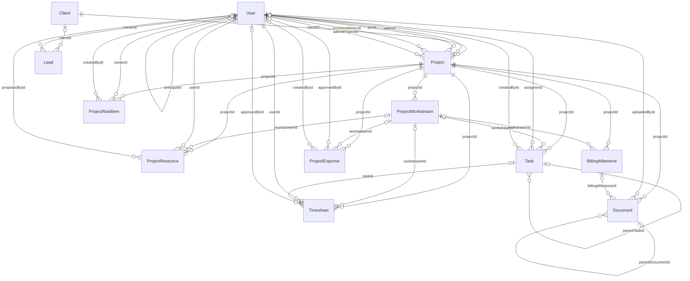

# SecureProfit Hub — Dokumentasi Basis Data (RDBMS)

| Atribut | Nilai |
| --- | --- |
| Judul Dokumen | Dokumentasi Basis Data Relasional (RDBMS) |
| Aplikasi | SecureProfit Hub — Professional Services Automation (PSA) |
| Versi Dokumen | 1.0 |
| Tanggal | 19 Juni 2026 |
| Status | Final — Internal |
| RDBMS | PostgreSQL |
| ORM / Migrasi | Prisma (Prisma Migrate) |
| Lingkungan | Dev: Replit (Helium) \| Produksi: Neon (Singapura) |
| Jumlah Tabel | 40 |
| Jumlah Enum | 19 |
| Klasifikasi | Rahasia — Penggunaan Internal |

## Daftar Isi

- 1. Pendahuluan
- 2. Ringkasan Eksekutif
- 3. Arsitektur Data & Lingkungan
- 4. Prinsip Desain RDBMS
- 5. Model Data: Domain & Diagram Relasi (ERD)
- 6. Katalog Relasi (Foreign Key)
- 7. Kamus Data (Data Dictionary)
- 8. Referensi Enumerasi
- 9. Siklus Hidup Data (State Machine)
- 10. Strategi Index & Performa
- 11. Integritas, Transaksi & Konkurensi
- 12. Keamanan & Tata Kelola Data
- 13. Operasional Basis Data
- Lampiran A — Diagram ERD (Mermaid)
- Lampiran B — Statistik & Konvensi

## 1. Pendahuluan

### 1.1 Tujuan
Dokumen ini mendeskripsikan desain basis data relasional (RDBMS) aplikasi **SecureProfit Hub** secara menyeluruh: arsitektur penyimpanan data, prinsip desain, struktur tabel (kamus data), relasi antar-entitas, aturan integritas, siklus hidup data, serta praktik operasional. Dokumen ditujukan sebagai acuan resmi (single source of truth) bagi tim rekayasa, DBA, audit, dan pemangku kepentingan teknis.

### 1.2 Ruang Lingkup
Mencakup skema PostgreSQL yang dikelola melalui Prisma ORM pada paket `lib/db`. Tidak mencakup detail implementasi endpoint API atau antarmuka pengguna, kecuali bila relevan terhadap perilaku data.

### 1.3 Pembaca
Arsitek perangkat lunak, backend engineer, Database Administrator (DBA), QA, tim keamanan/audit, dan manajemen teknis.

### 1.4 Definisi & Singkatan
| Istilah | Penjelasan |
| --- | --- |
| RDBMS | Relational Database Management System — sistem basis data relasional. |
| ORM | Object-Relational Mapping; di sini menggunakan Prisma. |
| PK | Primary Key — kunci utama baris. |
| FK | Foreign Key — kunci tamu yang merujuk baris tabel lain. |
| ERD | Entity Relationship Diagram — diagram relasi antar-entitas. |
| CUID | Collision-resistant Unique Identifier; format ID default seluruh tabel. |
| DPP | Dasar Pengenaan Pajak. |
| PPN/VAT | Pajak Pertambahan Nilai (default 11%). |
| Soft delete | Penonaktifan baris via kolom deletedAt tanpa menghapus fisik. |

## 2. Ringkasan Eksekutif

SecureProfit Hub menyimpan seluruh data operasionalnya dalam satu basis data **PostgreSQL** yang ternormalisasi, terdiri atas **40 tabel**, **19 tipe enumerasi**, **478 kolom**, dan **79 relasi foreign key**. Skema dirancang dengan integritas referensial yang tegas (aturan `onDelete` eksplisit maupun default Prisma), batasan keunikan (**12 unik kolom tunggal** plus unik komposit), serta **72 index sekunder & unik komposit** (level tabel) untuk menjaga performa kueri — di luar primary key tiap tabel.

Akses dan perubahan skema dikelola sepenuhnya melalui **Prisma Migrate** (skema terversi), sehingga setiap perubahan struktur tercatat, dapat ditinjau, dan dapat direproduksi antar-lingkungan. Karakteristik ini menegaskan bahwa aplikasi telah menerapkan RDBMS yang matang — bukan sekadar penyimpanan data datar.

## 3. Arsitektur Data & Lingkungan

### 3.1 Tumpukan Teknologi
| Lapisan | Teknologi | Keterangan |
| --- | --- | --- |
| RDBMS | PostgreSQL | Mesin basis data relasional utama. |
| ORM | Prisma Client | Akses data type-safe; client di-generate ke lib/db/src/generated/client. |
| Migrasi | Prisma Migrate | Skema terversi; baseline migrasi 0_init. |
| Validasi | Zod (di-generate dari OpenAPI) | Validasi input/output di lapisan API sebelum menyentuh DB. |
| Aplikasi | Node.js + Express (api-server) | Satu-satunya komponen yang mengakses DB. |

### 3.2 Lingkungan & Koneksi
- **Pengembangan**: PostgreSQL terkelola Replit (Helium).
- **Produksi**: Neon (region Singapura), diakses melalui *pooled endpoint*. URL koneksi membawa parameter pool untuk menahan pemutusan koneksi idle.
- **Keepalive**: api-server mengirim ping ringan (`SELECT 1`) secara periodik (default 4 menit) agar compute Neon tidak masuk mode autosuspend, sehingga permintaan pengguna tetap responsif.
- **Graceful shutdown**: saat deploy rollover, server berhenti menerima koneksi baru, menuntaskan permintaan berjalan, lalu menutup pool Prisma secara rapi.

## 4. Prinsip Desain RDBMS

### 4.1 Normalisasi
Skema mengikuti bentuk normal (umumnya 3NF): data tidak diduplikasi; relasi banyak-ke-banyak dimodelkan lewat tabel penghubung eksplisit (`UserSkill`, `TaskAssignee`, `TaskDependency`). Hal ini meminimalkan anomali penyisipan/pembaruan/penghapusan.

### 4.2 Integritas Referensial
Setiap relasi memiliki foreign key dengan aturan `onDelete` eksplisit:
- **Cascade** — baris anak ikut terhapus bersama induk (mis. menghapus `Project` menghapus task, timesheet, dokumen, RAID terkait).
- **SetNull** — referensi opsional dikosongkan saat induk hilang (mis. `workstreamId` pada banyak tabel).
Dengan demikian tidak ada baris anak yang menggantung (orphan).

### 4.3 Batasan & Domain Nilai
- **Primary key** CUID pada seluruh tabel.
- **Keunikan tunggal**: mis. `User.email`, `Project.code`, `BillingMilestone.invoiceNumber`.
- **Keunikan komposit**: mis. `@@unique([projectId, userId])` pada `ProjectResource`, `@@unique([userId, period, periodYear])` pada `PerformanceReview`.
- **Enumerasi**: 19 tipe enum menjaga nilai kolom status/peran tetap konsisten di level basis data.

### 4.4 Indexing
Index sekunder (`@@index`) dipasang pada kolom yang sering difilter/di-join — foreign key, kolom status, dan kolom tanggal — untuk menjaga performa kueri pada tabel bervolume tinggi seperti `Timesheet` dan `Project`.

### 4.5 Transaksi (ACID)
Operasi kritis dijalankan dalam transaksi atomik untuk mencegah kondisi balapan (race condition) — misalnya alokasi nomor invoice yang harus unik dan berurutan. Lihat Bab 11.

### 4.6 Soft Delete & Jejak Audit
Entitas penting (`User`, `Project`, `Lead`) menggunakan `deletedAt` untuk penonaktifan reversibel alih-alih penghapusan fisik. Setiap aksi sensitif dicatat pada `AuditLog` (termasuk nilai sebelum/sesudah) untuk kebutuhan audit.

## 5. Model Data: Domain & Diagram Relasi (ERD)

Tabel dikelompokkan ke dalam **8 domain fungsional**. Diagram ERD lengkap (format Mermaid) tersedia pada **Lampiran A** dan dapat dirender melalui editor apa pun yang mendukung Mermaid.

| Domain | Fokus | Jumlah Tabel |
| --- | --- | --- |
| Identitas, Organisasi & Kompetensi | Master data orang dan struktur organisasi: akun & peran, unit bisnis, keahlian, target pengembangan, dan cuti. | 7 |
| Sales & CRM | Pipeline penjualan dan data pelanggan, termasuk pemetaan integrasi Pipedrive. | 4 |
| Proyek & Delivery | Entitas inti proyek beserta pemecahan kerja (workstream, task, RAID), staffing, dan laporan. | 11 |
| Waktu & Biaya | Pencatatan jam kerja dan pengeluaran proyek dengan alur persetujuan; basis perhitungan biaya aktual. | 2 |
| Keuangan & Penagihan | Termin pembayaran, dokumen (BAST/invoice/kontrak), pengaturan invoice, dan koneksi Xero. | 4 |
| Kualitas & Kinerja | Survei kepuasan klien (CSAT) dan penilaian kinerja periodik. | 4 |
| Template & Blueprint | Cetak biru yang dapat dipakai ulang untuk mempercepat pembuatan proyek dan WBS. | 5 |
| Sistem, Notifikasi & Audit | Notifikasi in-app, jejak audit, dan pengaturan aplikasi. | 3 |

## 6. Katalog Relasi (Foreign Key)

Seluruh relasi foreign key beserta kardinalitas dan aturan penghapusannya:

| Tabel (anak) | Foreign Key | Tabel (induk) | Kardinalitas | onDelete |
| --- | --- | --- | --- | --- |
| User | businessUnitId | BusinessUnit | 0..1 | SetNull (default Prisma) |
| User | managerId | User | 0..1 | SetNull (default Prisma) |
| User | principalId | User | 0..1 | SetNull (default Prisma) |
| Project | clientId | Client | 1 (wajib) | Restrict (default Prisma) |
| Project | salesId | User | 0..1 | SetNull (default Prisma) |
| Project | pmId | User | 0..1 | SetNull (default Prisma) |
| Project | technicalWriterId | User | 0..1 | SetNull (default Prisma) |
| Project | adminProjectId | User | 0..1 | SetNull (default Prisma) |
| ProjectReport | projectId | Project | 1 (wajib) | Cascade |
| ProjectReport | workstreamId | ProjectWorkstream | 0..1 | SetNull |
| ProjectReport | createdById | User | 0..1 | SetNull (default Prisma) |
| ProjectWorkstream | projectId | Project | 1 (wajib) | Cascade |
| ProjectWorkstream | businessUnitId | BusinessUnit | 0..1 | SetNull (default Prisma) |
| SurveyResponse | projectId | Project | 1 (wajib) | Cascade |
| AuditLog | userId | User | 0..1 | SetNull (default Prisma) |
| ProjectResource | projectId | Project | 1 (wajib) | Cascade |
| ProjectResource | workstreamId | ProjectWorkstream | 0..1 | SetNull |
| ProjectResource | userId | User | 1 (wajib) | Restrict (default Prisma) |
| ProjectResource | proposedById | User | 0..1 | SetNull (default Prisma) |
| Timesheet | projectId | Project | 1 (wajib) | Cascade |
| Timesheet | workstreamId | ProjectWorkstream | 0..1 | SetNull |
| Timesheet | userId | User | 1 (wajib) | Restrict (default Prisma) |
| Timesheet | taskId | Task | 0..1 | SetNull (default Prisma) |
| Timesheet | approvedById | User | 0..1 | SetNull (default Prisma) |
| Document | projectId | Project | 1 (wajib) | Cascade |
| Document | uploadedById | User | 0..1 | SetNull (default Prisma) |
| Document | parentDocumentId | Document | 0..1 | SetNull |
| Document | billingMilestoneId | BillingMilestone | 0..1 | Cascade |
| ProjectClosingChecklistItem | projectId | Project | 1 (wajib) | Cascade |
| ProjectClosingChecklistItem | completedById | User | 0..1 | SetNull (default Prisma) |
| ProjectExpense | projectId | Project | 1 (wajib) | Cascade |
| ProjectExpense | workstreamId | ProjectWorkstream | 0..1 | SetNull |
| ProjectExpense | approvedById | User | 0..1 | SetNull (default Prisma) |
| ProjectExpense | createdById | User | 0..1 | SetNull (default Prisma) |
| UserSkill | userId | User | 1 (wajib) | Cascade |
| UserSkill | skillId | Skill | 1 (wajib) | Cascade |
| SkillDevelopmentGoal | userId | User | 1 (wajib) | Cascade |
| SkillDevelopmentGoal | skillId | Skill | 1 (wajib) | Cascade |
| SkillDevelopmentGoal | createdById | User | 0..1 | SetNull (default Prisma) |
| SkillProgressionLog | userId | User | 1 (wajib) | Cascade |
| SkillProgressionLog | skillId | Skill | 1 (wajib) | Cascade |
| SkillProgressionLog | changedById | User | 0..1 | SetNull (default Prisma) |
| Activity | userId | User | 0..1 | SetNull (default Prisma) |
| Activity | projectId | Project | 0..1 | Cascade |
| Task | projectId | Project | 1 (wajib) | Cascade |
| Task | workstreamId | ProjectWorkstream | 0..1 | SetNull |
| Task | assigneeId | User | 0..1 | SetNull (default Prisma) |
| Task | createdById | User | 0..1 | SetNull (default Prisma) |
| Task | parentTaskId | Task | 0..1 | Cascade |
| TaskDependency | taskId | Task | 1 (wajib) | Cascade |
| TaskDependency | dependsOnTaskId | Task | 1 (wajib) | Cascade |
| BillingMilestone | projectId | Project | 1 (wajib) | Cascade |
| BillingMilestone | workstreamId | ProjectWorkstream | 0..1 | SetNull |
| TaskAssignee | taskId | Task | 1 (wajib) | Cascade |
| TaskAssignee | userId | User | 1 (wajib) | Restrict (default Prisma) |
| TaskTimeLog | taskId | Task | 1 (wajib) | Cascade |
| TaskTimeLog | userId | User | 1 (wajib) | Restrict (default Prisma) |
| Lead | clientId | Client | 0..1 | SetNull (default Prisma) |
| Lead | ownerId | User | 1 (wajib) | Restrict (default Prisma) |
| LeadActivity | leadId | Lead | 1 (wajib) | Cascade |
| LeadActivity | createdById | User | 1 (wajib) | Restrict (default Prisma) |
| UserLeave | userId | User | 1 (wajib) | Cascade |
| TaskTemplate | businessUnitId | BusinessUnit | 0..1 | SetNull (default Prisma) |
| TaskTemplate | createdById | User | 1 (wajib) | Restrict (default Prisma) |
| ProjectTemplate | businessUnitId | BusinessUnit | 0..1 | SetNull (default Prisma) |
| ProjectTemplate | taskTemplateId | TaskTemplate | 0..1 | SetNull (default Prisma) |
| ProjectTemplate | createdById | User | 1 (wajib) | Restrict (default Prisma) |
| ProjectTemplateResource | templateId | ProjectTemplate | 1 (wajib) | Cascade |
| ProjectTemplateMilestone | templateId | ProjectTemplate | 1 (wajib) | Cascade |
| ProjectTemplateRaidItem | templateId | ProjectTemplate | 1 (wajib) | Cascade |
| Notification | userId | User | 1 (wajib) | Cascade |
| ProjectRaidItem | projectId | Project | 1 (wajib) | Cascade |
| ProjectRaidItem | ownerId | User | 0..1 | SetNull (default Prisma) |
| ProjectRaidItem | createdById | User | 0..1 | SetNull (default Prisma) |
| PerformanceReview | userId | User | 1 (wajib) | Restrict (default Prisma) |
| PerformanceReview | reviewerId | User | 1 (wajib) | Restrict (default Prisma) |
| PerformanceReviewProjectRating | reviewId | PerformanceReview | 1 (wajib) | Cascade |
| PerformanceReviewProjectRating | projectId | Project | 1 (wajib) | Cascade |
| PerformanceReviewProjectRating | ratedById | User | 1 (wajib) | Restrict (default Prisma) |

## 7. Kamus Data (Data Dictionary)

Untuk setiap tabel: deskripsi, daftar kolom (tipe SQL, nullability, default, kunci, deskripsi), serta index/batasan dan foreign key tingkat tabel.

### 7.1 Identitas, Organisasi & Kompetensi

*Master data orang dan struktur organisasi: akun & peran, unit bisnis, keahlian, target pengembangan, dan cuti.*

#### User

Akun pengguna sekaligus master data SDM: kredensial, peran (RBAC), seniority, tarif harian, serta dua hierarki organisasi (atasan struktural managerId dan principal pembina principalId).

| Kolom | Tipe SQL | Null | Default | Kunci | Deskripsi |
| --- | --- | --- | --- | --- | --- |
| id | text | Tidak | cuid() | PK | Primary key (CUID). |
| email | text | Tidak | - | UNIQUE | - |
| passwordHash | text | Tidak | - | - | - |
| name | text | Tidak | - | - | - |
| role | UserRole (enum) | Tidak | - | - | Peran RBAC penentu hak akses pengguna. |
| title | text | Ya | - | - | - |
| dailyRate | double precision | Ya | - | - | Tarif harian (IDR), dasar perhitungan biaya resource. |
| seniority | Seniority (enum) | Ya | - | - | Tingkat senioritas (JUNIOR/MID/SENIOR/PRINCIPAL). |
| isActive | boolean | Tidak | true | - | Flag boolean (default true). |
| avatarDataUrl | text | Ya | - | - | - |
| deletedAt | timestamp(3) | Ya | - | - | Soft-delete: terisi jika baris dinonaktifkan (NULL = aktif). |
| createdAt | timestamp(3) | Tidak | now() | - | Timestamp baris dibuat. |
| updatedAt | timestamp(3) | Tidak | - | - | Timestamp baris terakhir diubah. |
| businessUnitId | text | Ya | - | FK | Foreign key ke BusinessUnit. |
| managerId | text | Ya | - | FK | Atasan struktural (PM -> PMO). |
| principalId | text | Ya | - | FK | Principal pembina untuk anggota tim delivery. |
| calendarTokenVersion | integer | Tidak | 0 | - | Versi token feed kalender; dinaikkan untuk mencabut tautan iCal lama. |

**Foreign key keluar:** businessUnitId -> BusinessUnit (onDelete: SetNull (default Prisma)); managerId -> User (onDelete: SetNull (default Prisma)); principalId -> User (onDelete: SetNull (default Prisma)).

#### BusinessUnit

Unit bisnis/lini layanan (mis. Pentest, GRC, Threat Hunting) sebagai pengelompokan SDM dan pekerjaan.

| Kolom | Tipe SQL | Null | Default | Kunci | Deskripsi |
| --- | --- | --- | --- | --- | --- |
| id | text | Tidak | cuid() | PK | Primary key (CUID). |
| name | text | Tidak | - | UNIQUE | - |
| description | text | Ya | - | - | - |
| isActive | boolean | Tidak | true | - | Flag boolean (default true). |
| createdAt | timestamp(3) | Tidak | now() | - | Timestamp baris dibuat. |
| updatedAt | timestamp(3) | Tidak | - | - | Timestamp baris terakhir diubah. |

#### Skill

Master kompetensi/keahlian yang dapat dimiliki pengguna.

| Kolom | Tipe SQL | Null | Default | Kunci | Deskripsi |
| --- | --- | --- | --- | --- | --- |
| id | text | Tidak | cuid() | PK | Primary key (CUID). |
| name | text | Tidak | - | UNIQUE | - |
| category | text | Ya | - | - | - |
| isActive | boolean | Tidak | true | - | Flag boolean (default true). |
| createdAt | timestamp(3) | Tidak | now() | - | Timestamp baris dibuat. |
| updatedAt | timestamp(3) | Tidak | - | - | Timestamp baris terakhir diubah. |

#### UserSkill

Tabel relasi banyak-ke-banyak antara pengguna dan skill, dengan tingkat kemahiran (proficiency).

| Kolom | Tipe SQL | Null | Default | Kunci | Deskripsi |
| --- | --- | --- | --- | --- | --- |
| id | text | Tidak | cuid() | PK | Primary key (CUID). |
| userId | text | Tidak | - | FK | Foreign key ke User. |
| skillId | text | Tidak | - | FK | Foreign key ke Skill. |
| proficiency | integer | Tidak | 3 | - | - |
| createdAt | timestamp(3) | Tidak | now() | - | Timestamp baris dibuat. |

**Index & batasan tabel:** UNIQUE (userId, skillId); INDEX (userId); INDEX (skillId).

**Foreign key keluar:** userId -> User (onDelete: Cascade); skillId -> Skill (onDelete: Cascade).

#### SkillDevelopmentGoal

Target pengembangan kompetensi per pengguna (level saat ini menuju level target).

| Kolom | Tipe SQL | Null | Default | Kunci | Deskripsi |
| --- | --- | --- | --- | --- | --- |
| id | text | Tidak | cuid() | PK | Primary key (CUID). |
| userId | text | Tidak | - | FK | Foreign key ke User. |
| skillId | text | Tidak | - | FK | Foreign key ke Skill. |
| currentLevel | integer | Tidak | 1 | - | - |
| targetLevel | integer | Tidak | 3 | - | - |
| targetDate | timestamp(3) | Ya | - | - | - |
| status | text | Tidak | "ACTIVE" | - | - |
| notes | text | Ya | - | - | - |
| createdById | text | Ya | - | FK | Foreign key ke User. |
| createdAt | timestamp(3) | Tidak | now() | - | Timestamp baris dibuat. |
| updatedAt | timestamp(3) | Tidak | - | - | Timestamp baris terakhir diubah. |
| completedAt | timestamp(3) | Ya | - | - | - |

**Index & batasan tabel:** UNIQUE (userId, skillId); INDEX (userId); INDEX (status).

**Foreign key keluar:** userId -> User (onDelete: Cascade); skillId -> Skill (onDelete: Cascade); createdById -> User (onDelete: SetNull (default Prisma)).

#### SkillProgressionLog

Riwayat perubahan level kompetensi pengguna.

| Kolom | Tipe SQL | Null | Default | Kunci | Deskripsi |
| --- | --- | --- | --- | --- | --- |
| id | text | Tidak | cuid() | PK | Primary key (CUID). |
| userId | text | Tidak | - | FK | Foreign key ke User. |
| skillId | text | Tidak | - | FK | Foreign key ke Skill. |
| fromLevel | integer | Ya | - | - | - |
| toLevel | integer | Tidak | - | - | - |
| changedById | text | Ya | - | FK | Foreign key ke User. |
| note | text | Ya | - | - | - |
| createdAt | timestamp(3) | Tidak | now() | - | Timestamp baris dibuat. |

**Index & batasan tabel:** INDEX (userId); INDEX (skillId).

**Foreign key keluar:** userId -> User (onDelete: Cascade); skillId -> Skill (onDelete: Cascade); changedById -> User (onDelete: SetNull (default Prisma)).

#### UserLeave

Catatan cuti/ketidakhadiran pengguna yang mengurangi target jam kerja dan kapasitas perencanaan.

| Kolom | Tipe SQL | Null | Default | Kunci | Deskripsi |
| --- | --- | --- | --- | --- | --- |
| id | text | Tidak | cuid() | PK | Primary key (CUID). |
| userId | text | Tidak | - | FK | Foreign key ke User. |
| startDate | timestamp(3) | Tidak | - | - | - |
| endDate | timestamp(3) | Tidak | - | - | - |
| type | LeaveType (enum) | Tidak | ANNUAL | - | Enum LeaveType: ANNUAL, SICK, TRAINING, UNPAID, OTHER. |
| note | text | Ya | - | - | - |
| createdAt | timestamp(3) | Tidak | now() | - | Timestamp baris dibuat. |
| updatedAt | timestamp(3) | Tidak | - | - | Timestamp baris terakhir diubah. |

**Index & batasan tabel:** INDEX (userId, startDate); INDEX (startDate, endDate).

**Foreign key keluar:** userId -> User (onDelete: Cascade).

### 7.2 Sales & CRM

*Pipeline penjualan dan data pelanggan, termasuk pemetaan integrasi Pipedrive.*

#### Lead

Peluang penjualan (sales pipeline) dari tahap NEW hingga WON/LOST; sumber konversi menjadi proyek; tertaut ke Pipedrive.

| Kolom | Tipe SQL | Null | Default | Kunci | Deskripsi |
| --- | --- | --- | --- | --- | --- |
| id | text | Tidak | cuid() | PK | Primary key (CUID). |
| title | text | Tidak | - | - | - |
| contactName | text | Ya | - | - | - |
| contactEmail | text | Ya | - | - | - |
| contactPhone | text | Ya | - | - | - |
| clientId | text | Ya | - | FK | Foreign key ke Client. |
| prospectiveClientName | text | Ya | - | - | - |
| industry | text | Ya | - | - | - |
| source | text | Ya | - | - | - |
| region | text | Ya | - | - | - |
| stage | LeadStage (enum) | Tidak | NEW | - | Tahap pipeline (NEW..WON/LOST). |
| estimatedValue | double precision | Tidak | 0 | - | - |
| probability | integer | Tidak | 20 | - | - |
| expectedCloseDate | timestamp(3) | Ya | - | - | - |
| ownerId | text | Tidak | - | FK | Foreign key ke User. |
| notes | text | Ya | - | - | - |
| lostReason | text | Ya | - | - | - |
| competitorWon | text | Ya | - | - | - |
| convertedProjectId | text | Ya | - | UNIQUE | Proyek hasil konversi lead (unik). |
| wonAt | timestamp(3) | Ya | - | - | - |
| lostAt | timestamp(3) | Ya | - | - | - |
| deletedAt | timestamp(3) | Ya | - | - | Soft-delete: terisi jika baris dinonaktifkan (NULL = aktif). |
| pipedriveDealId | integer | Ya | - | UNIQUE | ID deal Pipedrive (unik) untuk impor satu arah. |
| pipedrivePersonId | integer | Ya | - | - | - |
| pipedriveUpdatedAt | timestamp(3) | Ya | - | - | - |
| createdAt | timestamp(3) | Tidak | now() | - | Timestamp baris dibuat. |
| updatedAt | timestamp(3) | Tidak | - | - | Timestamp baris terakhir diubah. |

**Index & batasan tabel:** INDEX (ownerId); INDEX (stage); INDEX (deletedAt).

**Foreign key keluar:** clientId -> Client (onDelete: SetNull (default Prisma)); ownerId -> User (onDelete: Restrict (default Prisma)).

#### LeadActivity

Aktivitas tindak lanjut atas lead (call/email/meeting/note) beserta rencana aksi berikutnya.

| Kolom | Tipe SQL | Null | Default | Kunci | Deskripsi |
| --- | --- | --- | --- | --- | --- |
| id | text | Tidak | cuid() | PK | Primary key (CUID). |
| leadId | text | Tidak | - | FK | Foreign key ke Lead. |
| type | LeadActivityType (enum) | Tidak | - | - | Enum LeadActivityType: CALL, EMAIL, MEETING, NOTE. |
| occurredAt | timestamp(3) | Tidak | now() | - | - |
| outcome | text | Ya | - | - | - |
| nextActionAt | timestamp(3) | Ya | - | - | - |
| nextActionNote | text | Ya | - | - | - |
| createdById | text | Tidak | - | FK | Foreign key ke User. |
| createdAt | timestamp(3) | Tidak | now() | - | Timestamp baris dibuat. |

**Index & batasan tabel:** INDEX (leadId, occurredAt); INDEX (nextActionAt).

**Foreign key keluar:** leadId -> Lead (onDelete: Cascade); createdById -> User (onDelete: Restrict (default Prisma)).

#### Client

Master data klien/pelanggan beserta tautan kontak ke sistem eksternal (Xero, Pipedrive).

| Kolom | Tipe SQL | Null | Default | Kunci | Deskripsi |
| --- | --- | --- | --- | --- | --- |
| id | text | Tidak | cuid() | PK | Primary key (CUID). |
| name | text | Tidak | - | - | - |
| contactPerson | text | Ya | - | - | - |
| email | text | Ya | - | - | - |
| phone | text | Ya | - | - | - |
| industry | text | Ya | - | - | - |
| xeroContactId | text | Ya | - | - | - |
| pipedriveOrgId | integer | Ya | - | UNIQUE | - |
| createdAt | timestamp(3) | Tidak | now() | - | Timestamp baris dibuat. |
| updatedAt | timestamp(3) | Tidak | - | - | Timestamp baris terakhir diubah. |

#### PipedriveStageMapping

Pemetaan stage pipeline Pipedrive ke tahap Lead internal.

| Kolom | Tipe SQL | Null | Default | Kunci | Deskripsi |
| --- | --- | --- | --- | --- | --- |
| id | text | Tidak | cuid() | PK | Primary key (CUID). |
| pipedrivePipelineId | integer | Tidak | - | - | - |
| pipedriveStageId | integer | Tidak | - | UNIQUE | - |
| leadStage | LeadStage (enum) | Tidak | - | - | Enum LeadStage: NEW, QUALIFIED, PROPOSAL, NEGOTIATION, WON, LOST. |
| label | text | Ya | - | - | - |
| updatedAt | timestamp(3) | Tidak | - | - | Timestamp baris terakhir diubah. |

### 7.3 Proyek & Delivery

*Entitas inti proyek beserta pemecahan kerja (workstream, task, RAID), staffing, dan laporan.*

#### Project

Entitas inti aplikasi: kontrak/penugasan yang dilacak sepanjang siklus hidup, memuat nilai kontrak, estimasi biaya/mandays, konfigurasi pajak, serta token akses publik (portal klien & survei).

| Kolom | Tipe SQL | Null | Default | Kunci | Deskripsi |
| --- | --- | --- | --- | --- | --- |
| id | text | Tidak | cuid() | PK | Primary key (CUID). |
| code | text | Tidak | - | UNIQUE | Kode proyek unik (business key). |
| name | text | Tidak | - | - | - |
| description | text | Ya | - | - | - |
| status | ProjectStatus (enum) | Tidak | OBSERVATION | - | Status siklus hidup proyek (lihat State Machine). |
| kind | ProjectKind (enum) | Tidak | CLIENT | - | Jenis proyek; menentukan gerbang lifecycle dan visibilitas finansial. |
| clientId | text | Tidak | - | FK | Foreign key ke Client. |
| salesId | text | Ya | - | FK | Foreign key ke User. |
| pmId | text | Ya | - | FK | Foreign key ke User. |
| technicalWriterId | text | Ya | - | FK | Foreign key ke User. |
| adminProjectId | text | Ya | - | FK | Foreign key ke User. |
| startDate | timestamp(3) | Ya | - | - | - |
| endDate | timestamp(3) | Ya | - | - | - |
| contractValue | double precision | Tidak | 0 | - | Nilai kontrak (IDR). |
| currency | text | Tidak | "IDR" | - | - |
| exchangeRate | double precision | Tidak | 1 | - | - |
| vatPercent | double precision | Tidak | 11 | - | - |
| contractValueIncludesVat | boolean | Tidak | true | - | Apakah nilai kontrak sudah termasuk PPN (memengaruhi pemisahan DPP/PPN). |
| estimatedCost | double precision | Tidak | 0 | - | - |
| plannedMandays | double precision | Tidak | 0 | - | Estimasi total mandays dari tahap intake. |
| lastStatusReason | text | Ya | - | - | - |
| reportCoverUrl | text | Ya | - | - | - |
| reportLink | text | Ya | - | - | - |
| reportSubmittedAt | timestamp(3) | Ya | - | - | - |
| spkFileUrl | text | Ya | - | - | - |
| spkFileName | text | Ya | - | - | - |
| contractFileUrl | text | Ya | - | - | - |
| contractFileName | text | Ya | - | - | - |
| deletedAt | timestamp(3) | Ya | - | - | Soft-delete: terisi jika baris dinonaktifkan (NULL = aktif). |
| createdAt | timestamp(3) | Tidak | now() | - | Timestamp baris dibuat. |
| updatedAt | timestamp(3) | Tidak | - | - | Timestamp baris terakhir diubah. |
| useWorkstreams | boolean | Tidak | false | - | Flag boolean (default false). |
| surveyToken | text | Ya | - | UNIQUE | Token publik survei CSAT (unik, dapat dinonaktifkan). |
| surveyEnabled | boolean | Tidak | true | - | Flag boolean (default true). |
| surveyExpiresAt | timestamp(3) | Ya | - | - | - |
| clientShareToken | text | Ya | - | UNIQUE | Token publik portal progres klien (unik, dapat dinonaktifkan). |
| clientShareEnabled | boolean | Tidak | false | - | Flag boolean (default false). |
| clientShareExpiresAt | timestamp(3) | Ya | - | - | - |

**Index & batasan tabel:** INDEX (pmId); INDEX (salesId); INDEX (clientId); INDEX (status); INDEX (deletedAt).

**Foreign key keluar:** clientId -> Client (onDelete: Restrict (default Prisma)); salesId -> User (onDelete: SetNull (default Prisma)); pmId -> User (onDelete: SetNull (default Prisma)); technicalWriterId -> User (onDelete: SetNull (default Prisma)); adminProjectId -> User (onDelete: SetNull (default Prisma)).

#### ProjectWorkstream

Pemecahan proyek besar menjadi beberapa aliran kerja (workstream) dengan alokasi, mandays, dan biaya tersendiri.

| Kolom | Tipe SQL | Null | Default | Kunci | Deskripsi |
| --- | --- | --- | --- | --- | --- |
| id | text | Tidak | cuid() | PK | Primary key (CUID). |
| projectId | text | Tidak | - | FK | Foreign key ke Project. |
| code | text | Tidak | - | - | - |
| name | text | Tidak | - | - | - |
| description | text | Ya | - | - | - |
| businessUnitId | text | Ya | - | FK | Foreign key ke BusinessUnit. |
| allocationPct | double precision | Tidak | 0 | - | - |
| plannedMandays | double precision | Tidak | 0 | - | - |
| estimatedCost | double precision | Tidak | 0 | - | - |
| startDate | timestamp(3) | Ya | - | - | - |
| endDate | timestamp(3) | Ya | - | - | - |
| status | text | Tidak | "ACTIVE" | - | - |
| sortOrder | integer | Tidak | 0 | - | - |
| createdAt | timestamp(3) | Tidak | now() | - | Timestamp baris dibuat. |
| updatedAt | timestamp(3) | Tidak | - | - | Timestamp baris terakhir diubah. |

**Index & batasan tabel:** UNIQUE (projectId, code); INDEX (projectId); INDEX (businessUnitId).

**Foreign key keluar:** projectId -> Project (onDelete: Cascade); businessUnitId -> BusinessUnit (onDelete: SetNull (default Prisma)).

#### ProjectResource

Penempatan (staffing) seseorang pada proyek dengan mandays terencana, tarif harian, dan status persetujuan alur propose-accept.

| Kolom | Tipe SQL | Null | Default | Kunci | Deskripsi |
| --- | --- | --- | --- | --- | --- |
| id | text | Tidak | cuid() | PK | Primary key (CUID). |
| projectId | text | Tidak | - | FK | Foreign key ke Project. |
| workstreamId | text | Ya | - | FK | Foreign key ke ProjectWorkstream. |
| userId | text | Tidak | - | FK | Foreign key ke User. |
| roleInProject | text | Ya | - | - | - |
| plannedMandays | double precision | Tidak | 0 | - | - |
| dailyRate | double precision | Tidak | 0 | - | Tarif harian yang dipakai untuk biaya resource pada proyek ini. |
| proposedById | text | Ya | - | FK | Foreign key ke User. |
| proposedAt | timestamp(3) | Ya | - | - | - |
| acceptedAt | timestamp(3) | Ya | - | - | NULL berarti menunggu persetujuan (alur propose-accept). |
| pendingPrincipalApproval | boolean | Tidak | false | - | Flag boolean (default false). |
| createdAt | timestamp(3) | Tidak | now() | - | Timestamp baris dibuat. |

**Index & batasan tabel:** UNIQUE (projectId, userId).

**Foreign key keluar:** projectId -> Project (onDelete: Cascade); workstreamId -> ProjectWorkstream (onDelete: SetNull); userId -> User (onDelete: Restrict (default Prisma)); proposedById -> User (onDelete: SetNull (default Prisma)).

#### Task

Item pekerjaan/WBS proyek; mendukung sub-tugas (hierarki), dependensi, banyak penanggung jawab, dan flag billable.

| Kolom | Tipe SQL | Null | Default | Kunci | Deskripsi |
| --- | --- | --- | --- | --- | --- |
| id | text | Tidak | cuid() | PK | Primary key (CUID). |
| projectId | text | Tidak | - | FK | Foreign key ke Project. |
| workstreamId | text | Ya | - | FK | Foreign key ke ProjectWorkstream. |
| title | text | Tidak | - | - | - |
| description | text | Ya | - | - | - |
| status | TaskStatus (enum) | Tidak | TODO | - | Enum TaskStatus: TODO, IN_PROGRESS, BLOCKED, DONE. |
| progressPercent | integer | Tidak | 0 | - | - |
| billable | boolean | Tidak | true | - | Jika false, jam pada task ini tidak masuk ke revenue/margin. |
| startDate | timestamp(3) | Ya | - | - | - |
| endDate | timestamp(3) | Ya | - | - | - |
| assigneeId | text | Ya | - | FK | Foreign key ke User. |
| createdById | text | Ya | - | FK | Foreign key ke User. |
| createdAt | timestamp(3) | Tidak | now() | - | Timestamp baris dibuat. |
| updatedAt | timestamp(3) | Tidak | - | - | Timestamp baris terakhir diubah. |
| parentTaskId | text | Ya | - | FK | Induk untuk hierarki sub-tugas (WBS). |

**Index & batasan tabel:** INDEX (projectId); INDEX (assigneeId); INDEX (status); INDEX (parentTaskId).

**Foreign key keluar:** projectId -> Project (onDelete: Cascade); workstreamId -> ProjectWorkstream (onDelete: SetNull); assigneeId -> User (onDelete: SetNull (default Prisma)); createdById -> User (onDelete: SetNull (default Prisma)); parentTaskId -> Task (onDelete: Cascade).

#### TaskAssignee

Tabel relasi banyak-ke-banyak penanggung jawab tugas.

| Kolom | Tipe SQL | Null | Default | Kunci | Deskripsi |
| --- | --- | --- | --- | --- | --- |
| id | text | Tidak | cuid() | PK | Primary key (CUID). |
| taskId | text | Tidak | - | FK | Foreign key ke Task. |
| userId | text | Tidak | - | FK | Foreign key ke User. |
| createdAt | timestamp(3) | Tidak | now() | - | Timestamp baris dibuat. |

**Index & batasan tabel:** UNIQUE (taskId, userId); INDEX (userId).

**Foreign key keluar:** taskId -> Task (onDelete: Cascade); userId -> User (onDelete: Restrict (default Prisma)).

#### TaskDependency

Relasi dependensi antar-tugas (finish-to-start).

| Kolom | Tipe SQL | Null | Default | Kunci | Deskripsi |
| --- | --- | --- | --- | --- | --- |
| id | text | Tidak | cuid() | PK | Primary key (CUID). |
| taskId | text | Tidak | - | FK | Foreign key ke Task. |
| dependsOnTaskId | text | Tidak | - | FK | Foreign key ke Task. |
| createdAt | timestamp(3) | Tidak | now() | - | Timestamp baris dibuat. |

**Index & batasan tabel:** UNIQUE (taskId, dependsOnTaskId); INDEX (dependsOnTaskId).

**Foreign key keluar:** taskId -> Task (onDelete: Cascade); dependsOnTaskId -> Task (onDelete: Cascade).

#### TaskTimeLog

Log jam kerja terhadap tugas tertentu (granular, di luar timesheet resmi).

| Kolom | Tipe SQL | Null | Default | Kunci | Deskripsi |
| --- | --- | --- | --- | --- | --- |
| id | text | Tidak | cuid() | PK | Primary key (CUID). |
| taskId | text | Tidak | - | FK | Foreign key ke Task. |
| userId | text | Tidak | - | FK | Foreign key ke User. |
| hours | double precision | Tidak | - | - | - |
| note | text | Ya | - | - | - |
| loggedAt | timestamp(3) | Tidak | now() | - | - |
| createdAt | timestamp(3) | Tidak | now() | - | Timestamp baris dibuat. |

**Index & batasan tabel:** INDEX (taskId); INDEX (userId); INDEX (loggedAt).

**Foreign key keluar:** taskId -> Task (onDelete: Cascade); userId -> User (onDelete: Restrict (default Prisma)).

#### ProjectRaidItem

Register RAID (Risk/Assumption/Issue/Dependency) per proyek dengan dampak, kemungkinan, dan status.

| Kolom | Tipe SQL | Null | Default | Kunci | Deskripsi |
| --- | --- | --- | --- | --- | --- |
| id | text | Tidak | cuid() | PK | Primary key (CUID). |
| projectId | text | Tidak | - | FK | Foreign key ke Project. |
| type | RaidType (enum) | Tidak | - | - | Enum RaidType: RISK, ASSUMPTION, ISSUE, DEPENDENCY. |
| title | text | Tidak | - | - | - |
| description | text | Ya | - | - | - |
| impact | RaidImpact (enum) | Tidak | MEDIUM | - | Enum RaidImpact: LOW, MEDIUM, HIGH, CRITICAL. |
| likelihood | RaidLikelihood (enum) | Tidak | MEDIUM | - | Enum RaidLikelihood: LOW, MEDIUM, HIGH. |
| status | RaidStatus (enum) | Tidak | OPEN | - | Enum RaidStatus: OPEN, MITIGATING, CLOSED. |
| ownerId | text | Ya | - | FK | Foreign key ke User. |
| mitigation | text | Ya | - | - | - |
| dueDate | timestamp(3) | Ya | - | - | - |
| closedAt | timestamp(3) | Ya | - | - | - |
| createdById | text | Ya | - | FK | Foreign key ke User. |
| createdAt | timestamp(3) | Tidak | now() | - | Timestamp baris dibuat. |
| updatedAt | timestamp(3) | Tidak | - | - | Timestamp baris terakhir diubah. |

**Index & batasan tabel:** INDEX (projectId); INDEX (type); INDEX (status).

**Foreign key keluar:** projectId -> Project (onDelete: Cascade); ownerId -> User (onDelete: SetNull (default Prisma)); createdById -> User (onDelete: SetNull (default Prisma)).

#### ProjectReport

Katalog laporan deliverable proyek (Draft/Interim/Final) beserta tautan dan metadata versi.

| Kolom | Tipe SQL | Null | Default | Kunci | Deskripsi |
| --- | --- | --- | --- | --- | --- |
| id | text | Tidak | cuid() | PK | Primary key (CUID). |
| projectId | text | Tidak | - | FK | Foreign key ke Project. |
| title | text | Tidak | - | - | - |
| reportNumber | text | Ya | - | - | - |
| version | text | Ya | - | - | - |
| reportType | ProjectReportType (enum) | Ya | - | - | Enum ProjectReportType: DRAFT, INTERIM, FINAL. |
| periodStart | timestamp(3) | Ya | - | - | - |
| periodEnd | timestamp(3) | Ya | - | - | - |
| author | text | Ya | - | - | - |
| coverUrl | text | Ya | - | - | - |
| link | text | Ya | - | - | - |
| note | text | Ya | - | - | - |
| workstreamId | text | Ya | - | FK | Foreign key ke ProjectWorkstream. |
| submittedAt | timestamp(3) | Ya | - | - | - |
| createdById | text | Ya | - | FK | Foreign key ke User. |
| createdAt | timestamp(3) | Tidak | now() | - | Timestamp baris dibuat. |
| updatedAt | timestamp(3) | Tidak | - | - | Timestamp baris terakhir diubah. |

**Index & batasan tabel:** INDEX (projectId); INDEX (workstreamId).

**Foreign key keluar:** projectId -> Project (onDelete: Cascade); workstreamId -> ProjectWorkstream (onDelete: SetNull); createdById -> User (onDelete: SetNull (default Prisma)).

#### ProjectClosingChecklistItem

Daftar periksa penutupan proyek yang harus dipenuhi sebelum proyek berstatus CLOSED.

| Kolom | Tipe SQL | Null | Default | Kunci | Deskripsi |
| --- | --- | --- | --- | --- | --- |
| id | text | Tidak | cuid() | PK | Primary key (CUID). |
| projectId | text | Tidak | - | FK | Foreign key ke Project. |
| key | text | Tidak | - | - | - |
| label | text | Tidak | - | - | - |
| status | text | Tidak | "PENDING" | - | - |
| note | text | Ya | - | - | - |
| completedAt | timestamp(3) | Ya | - | - | - |
| completedById | text | Ya | - | FK | Foreign key ke User. |
| sortOrder | integer | Tidak | 0 | - | - |
| createdAt | timestamp(3) | Tidak | now() | - | Timestamp baris dibuat. |
| updatedAt | timestamp(3) | Tidak | - | - | Timestamp baris terakhir diubah. |

**Index & batasan tabel:** UNIQUE (projectId, key); INDEX (projectId).

**Foreign key keluar:** projectId -> Project (onDelete: Cascade); completedById -> User (onDelete: SetNull (default Prisma)).

#### Activity

Umpan aktivitas ringan (feed) terkait proyek/pengguna untuk linimasa.

| Kolom | Tipe SQL | Null | Default | Kunci | Deskripsi |
| --- | --- | --- | --- | --- | --- |
| id | text | Tidak | cuid() | PK | Primary key (CUID). |
| type | text | Tidak | - | - | - |
| message | text | Tidak | - | - | - |
| userId | text | Ya | - | FK | Foreign key ke User. |
| projectId | text | Ya | - | FK | Foreign key ke Project. |
| createdAt | timestamp(3) | Tidak | now() | - | Timestamp baris dibuat. |

**Foreign key keluar:** userId -> User (onDelete: SetNull (default Prisma)); projectId -> Project (onDelete: Cascade).

### 7.4 Waktu & Biaya

*Pencatatan jam kerja dan pengeluaran proyek dengan alur persetujuan; basis perhitungan biaya aktual.*

#### Timesheet

Catatan jam kerja harian per pengguna/proyek dengan alur DRAFT -> SUBMITTED -> APPROVED/REJECTED; menjadi basis perhitungan biaya resource.

| Kolom | Tipe SQL | Null | Default | Kunci | Deskripsi |
| --- | --- | --- | --- | --- | --- |
| id | text | Tidak | cuid() | PK | Primary key (CUID). |
| projectId | text | Tidak | - | FK | Foreign key ke Project. |
| workstreamId | text | Ya | - | FK | Foreign key ke ProjectWorkstream. |
| userId | text | Tidak | - | FK | Foreign key ke User. |
| taskId | text | Ya | - | FK | Foreign key ke Task. |
| workDate | timestamp(3) | Tidak | - | - | - |
| hours | double precision | Tidak | - | - | Jumlah jam kerja; biaya = (hours/8) x dailyRate. |
| description | text | Ya | - | - | - |
| status | TimesheetStatus (enum) | Tidak | DRAFT | - | Status persetujuan; hanya APPROVED yang masuk ke biaya resource. |
| approvedById | text | Ya | - | FK | Foreign key ke User. |
| approvedAt | timestamp(3) | Ya | - | - | - |
| rejectionReason | text | Ya | - | - | - |
| createdAt | timestamp(3) | Tidak | now() | - | Timestamp baris dibuat. |
| updatedAt | timestamp(3) | Tidak | - | - | Timestamp baris terakhir diubah. |

**Index & batasan tabel:** INDEX (taskId); INDEX (userId); INDEX (projectId); INDEX (status); INDEX (workDate).

**Foreign key keluar:** projectId -> Project (onDelete: Cascade); workstreamId -> ProjectWorkstream (onDelete: SetNull); userId -> User (onDelete: Restrict (default Prisma)); taskId -> Task (onDelete: SetNull (default Prisma)); approvedById -> User (onDelete: SetNull (default Prisma)).

#### ProjectExpense

Biaya non-resource (software, hardware, lisensi, perjalanan, dll) dengan alur persetujuan; hanya yang APPROVED dihitung ke biaya aktual.

| Kolom | Tipe SQL | Null | Default | Kunci | Deskripsi |
| --- | --- | --- | --- | --- | --- |
| id | text | Tidak | cuid() | PK | Primary key (CUID). |
| projectId | text | Tidak | - | FK | Foreign key ke Project. |
| workstreamId | text | Ya | - | FK | Foreign key ke ProjectWorkstream. |
| category | text | Tidak | - | - | - |
| description | text | Tidak | - | - | - |
| amount | double precision | Tidak | - | - | Nominal pengeluaran (IDR). |
| spentAt | timestamp(3) | Tidak | now() | - | - |
| evidenceUrl | text | Ya | - | - | - |
| evidenceFileName | text | Ya | - | - | - |
| status | ExpenseStatus (enum) | Tidak | PENDING | - | Status persetujuan; hanya APPROVED yang masuk ke biaya aktual. |
| approvedById | text | Ya | - | FK | Foreign key ke User. |
| approvedAt | timestamp(3) | Ya | - | - | - |
| rejectionReason | text | Ya | - | - | - |
| createdById | text | Ya | - | FK | Foreign key ke User. |
| createdAt | timestamp(3) | Tidak | now() | - | Timestamp baris dibuat. |
| updatedAt | timestamp(3) | Tidak | - | - | Timestamp baris terakhir diubah. |

**Index & batasan tabel:** INDEX (projectId); INDEX (spentAt); INDEX (status).

**Foreign key keluar:** projectId -> Project (onDelete: Cascade); workstreamId -> ProjectWorkstream (onDelete: SetNull); approvedById -> User (onDelete: SetNull (default Prisma)); createdById -> User (onDelete: SetNull (default Prisma)).

### 7.5 Keuangan & Penagihan

*Termin pembayaran, dokumen (BAST/invoice/kontrak), pengaturan invoice, dan koneksi Xero.*

#### BillingMilestone

Termin pembayaran (Terms of Payment) per proyek: persentase, DPP/PPN, jatuh tempo, status, nomor invoice unik, serta field sinkronisasi Xero.

| Kolom | Tipe SQL | Null | Default | Kunci | Deskripsi |
| --- | --- | --- | --- | --- | --- |
| id | text | Tidak | cuid() | PK | Primary key (CUID). |
| projectId | text | Tidak | - | FK | Foreign key ke Project. |
| workstreamId | text | Ya | - | FK | Foreign key ke ProjectWorkstream. |
| name | text | Tidak | - | - | - |
| description | text | Ya | - | - | - |
| percentage | double precision | Tidak | 0 | - | Porsi nilai kontrak untuk termin ini (total seluruh termin idealnya 100%). |
| amount | double precision | Ya | - | - | - |
| dueDate | timestamp(3) | Ya | - | - | - |
| status | BillingMilestoneStatus (enum) | Tidak | PLANNED | - | PLANNED -> INVOICED -> PAID / CANCELLED. |
| invoiceNumber | text | Ya | - | UNIQUE | Nomor invoice unik (format INV/YYYY/MM/NNNN), dialokasikan di dalam transaksi. |
| xeroInvoiceId | text | Ya | - | - | ID invoice di Xero setelah operasi push. |
| xeroInvoiceNumber | text | Ya | - | - | - |
| xeroAmountDue | double precision | Ya | - | - | - |
| xeroAmountPaid | double precision | Ya | - | - | - |
| xeroAmountCredited | double precision | Ya | - | - | - |
| xeroSyncedAt | timestamp(3) | Ya | - | - | - |
| invoicedAt | timestamp(3) | Ya | - | - | - |
| paidAt | timestamp(3) | Ya | - | - | - |
| sortOrder | integer | Tidak | 0 | - | - |
| createdAt | timestamp(3) | Tidak | now() | - | Timestamp baris dibuat. |
| updatedAt | timestamp(3) | Tidak | - | - | Timestamp baris terakhir diubah. |

**Index & batasan tabel:** INDEX (projectId); INDEX (status).

**Foreign key keluar:** projectId -> Project (onDelete: Cascade); workstreamId -> ProjectWorkstream (onDelete: SetNull).

#### Document

Repositori dokumen proyek (BAST/Invoice/Kontrak/lainnya) dengan versioning dan tautan ke milestone penagihan.

| Kolom | Tipe SQL | Null | Default | Kunci | Deskripsi |
| --- | --- | --- | --- | --- | --- |
| id | text | Tidak | cuid() | PK | Primary key (CUID). |
| projectId | text | Tidak | - | FK | Foreign key ke Project. |
| type | DocumentType (enum) | Tidak | - | - | Enum DocumentType: BAST, INVOICE, CONTRACT, OTHER. |
| fileName | text | Tidak | - | - | - |
| fileUrl | text | Tidak | - | - | Konten file (data URL base64) atau tautan. |
| invoiceNumber | text | Ya | - | - | - |
| invoiceAmount | double precision | Ya | - | - | - |
| invoiceStatus | text | Ya | - | - | - |
| notes | text | Ya | - | - | - |
| uploadedById | text | Ya | - | FK | Foreign key ke User. |
| uploadedAt | timestamp(3) | Tidak | now() | - | - |
| version | integer | Tidak | 1 | - | - |
| parentDocumentId | text | Ya | - | FK | Foreign key ke Document. |
| isLatest | boolean | Tidak | true | - | Penanda versi terbaru pada rantai versioning dokumen. |
| billingMilestoneId | text | Ya | - | FK | Foreign key ke BillingMilestone. |

**Index & batasan tabel:** INDEX (projectId, type, isLatest); INDEX (billingMilestoneId).

**Foreign key keluar:** projectId -> Project (onDelete: Cascade); uploadedById -> User (onDelete: SetNull (default Prisma)); parentDocumentId -> Document (onDelete: SetNull); billingMilestoneId -> BillingMilestone (onDelete: Cascade).

#### InvoiceSetting

Pengaturan singleton identitas penerbit invoice (perusahaan, NPWP, rekening bank).

| Kolom | Tipe SQL | Null | Default | Kunci | Deskripsi |
| --- | --- | --- | --- | --- | --- |
| id | text | Tidak | "default" | PK | Primary key (CUID). |
| companyName | text | Tidak | - | - | - |
| brand | text | Tidak | - | - | - |
| addressLines | text[] | Tidak | - | - | - |
| npwp | text | Tidak | - | - | - |
| email | text | Tidak | - | - | - |
| phone | text | Tidak | - | - | - |
| city | text | Tidak | - | - | - |
| bankName | text | Tidak | - | - | - |
| bankAccountName | text | Tidak | - | - | - |
| bankAccountNumber | text | Tidak | - | - | - |
| updatedAt | timestamp(3) | Tidak | - | - | Timestamp baris terakhir diubah. |
| updatedById | text | Ya | - | - | - |

#### XeroConnection

Kredensial koneksi OAuth Xero (token & tenant) berbentuk singleton.

| Kolom | Tipe SQL | Null | Default | Kunci | Deskripsi |
| --- | --- | --- | --- | --- | --- |
| id | text | Tidak | "default" | PK | Primary key (CUID). |
| accessToken | text | Tidak | - | - | - |
| refreshToken | text | Tidak | - | - | - |
| expiresAt | timestamp(3) | Tidak | - | - | - |
| tenantId | text | Tidak | - | - | - |
| tenantName | text | Ya | - | - | - |
| connectedAt | timestamp(3) | Tidak | now() | - | - |
| connectedById | text | Ya | - | - | - |
| disconnectedAt | timestamp(3) | Ya | - | - | - |
| updatedAt | timestamp(3) | Tidak | - | - | Timestamp baris terakhir diubah. |

### 7.6 Kualitas & Kinerja

*Survei kepuasan klien (CSAT) dan penilaian kinerja periodik.*

#### SurveyQuestion

Bank pertanyaan survei kepuasan klien (CSAT) yang dapat dikonfigurasi.

| Kolom | Tipe SQL | Null | Default | Kunci | Deskripsi |
| --- | --- | --- | --- | --- | --- |
| id | text | Tidak | cuid() | PK | Primary key (CUID). |
| key | text | Tidak | - | UNIQUE | - |
| text | text | Tidak | - | - | - |
| type | text | Tidak | "RATING" | - | - |
| order | integer | Tidak | 0 | - | - |
| required | boolean | Tidak | true | - | Flag boolean (default true). |
| isActive | boolean | Tidak | true | - | Flag boolean (default true). |
| createdAt | timestamp(3) | Tidak | now() | - | Timestamp baris dibuat. |
| updatedAt | timestamp(3) | Tidak | - | - | Timestamp baris terakhir diubah. |

#### SurveyResponse

Jawaban survei kepuasan yang dikirim klien melalui portal publik, termasuk snapshot pertanyaan saat pengisian.

| Kolom | Tipe SQL | Null | Default | Kunci | Deskripsi |
| --- | --- | --- | --- | --- | --- |
| id | text | Tidak | cuid() | PK | Primary key (CUID). |
| projectId | text | Tidak | - | FK | Foreign key ke Project. |
| submitterName | text | Ya | - | - | - |
| submitterEmail | text | Ya | - | - | - |
| answers | jsonb | Tidak | - | - | - |
| questionsSnapshot | jsonb | Ya | - | - | - |
| lessonLearned | text | Ya | - | - | - |
| createdAt | timestamp(3) | Tidak | now() | - | Timestamp baris dibuat. |

**Index & batasan tabel:** INDEX (projectId); INDEX (createdAt).

**Foreign key keluar:** projectId -> Project (onDelete: Cascade).

#### PerformanceReview

Penilaian kinerja periodik pengguna (kuartal/tahunan) dengan alur DRAFT -> SUBMITTED -> ACKNOWLEDGED.

| Kolom | Tipe SQL | Null | Default | Kunci | Deskripsi |
| --- | --- | --- | --- | --- | --- |
| id | text | Tidak | cuid() | PK | Primary key (CUID). |
| userId | text | Tidak | - | FK | Foreign key ke User. |
| reviewerId | text | Tidak | - | FK | Foreign key ke User. |
| period | PerformanceReviewPeriod (enum) | Tidak | - | - | Enum PerformanceReviewPeriod: Q1, Q2, Q3, Q4, ANNUAL. |
| periodYear | integer | Tidak | - | - | - |
| periodStart | timestamp(3) | Tidak | - | - | - |
| periodEnd | timestamp(3) | Tidak | - | - | - |
| status | PerformanceReviewStatus (enum) | Tidak | DRAFT | - | Enum PerformanceReviewStatus: DRAFT, SUBMITTED, ACKNOWLEDGED. |
| overallRating | integer | Ya | - | - | - |
| summary | text | Ya | - | - | - |
| strengths | text | Ya | - | - | - |
| improvements | text | Ya | - | - | - |
| goals | text | Ya | - | - | - |
| acknowledgement | text | Ya | - | - | - |
| submittedAt | timestamp(3) | Ya | - | - | - |
| acknowledgedAt | timestamp(3) | Ya | - | - | - |
| createdAt | timestamp(3) | Tidak | now() | - | Timestamp baris dibuat. |
| updatedAt | timestamp(3) | Tidak | - | - | Timestamp baris terakhir diubah. |

**Index & batasan tabel:** UNIQUE (userId, period, periodYear); INDEX (reviewerId); INDEX (status).

**Foreign key keluar:** userId -> User (onDelete: Restrict (default Prisma)); reviewerId -> User (onDelete: Restrict (default Prisma)).

#### PerformanceReviewProjectRating

Rincian penilaian kinerja per proyek dalam satu siklus review.

| Kolom | Tipe SQL | Null | Default | Kunci | Deskripsi |
| --- | --- | --- | --- | --- | --- |
| id | text | Tidak | cuid() | PK | Primary key (CUID). |
| reviewId | text | Tidak | - | FK | Foreign key ke PerformanceReview. |
| projectId | text | Tidak | - | FK | Foreign key ke Project. |
| ratedById | text | Tidak | - | FK | Foreign key ke User. |
| rating | integer | Tidak | - | - | - |
| comment | text | Ya | - | - | - |
| createdAt | timestamp(3) | Tidak | now() | - | Timestamp baris dibuat. |
| updatedAt | timestamp(3) | Tidak | - | - | Timestamp baris terakhir diubah. |

**Index & batasan tabel:** UNIQUE (reviewId, projectId); INDEX (projectId).

**Foreign key keluar:** reviewId -> PerformanceReview (onDelete: Cascade); projectId -> Project (onDelete: Cascade); ratedById -> User (onDelete: Restrict (default Prisma)).

### 7.7 Template & Blueprint

*Cetak biru yang dapat dipakai ulang untuk mempercepat pembuatan proyek dan WBS.*

#### TaskTemplate

Cetak biru WBS (struktur tugas) yang disimpan sebagai JSON untuk diterapkan ke proyek baru.

| Kolom | Tipe SQL | Null | Default | Kunci | Deskripsi |
| --- | --- | --- | --- | --- | --- |
| id | text | Tidak | cuid() | PK | Primary key (CUID). |
| name | text | Tidak | - | - | - |
| description | text | Ya | - | - | - |
| businessUnitId | text | Ya | - | FK | Foreign key ke BusinessUnit. |
| tasks | jsonb | Tidak | - | - | - |
| createdById | text | Tidak | - | FK | Foreign key ke User. |
| isActive | boolean | Tidak | true | - | Flag boolean (default true). |
| createdAt | timestamp(3) | Tidak | now() | - | Timestamp baris dibuat. |
| updatedAt | timestamp(3) | Tidak | - | - | Timestamp baris terakhir diubah. |

**Index & batasan tabel:** INDEX (businessUnitId, isActive).

**Foreign key keluar:** businessUnitId -> BusinessUnit (onDelete: SetNull (default Prisma)); createdById -> User (onDelete: Restrict (default Prisma)).

#### ProjectTemplate

Cetak biru proyek (durasi, estimasi, pajak) beserta paket resource/milestone/RAID standar.

| Kolom | Tipe SQL | Null | Default | Kunci | Deskripsi |
| --- | --- | --- | --- | --- | --- |
| id | text | Tidak | cuid() | PK | Primary key (CUID). |
| name | text | Tidak | - | - | - |
| description | text | Ya | - | - | - |
| businessUnitId | text | Ya | - | FK | Foreign key ke BusinessUnit. |
| kind | ProjectKind (enum) | Tidak | CLIENT | - | Enum ProjectKind: CLIENT, INTERNAL, PRESALES, TRAINING. |
| defaultDurationDays | integer | Tidak | 30 | - | - |
| estimatedContractValue | double precision | Tidak | 0 | - | - |
| estimatedCost | double precision | Tidak | 0 | - | - |
| plannedMandays | double precision | Tidak | 0 | - | - |
| vatPercent | double precision | Tidak | 11 | - | - |
| contractValueIncludesVat | boolean | Tidak | true | - | Flag boolean (default true). |
| taskTemplateId | text | Ya | - | FK | Foreign key ke TaskTemplate. |
| isActive | boolean | Tidak | true | - | Flag boolean (default true). |
| createdById | text | Tidak | - | FK | Foreign key ke User. |
| createdAt | timestamp(3) | Tidak | now() | - | Timestamp baris dibuat. |
| updatedAt | timestamp(3) | Tidak | - | - | Timestamp baris terakhir diubah. |

**Index & batasan tabel:** INDEX (businessUnitId, isActive).

**Foreign key keluar:** businessUnitId -> BusinessUnit (onDelete: SetNull (default Prisma)); taskTemplateId -> TaskTemplate (onDelete: SetNull (default Prisma)); createdById -> User (onDelete: Restrict (default Prisma)).

#### ProjectTemplateResource

Baris kebutuhan resource pada cetak biru proyek (peran, jumlah, mandays, tarif).

| Kolom | Tipe SQL | Null | Default | Kunci | Deskripsi |
| --- | --- | --- | --- | --- | --- |
| id | text | Tidak | cuid() | PK | Primary key (CUID). |
| templateId | text | Tidak | - | FK | Foreign key ke ProjectTemplate. |
| role | text | Tidak | - | - | - |
| count | integer | Tidak | 1 | - | - |
| plannedMandays | double precision | Tidak | 0 | - | - |
| dailyRate | double precision | Tidak | 0 | - | - |
| note | text | Ya | - | - | - |
| createdAt | timestamp(3) | Tidak | now() | - | Timestamp baris dibuat. |

**Index & batasan tabel:** INDEX (templateId).

**Foreign key keluar:** templateId -> ProjectTemplate (onDelete: Cascade).

#### ProjectTemplateMilestone

Baris termin penagihan standar pada cetak biru proyek.

| Kolom | Tipe SQL | Null | Default | Kunci | Deskripsi |
| --- | --- | --- | --- | --- | --- |
| id | text | Tidak | cuid() | PK | Primary key (CUID). |
| templateId | text | Tidak | - | FK | Foreign key ke ProjectTemplate. |
| name | text | Tidak | - | - | - |
| percentage | double precision | Tidak | 0 | - | - |
| offsetDays | integer | Tidak | 0 | - | - |
| order | integer | Tidak | 0 | - | - |
| createdAt | timestamp(3) | Tidak | now() | - | Timestamp baris dibuat. |

**Index & batasan tabel:** INDEX (templateId).

**Foreign key keluar:** templateId -> ProjectTemplate (onDelete: Cascade).

#### ProjectTemplateRaidItem

Baris RAID standar pada cetak biru proyek.

| Kolom | Tipe SQL | Null | Default | Kunci | Deskripsi |
| --- | --- | --- | --- | --- | --- |
| id | text | Tidak | cuid() | PK | Primary key (CUID). |
| templateId | text | Tidak | - | FK | Foreign key ke ProjectTemplate. |
| type | RaidType (enum) | Tidak | - | - | Enum RaidType: RISK, ASSUMPTION, ISSUE, DEPENDENCY. |
| title | text | Tidak | - | - | - |
| description | text | Ya | - | - | - |
| impact | RaidImpact (enum) | Tidak | MEDIUM | - | Enum RaidImpact: LOW, MEDIUM, HIGH, CRITICAL. |
| likelihood | RaidLikelihood (enum) | Tidak | MEDIUM | - | Enum RaidLikelihood: LOW, MEDIUM, HIGH. |
| mitigation | text | Ya | - | - | - |
| createdAt | timestamp(3) | Tidak | now() | - | Timestamp baris dibuat. |

**Index & batasan tabel:** INDEX (templateId).

**Foreign key keluar:** templateId -> ProjectTemplate (onDelete: Cascade).

### 7.8 Sistem, Notifikasi & Audit

*Notifikasi in-app, jejak audit, dan pengaturan aplikasi.*

#### Notification

Notifikasi in-app per pengguna (lonceng header), dengan status baca (readAt).

| Kolom | Tipe SQL | Null | Default | Kunci | Deskripsi |
| --- | --- | --- | --- | --- | --- |
| id | text | Tidak | cuid() | PK | Primary key (CUID). |
| userId | text | Tidak | - | FK | Foreign key ke User. |
| type | text | Tidak | - | - | - |
| title | text | Tidak | - | - | - |
| message | text | Tidak | - | - | - |
| link | text | Ya | - | - | - |
| readAt | timestamp(3) | Ya | - | - | - |
| createdAt | timestamp(3) | Tidak | now() | - | Timestamp baris dibuat. |

**Index & batasan tabel:** INDEX (userId, readAt); INDEX (userId, createdAt).

**Foreign key keluar:** userId -> User (onDelete: Cascade).

#### AuditLog

Jejak audit tak-termutasi untuk setiap aksi penting: siapa, kapan, dan nilai sebelum/sesudah (dataBefore/dataAfter).

| Kolom | Tipe SQL | Null | Default | Kunci | Deskripsi |
| --- | --- | --- | --- | --- | --- |
| id | text | Tidak | cuid() | PK | Primary key (CUID). |
| userId | text | Ya | - | FK | Foreign key ke User. |
| userName | text | Tidak | - | - | - |
| userRole | text | Tidak | - | - | - |
| action | text | Tidak | - | - | - |
| entityType | text | Tidak | - | - | - |
| entityId | text | Ya | - | - | - |
| description | text | Tidak | - | - | - |
| dataBefore | jsonb | Ya | - | - | - |
| dataAfter | jsonb | Ya | - | - | - |
| createdAt | timestamp(3) | Tidak | now() | - | Timestamp baris dibuat. |

**Index & batasan tabel:** INDEX (createdAt); INDEX (userId); INDEX (action); INDEX (entityType, entityId).

**Foreign key keluar:** userId -> User (onDelete: SetNull (default Prisma)).

#### AppSetting

Pengaturan aplikasi singleton: ambang batas bisnis (margin, overrun, jatuh tempo) dan sakelar integrasi (email, Xero, Pipedrive).

| Kolom | Tipe SQL | Null | Default | Kunci | Deskripsi |
| --- | --- | --- | --- | --- | --- |
| id | text | Tidak | "default" | PK | Primary key (CUID). |
| defaultVatPercent | double precision | Tidak | 11 | - | - |
| timesheetBackdateDays | integer | Tidak | 5 | - | - |
| lowMarginPct | double precision | Tidak | 15 | - | - |
| budgetOverrunPct | double precision | Tidak | 80 | - | - |
| invoiceDueSoonDays | integer | Tidak | 7 | - | - |
| lateTimesheetDays | integer | Tidak | 3 | - | - |
| xeroAutoSyncEnabled | boolean | Tidak | false | - | Sakelar polling pembayaran Xero (default OFF). |
| emailNotificationsEnabled | boolean | Tidak | false | - | Kill-switch global email (default OFF). |
| pipedriveAutoSyncEnabled | boolean | Tidak | false | - | Sakelar polling impor Pipedrive (default OFF). |
| pipedriveLastSyncAt | timestamp(3) | Ya | - | - | - |
| pipedriveDefaultOwnerId | text | Ya | - | - | - |
| pipedriveWebhookSecret | text | Ya | - | - | - |
| pipedriveSyncRunId | text | Ya | - | - | - |
| pipedriveSyncStartedAt | timestamp(3) | Ya | - | - | - |
| pipedriveSyncFinishedAt | timestamp(3) | Ya | - | - | - |
| pipedriveSyncError | text | Ya | - | - | - |
| pipedriveSyncResult | jsonb | Ya | - | - | - |
| updatedAt | timestamp(3) | Tidak | - | - | Timestamp baris terakhir diubah. |
| updatedById | text | Ya | - | - | - |

## 8. Referensi Enumerasi

Daftar lengkap tipe enumerasi dan nilai yang diperbolehkan:

| Enum | Nilai | Keterangan |
| --- | --- | --- |
| BillingMilestoneStatus | PLANNED, INVOICED, PAID, CANCELLED | Status termin penagihan. |
| DocumentType | BAST, INVOICE, CONTRACT, OTHER | Jenis dokumen proyek. |
| ExpenseStatus | PENDING, APPROVED, REJECTED | Status persetujuan pengeluaran. |
| LeadActivityType | CALL, EMAIL, MEETING, NOTE | Jenis aktivitas tindak lanjut lead. |
| LeadStage | NEW, QUALIFIED, PROPOSAL, NEGOTIATION, WON, LOST | Tahap pipeline penjualan. |
| LeaveType | ANNUAL, SICK, TRAINING, UNPAID, OTHER | Jenis cuti/ketidakhadiran. |
| PerformanceReviewPeriod | Q1, Q2, Q3, Q4, ANNUAL | Periode siklus penilaian kinerja. |
| PerformanceReviewStatus | DRAFT, SUBMITTED, ACKNOWLEDGED | Status alur penilaian kinerja. |
| ProjectKind | CLIENT, INTERNAL, PRESALES, TRAINING | Jenis proyek; non-CLIENT (INTERNAL/PRESALES/TRAINING) dikecualikan dari gerbang penagihan & BAST. |
| ProjectReportType | DRAFT, INTERIM, FINAL | Klasifikasi laporan deliverable. |
| ProjectStatus | DRAFT, OBSERVATION, ACTIVE, NO_NEED_CONSULTANT, PAUSE, COMPLETE, CLOSED | Status siklus hidup proyek. |
| RaidImpact | LOW, MEDIUM, HIGH, CRITICAL | Tingkat dampak item RAID. |
| RaidLikelihood | LOW, MEDIUM, HIGH | Tingkat kemungkinan item RAID. |
| RaidStatus | OPEN, MITIGATING, CLOSED | Status penanganan item RAID. |
| RaidType | RISK, ASSUMPTION, ISSUE, DEPENDENCY | Klasifikasi item RAID. |
| Seniority | JUNIOR, MID, SENIOR, PRINCIPAL | Tingkat senioritas pengguna. |
| TaskStatus | TODO, IN_PROGRESS, BLOCKED, DONE | Status pengerjaan task. |
| TimesheetStatus | DRAFT, SUBMITTED, APPROVED, REJECTED | Status alur persetujuan timesheet. |
| UserRole | MANAGEMENT, PROJECT_MANAGER, SALES, KONSULTAN, TECHNICAL_WRITER, ADMIN_PROJECT, PRINCIPAL_KONSULTAN, PRINCIPAL_TECHNICAL_WRITER, PRINCIPAL_ADMIN_PROJECT, FINANCE, HR, SITE_ADMIN, SUPER_ADMIN | Peran RBAC yang menentukan hak akses di seluruh aplikasi. |

## 9. Siklus Hidup Data (State Machine)

### 9.1 Proyek (Project.status)
`DRAFT` -> `OBSERVATION` -> `ACTIVE` -> `PAUSE` / `COMPLETE` -> `CLOSED` (dengan `NO_NEED_CONSULTANT` untuk kasus khusus). Transisi naik dijaga oleh *gate* validasi:
- **Gate ACTIVE**: field inti Overview lengkap, ada PM, minimal 1 resource, 1 task, 1 item RAID, dan total persentase BillingMilestone = 100%.
- **Gate COMPLETE**: seluruh task DONE, tidak ada timesheet SUBMITTED, tidak ada expense PENDING, tidak ada milestone PLANNED, tidak ada RAID OPEN, serta minimal 1 dokumen BAST terbaru.

### 9.2 Timesheet (Timesheet.status)
`DRAFT` -> `SUBMITTED` -> `APPROVED` / `REJECTED`. Hanya status `APPROVED` yang dihitung sebagai biaya resource.

### 9.3 Pengeluaran (ProjectExpense.status)
`PENDING` -> `APPROVED` / `REJECTED`. Hanya `APPROVED` yang masuk ke biaya aktual; pengeluaran oleh Management otomatis APPROVED.

### 9.4 Termin Penagihan (BillingMilestone.status)
`PLANNED` -> `INVOICED` -> `PAID` (atau `CANCELLED`). Perubahan ke INVOICED/PAID otomatis menstempel `invoicedAt`/`paidAt`.

### 9.5 Lead (Lead.stage)
`NEW` -> `QUALIFIED` -> `PROPOSAL` -> `NEGOTIATION` -> `WON` / `LOST`. Lead WON dapat dikonversi menjadi Project (tercatat pada `convertedProjectId`).

### 9.6 Penilaian Kinerja (PerformanceReview.status)
`DRAFT` -> `SUBMITTED` -> `ACKNOWLEDGED`.

## 10. Strategi Index & Performa

Total **72 index sekunder & batasan unik komposit** terpasang di level tabel (`@@index`/`@@unique`) — di luar **40 primary key** dan **12 batasan unik kolom tunggal** (`@unique`). Pola index difokuskan pada: (a) foreign key untuk mempercepat join; (b) kolom `status` untuk filter daftar; (c) kolom tanggal (`workDate`, `createdAt`, `dueDate`) untuk rentang waktu. Daftar index per tabel:

| Tabel | Index & Batasan Unik |
| --- | --- |
| Project | INDEX (pmId); INDEX (salesId); INDEX (clientId); INDEX (status); INDEX (deletedAt) |
| ProjectReport | INDEX (projectId); INDEX (workstreamId) |
| ProjectWorkstream | UNIQUE (projectId, code); INDEX (projectId); INDEX (businessUnitId) |
| SurveyResponse | INDEX (projectId); INDEX (createdAt) |
| AuditLog | INDEX (createdAt); INDEX (userId); INDEX (action); INDEX (entityType, entityId) |
| ProjectResource | UNIQUE (projectId, userId) |
| Timesheet | INDEX (taskId); INDEX (userId); INDEX (projectId); INDEX (status); INDEX (workDate) |
| Document | INDEX (projectId, type, isLatest); INDEX (billingMilestoneId) |
| ProjectClosingChecklistItem | UNIQUE (projectId, key); INDEX (projectId) |
| ProjectExpense | INDEX (projectId); INDEX (spentAt); INDEX (status) |
| UserSkill | UNIQUE (userId, skillId); INDEX (userId); INDEX (skillId) |
| SkillDevelopmentGoal | UNIQUE (userId, skillId); INDEX (userId); INDEX (status) |
| SkillProgressionLog | INDEX (userId); INDEX (skillId) |
| Task | INDEX (projectId); INDEX (assigneeId); INDEX (status); INDEX (parentTaskId) |
| TaskDependency | UNIQUE (taskId, dependsOnTaskId); INDEX (dependsOnTaskId) |
| BillingMilestone | INDEX (projectId); INDEX (status) |
| TaskAssignee | UNIQUE (taskId, userId); INDEX (userId) |
| TaskTimeLog | INDEX (taskId); INDEX (userId); INDEX (loggedAt) |
| Lead | INDEX (ownerId); INDEX (stage); INDEX (deletedAt) |
| LeadActivity | INDEX (leadId, occurredAt); INDEX (nextActionAt) |
| UserLeave | INDEX (userId, startDate); INDEX (startDate, endDate) |
| TaskTemplate | INDEX (businessUnitId, isActive) |
| ProjectTemplate | INDEX (businessUnitId, isActive) |
| ProjectTemplateResource | INDEX (templateId) |
| ProjectTemplateMilestone | INDEX (templateId) |
| ProjectTemplateRaidItem | INDEX (templateId) |
| Notification | INDEX (userId, readAt); INDEX (userId, createdAt) |
| ProjectRaidItem | INDEX (projectId); INDEX (type); INDEX (status) |
| PerformanceReview | UNIQUE (userId, period, periodYear); INDEX (reviewerId); INDEX (status) |
| PerformanceReviewProjectRating | UNIQUE (reviewId, projectId); INDEX (projectId) |

Selain index, performa dijaga melalui **connection pooling** (Neon pooled endpoint), **DB keepalive** untuk menghindari cold-start, serta **cache TtlCache** berjangka pendek pada endpoint dashboard yang berat (kunci cache selalu mengikutkan cakupan peran pemanggil agar tidak terjadi kebocoran data antar-peran).

## 11. Integritas, Transaksi & Konkurensi

### 11.1 Alokasi Nomor Invoice
Nomor invoice (`BillingMilestone.invoiceNumber`) bersifat unik di level basis data dan dialokasikan dalam **transaksi dengan retry** (format INV/YYYY/MM/NNNN). Pendekatan ini mencegah duplikasi saat dua pengguna menerbitkan invoice bersamaan — tidak menggunakan pola scan-then-max+1 yang rawan balapan.

### 11.2 Integrasi Xero
Push invoice ke Xero menggunakan **advisory lock per-milestone** dan mencadangkan nomor invoice sebelum panggilan ke Xero; milestone hanya ditandai PAID bila status Xero benar-benar "PAID". Refresh token OAuth diserialkan antar-instance melalui `pg_advisory_xact_lock` agar tidak terjadi refresh ganda.

### 11.3 Sinkronisasi Pipedrive
Impor lead bersifat **satu arah** (Pipedrive -> Leads) dan dijalankan asinkron dengan klaim berbasis DB sehingga poll otomatis dan "Sync now" manual tidak pernah berjalan bersamaan.

### 11.4 Aturan Cascade
Penghapusan `Project` mengalir (cascade) ke seluruh entitas anak (task, timesheet, dokumen, RAID, milestone, dst.), sementara referensi opsional seperti `workstreamId` di-set NULL. Hal ini menjamin konsistensi tanpa baris menggantung.

## 12. Keamanan & Tata Kelola Data

- **Otentikasi**: JWT (HS256) bearer token; kata sandi disimpan sebagai hash bcrypt (kolom `passwordHash`), tidak pernah plaintext.
- **Otorisasi (RBAC)**: 13 peran dengan hak akses berbeda, ditegakkan di lapisan aplikasi (`requireRole`) sebelum kueri menyentuh DB.
- **Data scoping**: daftar data difilter per peran (mis. PM melihat proyek miliknya; daftar timesheet global bersifat default-deny — hanya Management yang melihat seluruhnya).
- **Permukaan publik**: portal klien & survei diakses via token publik unik yang dapat dinonaktifkan/kedaluwarsa; respons 404 identik untuk token tidak dikenal/nonaktif/kedaluwarsa agar tidak ada kebocoran (token oracle); kolom finansial tidak pernah diekspos ke publik.
- **Rahasia**: kredensial (Xero token, API key) tidak disimpan di kode; token Xero berada pada singleton `XeroConnection`.
- **Audit & reversibilitas**: `AuditLog` mencatat aksi sensitif; soft delete (`deletedAt`) memungkinkan pemulihan.

## 13. Operasional Basis Data

### 13.1 Migrasi Skema
Perubahan skema **wajib** melalui Prisma Migrate (bukan `db push`): edit `schema.prisma` -> `pnpm --filter @workspace/db run migrate` (membuat + menerapkan ke dev) -> commit folder migrasi. Merge ke main otomatis menerapkan migrasi ke DB **dev**; **produksi TIDAK** otomatis ter-migrasi oleh deploy autoscale — terapkan manual sebelum/sesudah republish (`bash scripts/release-prod-migrate.sh` atau `migrate:deploy` terhadap URL produksi). Baseline produksi adalah migrasi `0_init`.

### 13.2 Seeding
Seed bersifat **idempoten**. Saat boot, seed lengkap (data demo) dilewati di produksi kecuali `SEED_ON_BOOT=true`; namun akun inti (Principal, Site Admin, Finance, HR), taksonomi (Business Unit, Skill), dan blueprint (template) selalu dipastikan ada.

### 13.3 Cadangan & Pemulihan
Lingkungan Replit membuat checkpoint otomatis (kode + basis data) sehingga perubahan yang keliru dapat dikembalikan (rollback). Untuk produksi, gunakan kapabilitas snapshot/branch dari penyedia (Neon).

### 13.4 Variabel Lingkungan Utama
| Variabel | Fungsi |
| --- | --- |
| DATABASE_URL | URL koneksi PostgreSQL (membawa parameter pool). |
| DB_KEEPALIVE_MS | Interval ping keepalive (default 4 menit; 0 untuk menonaktifkan). |
| SEED_ON_BOOT | Opt-in seeding data demo di produksi. |
| NODE_ENV | Menentukan perilaku produksi (mis. lewati seed demo). |

## Lampiran A — Diagram ERD (Mermaid)

Blok berikut adalah sumber Mermaid `erDiagram` untuk relasi inti. Tempel ke editor yang mendukung Mermaid (mis. mermaid.live) untuk merender visual.

## Lampiran B — Statistik & Konvensi

| Metrik | Nilai |
| --- | --- |
| Total tabel | 40 |
| Total enum | 19 |
| Total kolom | 478 |
| Total relasi (FK) | 79 |
| Index sekunder & unik komposit (block-level) | 72 |
| Batasan unik kolom tunggal (@unique) | 12 |

**Konvensi:**
- Seluruh primary key bertipe CUID (string).
- Kolom audit standar: `createdAt`, `updatedAt`, dan (untuk entitas tertentu) `deletedAt`.
- Nilai moneter disimpan sebagai `Float` dalam IDR; pajak default PPN 11%.
- Tipe SQL pada kamus data adalah hasil pemetaan Prisma -> PostgreSQL (mis. String -> text, DateTime -> timestamp(3), Json -> jsonb).

*Dokumen ini dihasilkan otomatis dari `lib/db/prisma/schema.prisma` oleh `scripts/src/gen-database-doc.ts` sehingga selalu sinkron dengan skema terkini.*